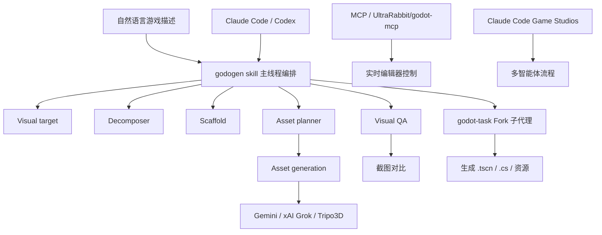

# Godogen 专家学习报告：Claude Code 驱动 Godot 4 的自动化游戏生成工作流 {#top}
> 默认假设：本报告以中文读者、全球开源项目为口径；使用目的为快速建立对 godogen 及相关 AI 游戏开发工作流的专业理解；时间范围为当前至 2028 年；深度为标准（standard），输出约 60 张关键词教学卡；排除项为纯 Godot 引擎教学、Unity/Unreal 引擎细节、法律/财务投资建议。如需切换口径，可重跑并指定地域、目的或深度。

## 导读摘要 {#section-01}
### 这份学习材料解决什么问题 {#section-02}
如果你正在用 Godot 4 做游戏，又听说了 `godogen`、`UltraRabbit/godot-mcp`、`Claude Code Game Studios` 这些名字，很可能会困惑：它们到底是插件、脚本、技能（skill），还是完整的工作室框架？这份材料要帮你把概念拆开、把结构看清、把选择做对。读完之后，你应该能够用三句话讲清楚 godogen 是什么，判断它和你的项目是否匹配，知道它和 Godot MCP 服务器、Claude Code Game Studios 的区别，并能列出启动它的前置条件与主要风险。

这不是一份 Godot 引擎入门教程，也不是某款工具的推广文案。它是一份面向开发者、独立工作室和小团队的学习报告：先定边界，再看结构，再判断生命周期和替代方案，最后用关键词卡和费曼问题把知识变成可复述的能力。

### 本报告的三个亮点 {#section-03}
1. **把三个容易混淆的流派拆开**：godogen（自主生成管线）、Godot MCP（实时交互控制）、Claude Code Game Studios（多智能体工作室框架）分别对应“生成器—遥控器—组织流程”三种不同定位，避免一开始就选错工具。
2. **用关键词卡讲清底层逻辑**：60 张卡片不仅解释术语，更说明每个概念为什么存在、怎么运转、哪里容易踩坑，并给出真实项目信号。
3. **用证据标签控制风险**：关键判断都标注为 fact / inference / hypothesis / unknown，并给出置信度，帮助你在信息快速变化的领域保持清醒。

### 推荐阅读路径 {#section-04}
- **完全陌生**：先读导读、第 1 节“一页专家速览”、第 2 节“边界与排除项”，然后跳到第 11 节“专家学习教程”的orientation 模块。
- **想评估是否采用 godogen**：重点读第 4 节“价值链与参与者”、第 5 节“八维诊断”、第 7 节“竞争与替代风险”、第 13 节“机会风险清单”。
- **要带团队学习或内部分享**：重点使用第 10 节关键词分组、第 9 节代表锚点和第 12 节费曼问题。
- **已经在用 Claude Code / Godot**：可直接跳到第 3 节分类地图、第 8 节技术信号和第 14 节不确定性日志，补充决策所需的外部变量。

### 底层逻辑说明 {#section-05}
本报告按“边界 → 结构 → 动态 → 应用 → 自测”的层次展开。先定边界，是因为“AI 做游戏”这个词同时涵盖了代码补全、场景遥控、全自动生成和多智能体协作四种完全不同的工作模式；如果混在一起，所有判断都会失真。再看结构，是为了理解 godogen 这类工具内部有哪些阶段、每个阶段依赖什么、谁是真正的价值创造者。接着看生命周期和技术/资本信号，判断这个领域是实验性泡沫还是进入可用区间。最后用关键词卡和费曼问题把抽象结构变成可检索、可讲述的知识。

## 0. 默认假设与研究边界 {#section-06}
本节先把研究对象说清楚。对新人来说，很多误解不是来自资料太少，而是来自一开始就把相邻概念混在一起。

| 项目 | 当前设定 | 说明 |
|---|---|---|
| 主题 | Godogen（Godot 4 自动化游戏生成管线） | 核心聚焦 htdt/godogen；同时覆盖 UltraRabbit/godot-mcp、Claude Code Game Studios 作为生态参照 |
| 地域 | 全球开源项目为主 | 项目代码和文档以英文为主，用户社区横跨北美、欧洲和中国独立开发者 |
| 用途 | 学习与技术选型 | 帮助开发者判断 godogen 是否适合当前项目，并理解配套工具 |
| 时间范围 | 2026 年 7 月至 2028 年 | 关注当前可用性与未来 2 年的演化 |
| 深度 | standard | 约 60 张关键词教学卡、10 个费曼问题、完整报告与导出 |
| 排除项 | Godot 引擎基础教学、Unity/Unreal 细节、法律/投资建议、纯商业模型分析 | 避免范围漂移 |

## 1. 一页专家速览 {#section-07}
这一节先给出整份报告的压缩版。你可以把它当作入门前的“地图”。

### 一句话定义 {#section-08}
Godogen 是一个开源的“提示词到可玩游戏”的自动化管线：你在已经发布好技能文件的空仓库里用自然语言描述游戏，Claude Code 或 Codex 会按阶段完成视觉目标、任务分解、架构搭建、资源规划、资源生成和视觉 QA，最终输出一个结构化的 Godot 4 项目。

### 五个核心事实 {#section-09}
1. **开源仓库与多引擎支持**：htdt/godogen 在 GitHub 开源，支持 Godot 4（.NET/C#）、Bevy 和 Babylon.js；Godot 是主要示例。**[fact]**
2. **双技能架构**：主线程使用 `godogen` skill 做规划与编排，Fork 出去的 `godot-task` skill 执行具体任务，从而控制上下文窗口。**[fact]**
3. **外部 API 依赖**：资源生成依赖 Gemini、xAI Grok、Tripo3D 等外部服务，需要 API key 并产生按量费用。**[fact]**
4. **2026 年 4 月 C# / .NET 9 迁移**：生成代码从 GDScript 切换到 C#，验证方式改为 `dotnet build`。**[fact, 置信度：中，来自 CHANGELOG 与社区讨论]**
5. **MCP 与工作室框架是邻近但不同的赛道**：UltraRabbit/godot-mcp 提供 149 个工具对 Godot 编辑器做实时控制；Claude Code Game Studios 是多智能体组织框架；godogen 是全自动生成管线。**[inference]**

### 五个关键判断 {#section-10}
| 判断 | 类型 | 证据 | 置信度 |
|---|---|---|---|
| godogen 目前更适合原型/垂直切片（vertical slice）和实验性项目，而非直接生产交付 | inference | 项目文档自述生成后仍需人工打磨；外部 API 成本和一致性限制 | 中 |
| 其价值核心不在“自动生成代码”，而在“把架构设计、资源规划、视觉 QA 串成可复现的管线” | inference | SKILL.md 的阶段划分与 PROJECT.md 的架构描述 | 中 |
| 对中文独立开发者而言，主要门槛是 API 费用、网络可达性和 .NET 版 Godot 的环境配置 | inference | 国内开发者对 Gemini/xAI/Tripo3D 的访问成本与 Godot .NET 构建链的熟悉度 | 中 |
| 未来 2 年内，godogen 与 MCP 服务器可能从“二选一”走向“混合使用”：先用 godogen 生成骨架，再用 MCP 做实时精修 | hypothesis | 两类工具互补；社区已经出现融合讨论 | 低 |
| 当前还没有大规模商业游戏完全由 godogen 产出的公开案例 | unknown | 搜索未找到已上市商业作品的独立验证 | — |

## 2. 领域定义、边界与排除项 {#section-11}
理解一个领域，第一步不是记术语，而是知道什么算在里面、什么不算在里面。

| 口径 | 定义 | 包含 | 排除 |
|---|---|---|---|
| 宽口径 | AI 辅助 Godot 游戏开发全生态 | 代码补全、编辑器插件、MCP 服务器、全自动生成管线、多智能体工作室、资产市场 | Unity/Unreal、通用 AI 绘画、与 Godot 无关的通用 LLM 应用 |
| 窄口径 | godogen 本身 | htdt/godogen 仓库、其 skill 文件、publish.sh 发布流程、双 skill 执行模型 | 其他 Godot MCP 项目、Claude Code Game Studios、CodexForGodot |
| 数据口径 | 可验证的开源项目与文档 | GitHub 仓库、README、SKILL.md、PROJECT.md、CHANGELOG、issue/PR | 未经核实的社交媒体截图、付费课程宣传 |
| 排除口径 | 容易混淆的“假朋友” | 不是 Godot 官方插件、不是游戏模板、不是即开即用的 SaaS | 不是 Claude Code 本身、不是 Godot 引擎 |

## 3. 多口径分类地图 {#section-12}
同一个领域可以被不同人用不同方式分类。下面把常见口径放在一起。

| 分类视角 | 用途 | 典型问题 | 代表来源/依据 |
|---|---|---|---|
| 技术形态 | 判断工具如何与 Godot 交互 | 它是生成项目文件、遥控编辑器，还是组织多个 AI 代理？ | 项目 README、插件结构 |
| 引擎支持 | 判断适用范围 | 支持 Godot 4 .NET、GDScript、Bevy 还是 Babylon.js？ | htdt/godogen 目录结构 |
| 代理架构 | 判断可扩展性 | 单代理还是多代理？主线程还是 Fork？ | PROJECT.md、AGENTS.md |
| 工作模式 | 判断使用方式 | 一次性生成 vs. 实时协作 vs. 多阶段门控 | 各项目文档 |
| 商业/开源 | 判断成本与可控性 | 开源免费、一次性付费还是按量 API？ | GitHub License、定价页 |
| 使用者角色 | 判断学习曲线 | 适合程序员、策划、美术还是全栈独立开发者？ | 社区教程、Discord/Reddit 讨论 |

## 4. 价值链、参与者与利润池 {#section-13}
godogen 不是传统商业市场，因此这里用“能力链”代替价值链：谁提供关键输入，谁执行关键阶段，谁最终获得可玩游戏。

| 环节/角色 | 核心能力 | 价值来源 | 壁垒/约束 | 观察指标 |
|---|---|---|---|---|
| 基础模型层 | 长上下文推理、代码生成、视觉理解 | Claude / GPT / Gemini API 调用费 | 模型能力、上下文长度、成本 | token 价格、上下文窗口、多模态支持 |
| 游戏引擎层 | Godot 4 .NET 运行、场景树、渲染、物理 | 免费开源引擎 + 生态插件 | 版本兼容性、.NET 构建链 | 版本号、GitHub issue 数量 |
| 管线编排层（godogen） | 阶段定义、上下文管理、错误恢复 | 自动化生成完整项目 | 对 Claude Code/Codex skill 机制的理解 | skill 文件复杂度、阶段划分清晰度 |
| 任务执行层（godot-task） | 在 Fork 上下文中实现具体功能 | 减少主线程上下文污染 | 子代理与主线程的协调 | 任务完成率、循环次数 |
| 资产生成层 | 2D/3D 图像、模型、动画、纹理 | 外部 API（Gemini/Grok/Tripo3D） | API 成本、一致性、版权 | 单资产成本、生成迭代次数 |
| 视觉 QA 层 | 截图对比、缺陷识别、自动修复 | 减少人工跑测 | 视觉模型准确率、运行稳定性 | 截图数量、修复轮次 |
| 开发者/用户 | 需求描述、验收、二次打磨 | 可玩原型或游戏资产 | 表达能力、对 Godot 的理解 | 项目完成度、上线时间 |

## 5. 当前状态八维诊断 {#section-14}
这一节回答“现在到底发生了什么”。

| 维度 | 当前状态 | 关键证据 | 不确定性 |
|---|---|---|---|
| 市场 | AI 辅助游戏开发工具处于快速增长期，社区热度高 | GitHub 多个相关项目 star 数快速增加；Claude Code / Codex 用户基数扩大 | 付费转化率、真实采用率缺乏公开数据 |
| 需求 | 独立开发者和小团队希望降低“从想法到可玩原型”的时间成本 | 社交媒体上大量“vibe coding game”内容 | 多少人愿意为 API 费用持续付费 |
| 供给 | 开源项目多，但文档成熟度参差不齐 | godogen 文档相对完整；部分 MCP 项目 README 较简略 | 长期维护能力未知 |
| 竞争 | 三条赛道并存：全自动生成、MCP 实时控制、多智能体工作室 | htdt/godogen、UltraRabbit/godot-mcp、Donchitos/Claude-Code-Game-Studios | 哪条赛道会成为主流 |
| 价值链 | 价值向基础模型和外部 API 服务商转移；编排层尚未形成稳定商业模式 | API key 是主要直接成本 | 编排层是否会出现商业化产品 |
| 政策/标准 | 尚无专门针对 AI 生成游戏内容的监管框架；需关注版权与平台政策 | 通用 AIGC 法规、各平台商店政策 | 未来是否会出现游戏内容披露义务 |
| 技术 | 多模态模型和上下文长度持续进步，但一致性、可控性仍是瓶颈 | 视觉 QA、任务分解、C# 迁移 | 视觉一致性和复杂游戏机制能否稳定生成 |
| 资本/财务 | 主要由开源社区和个人开发者驱动；部分 MCP 项目出现一次性付费 Pro 版 | GitHub Sponsor、付费 fork、API 费用 | 是否会有投资机构进入编排层 |

## 6. 生命周期与变化变量 {#section-15}
生命周期不是给行业贴标签，而是帮助我们判断下一步该看什么。

| 细分领域 | 阶段判断 | 证据 | 例外/反例 | 未来变量 |
|---|---|---|---|---|
| AI 代码补全（Copilot 类） | 成熟期 | 高渗透率、稳定商业模式 | 游戏领域专用化仍在演进 | 模型编码能力、上下文长度 |
| Godot MCP 实时控制 | 成长期 | 项目数量快速增加、工具数膨胀 | 部分项目 star 少、文档差 | MCP 协议标准化、Godot 官方态度 |
| 全自动生成管线（godogen） | 导入期末/成长期初 | 有完整流程但案例验证不足 | 社区热度高 | 模型多模态能力、成本下降 |
| 多智能体工作室框架 | 导入期 | 概念完整，实际采用少 | CCGS 等讨论热烈 | 代理协作稳定性、工程落地 |
| 3D 资产生成（Tripo3D 等） | 成长期 | 可用性快速提升 | 成本和一致性限制 | API 价格、生成速度、版权清晰度 |

## 7. 竞争结构、壁垒与替代风险 {#section-16}
这里不只是列出竞争对手，而是判断五种竞争力量如何影响这个领域的行动空间。

| 力量 | 当前判断 | 证据 | 对学习/行动的影响 |
|---|---|---|---|
| 现有竞争 | 三条赛道内部项目众多，但尚未出现垄断者 | godogen、多个 godot-mcp fork、CCGS 并存 | 选型成本较高，需要明确自身需求 |
| 潜在进入者 | 门槛较低：基于 Claude Code/Codex skill 或 MCP 协议即可做新工具 | 开源代码可 fork；MCP 协议公开 | 可能快速出现更好的方案，不宜过度锁定 |
| 替代品 | 传统手动开发、其他引擎（Unity/Unreal）AI 插件、通用 IDE 补全 | Cursor、Windsurf、Unity Muse 等 | 如果项目不依赖 Godot，可跨引擎比较 |
| 供应方（模型/API） | 议价能力强；成本和可用性受大模型厂商控制 | Claude/Gemini/xAI/Tripo3D 定价 | 需要持续监控 API 费用和访问稳定性 |
| 购买方（开发者） | 转换成本低，但迁移已有项目有沉没成本 | 开源工具可随时切换 | 先小项目试验，再决定是否用于主力项目 |

## 8. 政策、标准、技术与资本信号 {#section-17}
很多变化并不只来自产品本身。

| 信号类型 | 关键内容 | 为什么重要 | 跟踪方式 |
|---|---|---|---|
| 政策/监管 | 通用 AIGC 内容标识、版权归属、平台商店对 AI 生成内容的披露要求 | 可能影响游戏上线和资产使用 | 关注欧盟 AI Act、美国版权局声明、Steam/App Store 政策更新 |
| 标准/协议 | MCP（Model Context Protocol）正在快速成为 AI 工具与编辑器交互的事实协议 | 决定 MCP 服务器能否跨客户端复用 | Anthropic MCP 规范版本、Godot 官方是否支持 |
| 技术路线 | godogen 从 GDScript 迁移到 C# / .NET 9 | 影响环境配置和生成代码风格 | 关注 CHANGELOG、skill 文件更新 |
| 技术路线 | 视觉 QA 引入 Gemini / Claude 截图对比 | 决定自动生成游戏的视觉一致性上限 | 社区 demo、issue 反馈 |
| 资本/并购 | 目前以社区和个人项目为主；部分 fork 尝试一次性付费 Pro | 商业模式仍在探索 | GitHub Sponsor、付费仓库、教程/课程 |

## 9. 代表公司、人物、机构、案例或实践场景 {#section-18}
抽象概念需要落到真实对象上。以下锚点不是排名，而是学习示例。

### 学习锚点：htdt/godogen {#section-19}
| 字段 | 内容 |
|---|---|
| 类型 | 开源项目 / 自动化生成管线 |
| 代表性原因 | 是目前最完整的“提示词到 Godot 项目”开源方案之一 |
| 它说明的底层逻辑 | AI 游戏开发不只是代码生成，而是需要任务分解、资源规划、视觉反馈的完整管线 |
| 新人可学什么 | 如何设计一个分阶段的 AI 工作流；如何用 skill 机制控制上下文窗口 |
| 不应过度推断 | 看到 demo 不代表任何游戏都能一次成功；复杂机制和长流程仍需要人工干预 |
| 来源 | GitHub htdt/godogen；README / PROJECT.md / SKILL.md |

### 学习锚点：UltraRabbit/godot-mcp {#section-20}
| 字段 | 内容 |
|---|---|
| 类型 | 开源 MCP 服务器 + Godot 编辑器插件 |
| 代表性原因 | 提供 149 个工具，覆盖场景、节点、脚本、运行时、网络、音频等 |
| 它说明的底层逻辑 | MCP 协议可以把编辑器变成 AI 的“遥控器”，实现实时协作 |
| 新人可学什么 | 当 godogen 生成骨架后，如何用 MCP 做精细修改和调试 |
| 不应过度推断 | 工具数量多不代表每个工具都稳定；需要实际测试 |
| 来源 | GitHub UltraRabbit/godot-mcp |

### 学习锚点：Claude Code Game Studios (CCGS) {#section-21}
| 字段 | 内容 |
|---|---|
| 类型 | 多智能体工作室框架 |
| 代表性原因 | 把 49 个专业代理组织成三层结构，提供 72+ slash 命令和门控流程 |
| 它说明的底层逻辑 | 当项目变大，AI 协作需要从“单管线”升级为“组织流程” |
| 新人可学什么 | 多代理分工、门控检查、设计系统、垂直切片等概念如何落地 |
| 不应过度推断 | 框架完整不代表执行简单；实际项目仍需大量人工监督 |
| 来源 | GitHub Donchitos/Claude-Code-Game-Studios |

### 学习锚点：Godot 4 .NET 迁移事件 {#section-22}
| 字段 | 内容 |
|---|---|
| 类型 | 技术路线变化 |
| 代表性原因 | 2026 年 4 月 godogen 将生成代码从 GDScript 切换到 C# / .NET 9 |
| 它说明的底层逻辑 | 自动化管线必须跟随引擎生态和团队技术栈做调整；工具选择不是一次性决策 |
| 新人可学什么 | 评估 AI 工具时要考虑其生成物与团队技术栈的匹配度 |
| 不应过度推断 | C# 迁移对所有人都是好事；GDScript 社区仍很大 |
| 来源 | htdt/godogen CHANGELOG；社区讨论 |

## 10. 关键词库与概念关系图 {#section-23}
关键词是进入一个领域的语言入口。下面按模块分组，每组用两列表格呈现教学卡。

### 关键词分组 {#section-24}
| 模块 | 关键词 |
|---|---|
| 边界与基础 | Godogen、Godot 4、Claude Code、Codex、Skill、MCP、Godot MCP、Claude Code Game Studios |
| 工作流与阶段 | Visual target、Decomposer、Scaffold、Asset planner、Asset generation、Visual QA、Publish.sh、Runtime manifest |
| 代理与架构 | 主线程编排、Fork 子代理、godogen skill、godot-task skill、上下文窗口、长上下文、多智能体 |
| 资源与生成 | Gemini、xAI Grok、Tripo3D、Image-to-3D、GLB、Texture、Sprite、Rigged biped、背景移除（rembg） |
| 技术与工程 | GDScript、C#、.NET 9、dotnet build、Scene tree、Node、Signal、Resource、Project.godot、.tscn、.gd、.cs |
| 交互与控制 | MCP server、Editor plugin、WebSocket、Tool、Runtime execution、Screenshot、Input simulation、Scene manipulation |
| 产品与决策 | Vertical slice、Prototype、Vibe coding、AI 辅助开发、全自动生成、实时协作、门控检查、设计系统 |
| 商业与风险 | API key、按量计费、Token 成本、版权、AIGC 合规、平台政策、vendor lock-in、维护风险 |

### 关键词卡片 {#section-25}
#### 关键词：Godogen

| 字段 | 内容 |
|---|---|
| 一句话通俗理解 | 一个让 Claude Code 或 Codex 把你的文字描述变成完整 Godot 项目的开源“游戏生成工厂”。 |
| 概念阐述 | htdt/godogen 是一套 skill 文件和脚本，通过分阶段管线自动完成游戏设计、架构、资产生成和视觉 QA。 |
| 底层逻辑 | 把“我想做一款游戏”这个模糊需求，拆解成可执行、可验证、可迭代的机器任务链，降低从 0 到可玩原型的门槛。 |
| 所属模块 | 边界与基础 |
| 作用 | 定义本报告核心研究对象；是全自动生成赛道的代表。 |
| 行业真实示例 | htdt/godogen 仓库；社区 demo 展示从一句话生成 2D/3D Godot 项目。 |
| 应用场景 | 独立开发者快速验证玩法、团队做垂直切片、教学演示 AI 工作流。 |
| 可观察指标 | GitHub star 数、CHANGELOG 频率、社区 demo 数量、生成项目可运行率。 |
| 相关概念 | Godot MCP、Claude Code Game Studios、Codex、Skill |
| 常见误区 | 以为它是 Godot 插件或 SaaS；其实它是 AI agent 的 skill，需要 Claude Code/Codex 宿主。 |
| 证据 | GitHub htdt/godogen README、PROJECT.md |

#### 关键词：Godot 4

| 字段 | 内容 |
|---|---|
| 一句话通俗理解 | 一款开源、轻量、2D/3D 通吃的游戏引擎，本报告中是 godogen 的主要目标引擎。 |
| 概念阐述 | Godot 4 是 Godot 引擎的重大版本升级，引入 Vulkan 渲染、改进 GDScript、支持 .NET/C#。 |
| 底层逻辑 | 提供场景树、节点系统、信号机制和跨平台导出，让开发者用统一抽象管理游戏对象和生命周期。 |
| 所属模块 | 边界与基础 |
| 作用 | godogen 生成物的运行环境；引擎能力决定生成项目的上限。 |
| 行业真实示例 | 《Cassette Beasts》《Brotato》等使用 Godot 开发。 |
| 应用场景 | 独立游戏、2D/3D 项目、原型开发、教育。 |
| 可观察指标 | 版本号、稳定版发布周期、Asset Library 插件数量。 |
| 相关概念 | GDScript、C#、Scene tree、Node、Signal |
| 常见误区 | 以为 Godot 只能做 2D；其实 3D 能力在 4.x 已有大幅提升。 |
| 证据 | godotengine.org 官方文档 |

#### 关键词：Claude Code

| 字段 | 内容 |
|---|---|
| 一句话通俗理解 | Anthropic 出的命令行 AI 编程助手，可以读写文件、运行命令、理解整个代码库。 |
| 概念阐述 | Claude Code 是一个 agentic coding 工具，通过自然语言指令执行终端命令、编辑代码、调试项目。 |
| 底层逻辑 | 把大模型能力包装成可操作文件系统的“同事”，减少开发者在 IDE 和文档之间切换的成本。 |
| 所属模块 | 边界与基础 |
| 作用 | godogen 的主要宿主环境；skill 文件让 Claude Code 按游戏生成流程工作。 |
| 行业真实示例 | htdt/godogen 的 claude/ 目录；大量开发者用 Claude Code 做项目初始搭建。 |
| 应用场景 | 代码库重构、新功能开发、自动化脚本执行、游戏生成管线。 |
| 可观察指标 | 版本更新、API 定价、支持的模型版本。 |
| 相关概念 | Codex、Anthropic、MCP、Agent |
| 常见误区 | 以为 Claude Code 只是聊天机器人；其实它能直接修改文件和运行命令。 |
| 证据 | Anthropic Claude Code 官方文档 |

#### 关键词：Codex

| 字段 | 内容 |
|---|---|
| 一句话通俗理解 | OpenAI 推出的命令行编程 agent，定位与 Claude Code 类似。 |
| 概念阐述 | Codex CLI/Codex Agent 是 OpenAI 的 agentic coding 工具，也支持通过 skill 文件扩展行为。 |
| 底层逻辑 | 与 Claude Code 竞争同一赛道，靠模型能力和生态集成吸引开发者。 |
| 所属模块 | 边界与基础 |
| 作用 | godogen 的另一宿主；codex/ 目录下是适配 Codex 的 skill 版本。 |
| 行业真实示例 | htdt/godogen 的 codex/ 目录。 |
| 应用场景 | 与 Claude Code 类似；OpenAI 生态用户更倾向使用。 |
| 可观察指标 | OpenAI 发布节奏、Codex 与 Claude Code 的功能对比。 |
| 相关概念 | Claude Code、OpenAI、GPT、Skill |
| 常见误区 | 把 Codex 和 GitHub Copilot 混为一谈；Copilot 是 IDE 补全，Codex 是 agent。 |
| 证据 | OpenAI Codex 官方公告与文档 |

#### 关键词：Skill

| 字段 | 内容 |
|---|---|
| 一句话通俗理解 | 给 AI agent 的“岗位说明书 + 操作手册”，告诉它在这个项目里该怎么干活。 |
| 概念阐述 | 在 Claude Code / Codex 等工具中，skill 是一组提示词、规则、模板和命令，用于约束 agent 的行为。 |
| 底层逻辑 | 通过结构化指令把通用大模型变成某个垂直领域的专职助手，减少每次重复说明成本。 |
| 所属模块 | 边界与基础 |
| 作用 | godogen 的核心交付形式；`godogen` skill 和 `godot-task` skill 共同完成游戏生成。 |
| 行业真实示例 | htdt/godogen/skills/godogen/SKILL.md；CCGS 的 72+ slash 命令也基于 skill 机制。 |
| 应用场景 | 项目初始化、代码规范约束、测试流程、游戏生成管线。 |
| 可观察指标 | skill 文件数量、阶段划分粒度、执行成功率。 |
| 相关概念 | Prompt、Agent、MCP、Workflow |
| 常见误区 | 以为 skill 是插件或代码库；其实它更像高级系统提示词。 |
| 证据 | Claude Code / Codex skill 文档；htdt/godogen 仓库 |

#### 关键词：MCP

| 字段 | 内容 |
|---|---|
| 一句话通俗理解 | 让 AI agent 和外部工具“说同一种语言”的开放协议。 |
| 概念阐述 | Model Context Protocol（MCP）由 Anthropic 提出，标准化 AI 模型与数据源、工具之间的交互。 |
| 底层逻辑 | 通过统一接口，让 AI 不仅能“读”文件，还能“操作”编辑器、数据库、浏览器等工具。 |
| 所属模块 | 边界与基础 |
| 作用 | UltraRabbit/godot-mcp 等技术的基础；与 godogen 的 skill 机制互补。 |
| 行业真实示例 | Anthropic MCP 官方 SDK；各类编辑器 MCP 服务器。 |
| 应用场景 | AI 控制 Godot 编辑器、数据库查询、浏览器自动化、企业知识库。 |
| 可观察指标 | 协议版本、支持的客户端数量、工具生态规模。 |
| 相关概念 | MCP server、Tool、API、Agent |
| 常见误区 | 以为 MCP 是某个具体软件；其实它是协议/标准。 |
| 证据 | Anthropic MCP 官方规范 |

#### 关键词：Godot MCP

| 字段 | 内容 |
|---|---|
| 一句话通俗理解 | 一类让 AI 直接遥控 Godot 编辑器的工具，代表作是 UltraRabbit/godot-mcp。 |
| 概念阐述 | 通过 MCP 协议，AI 客户端可以调用 Godot 编辑器内的工具：创建节点、修改属性、运行游戏、截图等。 |
| 底层逻辑 | 把编辑器的能力暴露成 AI 可调用的函数，实现“你说我做”的实时协作。 |
| 所属模块 | 边界与基础 |
| 作用 | 与 godogen 的“全自动生成”形成对照：一个偏实时精修，一个偏一次性生成。 |
| 行业真实示例 | UltraRabbit/godot-mcp（149 tools）；Farraskuy/Godot-MCP（168 tools）。 |
| 应用场景 | 在已有项目中快速调整场景、调试运行、生成脚本。 |
| 可观察指标 | 工具数量、支持 Godot 版本、社区反馈稳定性。 |
| 相关概念 | MCP、Editor plugin、WebSocket、UltraRabbit/godot-mcp |
| 常见误区 | 以为 Godot MCP 就是 godogen；两者工作模式不同。 |
| 证据 | UltraRabbit/godot-mcp GitHub README |

#### 关键词：Claude Code Game Studios

| 字段 | 内容 |
|---|---|
| 一句话通俗理解 | 一个把多个 AI 代理组织成游戏工作室的框架，强调流程和门控。 |
| 概念阐述 | CCGS 将 49 个专业代理分为总监、部门主管、专员三层，通过 72+ slash 命令和门控流程管理游戏项目。 |
| 底层逻辑 | 当单条管线无法满足大型项目时，用“组织”方式分工协作，模拟真实游戏工作室。 |
| 所属模块 | 边界与基础 |
| 作用 | 展示 AI 游戏开发的第三种形态：多智能体流程管理。 |
| 行业真实示例 | Donchitos/Claude-Code-Game-Studios 仓库。 |
| 应用场景 | 中大型项目、需要严格流程和质量的团队。 |
| 可观察指标 | 代理数量、命令数、实际项目采用率。 |
| 相关概念 | Multi-agent、Workflow、Vertical slice、Design system |
| 常见误区 | 以为它能完全替代真实团队；其实仍需要大量人工监督。 |
| 证据 | GitHub Donchitos/Claude-Code-Game-Studios |

#### 关键词：Visual target

| 字段 | 内容 |
|---|---|
| 一句话通俗理解 | 游戏生成流程的第一步：先做出一张“目标长什么样”的参考图。 |
| 概念阐述 | godogen 管线中，Visual target 阶段根据自然语言描述生成参考视觉图像，作为后续美术和场景的对齐基准。 |
| 底层逻辑 | 在写代码之前先对齐“长什么样”，减少后期返工；类似人类团队先出概念图再开工。 |
| 所属模块 | 工作流与阶段 |
| 作用 | 为后续 asset planner 和 asset generation 提供视觉方向。 |
| 行业真实示例 | godogen SKILL.md 描述的首个阶段。 |
| 应用场景 | 任何需要统一美术风格的项目，尤其是 2D/3D 视觉驱动游戏。 |
| 可观察指标 | 参考图与最终截图的相似度、视觉 QA 阶段缺陷数量。 |
| 相关概念 | Asset planner、Visual QA、Concept art |
| 常见误区 | 以为参考图就是最终资源；其实它只是对齐工具。 |
| 证据 | htdt/godogen skills/godogen/SKILL.md |

#### 关键词：Decomposer

| 字段 | 内容 |
|---|---|
| 一句话通俗理解 | 把“我想做一款游戏”拆成一张可执行的任务依赖图。 |
| 概念阐述 | Decomposer 阶段将游戏描述分解为任务 DAG（有向无环图），明确哪些任务依赖哪些任务。 |
| 底层逻辑 | 复杂项目无法一次性生成，必须先做规划；DAG 让机器知道执行顺序。 |
| 所属模块 | 工作流与阶段 |
| 作用 | 生成项目蓝图，决定后续 Scaffold 和 godot-task 的工作量。 |
| 行业真实示例 | godogen PROJECT.md 中的任务分解设计。 |
| 应用场景 | 中大型游戏生成、多阶段协作项目。 |
| 可观察指标 | 任务数量、依赖深度、执行失败率。 |
| 相关概念 | Scaffold、Task DAG、Planning |
| 常见误区 | 以为分解越细越好；过细会增加协调成本。 |
| 证据 | htdt/godogen PROJECT.md |

#### 关键词：Scaffold

| 字段 | 内容 |
|---|---|
| 一句话通俗理解 | 搭骨架：先建项目结构、空场景和基础代码，再往里面填内容。 |
| 概念阐述 | Scaffold 阶段创建 Godot 项目目录、场景树、脚本框架和基础配置，为后续任务执行打好基础。 |
| 底层逻辑 | 先统一项目结构和命名规范，避免多个子代理各自为政导致代码冲突。 |
| 所属模块 | 工作流与阶段 |
| 作用 | 确保生成项目具备一致的工程结构。 |
| 行业真实示例 | godogen 生成 Project.godot、.tscn、.cs 文件的过程。 |
| 应用场景 | 新项目初始化、团队统一代码规范。 |
| 可观察指标 | 文件结构一致性、编译通过率。 |
| 相关概念 | Decomposer、godot-task、Project structure |
| 常见误区 | 以为骨架阶段就要完成所有功能；其实它只是基础框架。 |
| 证据 | htdt/godogen SKILL.md |

#### 关键词：Asset planner

| 字段 | 内容 |
|---|---|
| 一句话通俗理解 | 像制片主任一样，先算清楚需要多少美术资源、要花多少钱、优先级怎么排。 |
| 概念阐述 | Asset planner 阶段根据视觉目标和游戏机制，规划 2D/3D 资源清单、预算和生成顺序。 |
| 底层逻辑 | API 生成资源有成本，必须优先生成对视觉影响最大的资源，控制总费用。 |
| 所属模块 | 工作流与阶段 |
| 作用 | 控制资产生成成本，保证核心视觉质量。 |
| 行业真实示例 | godogen 中按视觉重要性为资源排序。 |
| 应用场景 | 资源密集型项目、预算敏感的小团队。 |
| 可观察指标 | 资源清单完整度、实际费用与预算偏差。 |
| 相关概念 | Asset generation、Visual target、Budget |
| 常见误区 | 以为规划可以自动精确到每个像素；其实需要迭代调整。 |
| 证据 | htdt/godogen PROJECT.md |

#### 关键词：Asset generation

| 字段 | 内容 |
|---|---|
| 一句话通俗理解 | 真正“画图做模型”的阶段，调用外部 AI 服务生成游戏资源。 |
| 概念阐述 | Asset generation 阶段使用 Gemini、xAI Grok、Tripo3D 等 API 生成纹理、精灵、3D 模型、动画等资源。 |
| 底层逻辑 | 把 AI 图像/3D 生成能力接入到游戏工程管线中，实现资源自动化。 |
| 所属模块 | 工作流与阶段 |
| 作用 | 将视觉目标转化为可导入 Godot 的资源文件。 |
| 行业真实示例 | Tripo3D 将图片转为带骨骼的 3D 角色；Grok 生成纹理和动画精灵。 |
| 应用场景 | 快速产出原型美术、垂直切片资源、独立游戏美术。 |
| 可观察指标 | 单资源成本、生成迭代次数、资源导入成功率。 |
| 相关概念 | Tripo3D、Gemini、xAI Grok、Texture、Sprite、GLB |
| 常见误区 | 以为生成的资源可以直接商用；需关注版权和服务条款。 |
| 证据 | htdt/godogen README / setup.md |

#### 关键词：Visual QA

| 字段 | 内容 |
|---|---|
| 一句话通俗理解 | 运行游戏、截图、对比参考图，自动发现“货不对板”并修复。 |
| 概念阐述 | Visual QA 阶段启动 Godot 运行实例，捕获截图，用视觉模型与 Visual target 对比，识别差异并回滚修复。 |
| 底层逻辑 | 代码能跑不等于看起来对；视觉反馈是游戏开发中不可或缺的验收环节。 |
| 所属模块 | 工作流与阶段 |
| 作用 | 保证生成结果在视觉上符合预期，降低人工跑测负担。 |
| 行业真实示例 | godogen 中 Gemini / Claude 对比截图与参考图。 |
| 应用场景 | 任何对视觉一致性有要求的自动生成项目。 |
| 可观察指标 | 截图数量、缺陷检出率、修复轮次。 |
| 相关概念 | Visual target、Screenshot、Gemini Flash |
| 常见误区 | 以为 Visual QA 能发现所有 bug；它主要抓视觉差异，逻辑 bug 仍需其他测试。 |
| 证据 | htdt/godogen SKILL.md |

#### 关键词：Publish.sh

| 字段 | 内容 |
|---|---|
| 一句话通俗理解 | 把 godogen 的“技能文件”复制到一个新游戏仓库里的脚本。 |
| 概念阐述 | publish.sh 是 htdt/godogen 提供的发布脚本，运行后会在目标目录生成一个包含 skill 和引擎指南的最小项目模板。 |
| 底层逻辑 | 让 skill 源码和游戏项目分离：skill 仓库是“工厂”，发布后的目录是“产品车间”。 |
| 所属模块 | 工作流与阶段 |
| 作用 | 创建可交给 Claude Code / Codex 执行的游戏生成工作环境。 |
| 行业真实示例 | htdt/godogen 仓库根目录的 publish.sh。 |
| 应用场景 | 每次开新游戏项目时初始化 godogen 工作流。 |
| 可观察指标 | 发布目录结构是否正确、skill 文件是否完整。 |
| 相关概念 | Runtime manifest、Engine guide、Skill |
| 常见误区 | 以为 publish.sh 会直接生成游戏；其实它只是准备工作区。 |
| 证据 | htdt/godogen README |

#### 关键词：Runtime manifest

| 字段 | 内容 |
|---|---|
| 一句话通俗理解 | 告诉 AI 当前项目用什么引擎、什么版本、什么配置的“身份证”。 |
| 概念阐述 | Runtime manifest 是发布后的最小项目里的一份配置文件，描述引擎、目标和约束。 |
| 底层逻辑 | 让 AI agent 在启动时就能读取项目上下文，避免反复询问基础信息。 |
| 所属模块 | 工作流与阶段 |
| 作用 | 统一项目元数据入口。 |
| 行业真实示例 | godogen 发布目录中的 manifest 文件。 |
| 应用场景 | 多引擎、多项目、多版本管理。 |
| 可观察指标 | manifest 字段完整度、与实际情况一致性。 |
| 相关概念 | Publish.sh、Engine guide、Project metadata |
| 常见误区 | 以为 manifest 是 Godot 引擎文件；它是 godogen 管线的元数据。 |
| 证据 | htdt/godogen PROJECT.md |

#### 关键词：主线程编排

| 字段 | 内容 |
|---|---|
| 一句话通俗理解 | 由一个“总指挥”负责按计划推进整个生成流程。 |
| 概念阐述 | 在 godogen 中，`godogen` skill 在主线程运行，负责阶段切换、状态管理和结果汇总。 |
| 底层逻辑 | 保证流程有序进行，避免多个任务同时修改同一文件导致冲突。 |
| 所属模块 | 代理与架构 |
| 作用 | 控制生成管线的整体节奏。 |
| 行业真实示例 | htdt/godogen 的 1M 上下文主线程设计。 |
| 应用场景 | 多阶段、需要全局协调的复杂项目。 |
| 可观察指标 | 阶段完成率、主线程错误数。 |
| 相关概念 | Fork 子代理、godogen skill、Workflow |
| 常见误区 | 以为主线程做所有事；其实它主要负责编排。 |
| 证据 | htdt/godogen PROJECT.md |

#### 关键词：Fork 子代理

| 字段 | 内容 |
|---|---|
| 一句话通俗理解 | 把具体任务派给“分包队”去做，主线程只等结果。 |
| 概念阐述 | `godot-task` skill 在独立的 Fork 上下文中执行具体任务，减少主线程上下文占用。 |
| 底层逻辑 | 大模型上下文有限，Fork 可以把长任务拆出去，保持主线程清爽。 |
| 所属模块 | 代理与架构 |
| 作用 | 提高复杂项目的可扩展性和并行度。 |
| 行业真实示例 | godogen 双 skill 架构。 |
| 应用场景 | 大型代码库、多模块并行开发。 |
| 可观察指标 | 子任务成功率、主线程与子线程协调开销。 |
| 相关概念 | 主线程编排、上下文窗口、Subagent |
| 常见误区 | 以为 Fork 越多越好；协调和合并成本会随之上升。 |
| 证据 | htdt/godogen PROJECT.md |

#### 关键词：上下文窗口

| 字段 | 内容 |
|---|---|
| 一句话通俗理解 | AI 一次能“记住”多少内容；窗口越大，越能处理复杂项目。 |
| 概念阐述 | 上下文窗口是大模型单次请求中能处理的 token 数量，直接影响 agent 能同时看到多少代码和文档。 |
| 底层逻辑 | 游戏项目文件多、关系复杂，窗口不够会导致 agent“失忆”或重复劳动。 |
| 所属模块 | 代理与架构 |
| 作用 | 解释 godogen 为何要分阶段加载、为何要 Fork 子代理。 |
| 行业真实示例 | Claude 3.5/4 提供 200K+ token 上下文；godogen 主线程设计为 1M 上下文。 |
| 应用场景 | 大型代码库理解、全流程自动化。 |
| 可观察指标 | 模型上下文长度、实际占用 token 数。 |
| 相关概念 | Token、Long context、RAG |
| 常见误区 | 以为窗口越大就一定越好；成本和延迟也会上升。 |
| 证据 | Anthropic 模型文档 |

#### 关键词：长上下文

| 字段 | 内容 |
|---|---|
| 一句话通俗理解 | 能一次性塞进大量代码和文档的模型能力。 |
| 概念阐述 | 长上下文模型可以在单次请求中处理整本书、整个代码库或大量聊天记录。 |
| 底层逻辑 | 让 agent 在不做复杂检索的情况下，直接“通读”项目全貌。 |
| 所属模块 | 代理与架构 |
| 作用 | 支撑 godogen 主线程全局编排。 |
| 行业真实示例 | Claude 3 Opus/4、Gemini 1.5 Pro 的长上下文能力。 |
| 应用场景 | 大型项目整体理解、跨文件修改、自动化管线。 |
| 可观察指标 | 上下文长度、长上下文下的准确率。 |
| 相关概念 | 上下文窗口、RAG、Agent |
| 常见误区 | 长上下文等于高智商；其实它只是“记性好”。 |
| 证据 | 各模型官方 benchmark |

#### 关键词：多智能体

| 字段 | 内容 |
|---|---|
| 一句话通俗理解 | 多个 AI 代理像团队成员一样分工协作。 |
| 概念阐述 | 多智能体系统把不同任务分配给不同 specialized agent，通过协作完成复杂目标。 |
| 底层逻辑 | 单个 agent 难以同时擅长规划、编码、美术、测试；分工提升整体能力上限。 |
| 所属模块 | 代理与架构 |
| 作用 | 解释 Claude Code Game Studios 和 godogen Fork 设计的共同思路。 |
| 行业真实示例 | CCGS 的 49 个代理；godogen 的 godot-task。 |
| 应用场景 | 大型游戏项目、复杂软件开发。 |
| 可观察指标 | 代理数量、协作成功率、任务完成时间。 |
| 相关概念 | Agent、Workflow、Multi-agent system |
| 常见误区 | 以为多智能体就一定更稳定；协调失败会导致混乱。 |
| 证据 | CCGS 文档；godogen PROJECT.md |

#### 关键词：Gemini

| 字段 | 内容 |
|---|---|
| 一句话通俗理解 | Google 的多模态 AI 模型，在 godogen 中用于生成参考图和角色。 |
| 概念阐述 | Gemini 是 Google DeepMind 的 AI 模型系列，具备文本、图像、视频理解能力。 |
| 底层逻辑 | 多模态能力让它能根据文本生成图像，也能对比截图做视觉 QA。 |
| 所属模块 | 资源与生成 |
| 作用 | godogen 视觉目标、角色和视觉 QA 的模型来源之一。 |
| 行业真实示例 | Google AI Studio 提供的 Gemini API。 |
| 应用场景 | 图像生成、视觉理解、代码辅助。 |
| 可观察指标 | API 价格、生成质量、可用区域。 |
| 相关概念 | xAI Grok、Tripo3D、Multimodal |
| 常见误区 | 把 Gemini 当作免费工具；API 按量计费。 |
| 证据 | Google AI Studio 定价页 |

#### 关键词：xAI Grok

| 字段 | 内容 |
|---|---|
| 一句话通俗理解 | Elon Musk 旗下 xAI 的模型，在 godogen 中用于纹理和动画精灵生成。 |
| 概念阐述 | Grok 是 xAI 推出的大模型，部分版本具备图像生成能力。 |
| 底层逻辑 | 不同模型在纹理、简单物体、动画循环等任务上有不同优势，godogen 按任务选择模型。 |
| 所属模块 | 资源与生成 |
| 作用 | 为特定资产生成任务提供模型能力。 |
| 行业真实示例 | godogen setup.md 中列出的 API key 之一。 |
| 应用场景 | 纹理生成、精灵动画、风格化资产。 |
| 可观察指标 | API 可用性、生成风格一致性。 |
| 相关概念 | Gemini、Tripo3D、Asset generation |
| 常见误区 | 以为 Grok 只做聊天；其实也有图像生成功能。 |
| 证据 | xAI 官方文档与 godogen setup.md |

#### 关键词：Tripo3D

| 字段 | 内容 |
|---|---|
| 一句话通俗理解 | 一个能把图片变成 3D 模型的在线服务。 |
| 概念阐述 | Tripo3D 提供 image-to-3D 转换，可输出 GLB 等游戏引擎可用格式，并支持带骨骼的 biped 动画。 |
| 底层逻辑 | 降低 3D 角色和道具的建模门槛，让 AI 管线能自动产出可导入 Godot 的模型。 |
| 所属模块 | 资源与生成 |
| 作用 | godogen 3D 资产生成的关键外部服务。 |
| 行业真实示例 | 将角色概念图转换为带骨骼的 GLB 模型。 |
| 应用场景 | 3D 原型、独立游戏角色、快速验证视觉。 |
| 可观察指标 | 单模型成本、转换成功率、骨骼绑定质量。 |
| 相关概念 | Image-to-3D、GLB、Rigged biped |
| 常见误区 | 以为图片转 3D 是免费的；Tripo3D 按量收费。 |
| 证据 | Tripo3D 定价页；godogen setup.md |

#### 关键词：Image-to-3D

| 字段 | 内容 |
|---|---|
| 一句话通俗理解 | 让 AI 根据一张图片“猜”出三维形状的技术。 |
| 概念阐述 | Image-to-3D 是从单张或多张图像重建 3D 几何和纹理的生成技术。 |
| 底层逻辑 | 利用多视角一致性、先验知识和神经渲染，从 2D 信息推断 3D 结构。 |
| 所属模块 | 资源与生成 |
| 作用 | 让没有 3D 建模能力的开发者也能快速获得模型。 |
| 行业真实示例 | Tripo3D、Meshy、CSM 等服务。 |
| 应用场景 | 概念验证、原型美术、独立游戏资产。 |
| 可观察指标 | 几何准确度、纹理质量、拓扑可用性。 |
| 相关概念 | Tripo3D、3D reconstruction、NeRF |
| 常见误区 | 以为生成的模型无需清理；通常需要重新拓扑和减面。 |
| 证据 | 各 image-to-3D 服务 benchmark |

#### 关键词：GLB

| 字段 | 内容 |
|---|---|
| 一句话通俗理解 | 一种把 3D 模型和贴图打包成一个文件的格式，Godot 能直接导入。 |
| 概念阐述 | GLB 是 glTF 2.0 的二进制容器格式，包含网格、材质、动画、骨骼等数据。 |
| 底层逻辑 | 单一文件便于传输和导入，减少资源管理复杂度。 |
| 所属模块 | 资源与生成 |
| 作用 | godogen 3D 资产生成的主要输出格式。 |
| 行业真实示例 | Godot 直接导入 .glb 文件；Tripo3D 输出 glb。 |
| 应用场景 | 3D 角色、场景道具、动画资源。 |
| 可观察指标 | 文件大小、导入时间、渲染表现。 |
| 相关概念 | glTF、3D model、Texture |
| 常见误区 | 把 GLB 和 FBX/OBJ 混用；GLB 是现代 Web/引擎更推荐的格式。 |
| 证据 | Khronos glTF 规范 |

#### 关键词：Texture

| 字段 | 内容 |
|---|---|
| 一句话通俗理解 | 贴在 3D 模型表面的“皮肤”，决定模型看起来是什么材质。 |
| 概念阐述 | Texture 是覆盖在 3D 几何表面的图像，用于表现颜色、凹凸、金属度等材质属性。 |
| 底层逻辑 | 用 2D 图像信息丰富 3D 表面细节，减少实际几何复杂度。 |
| 所属模块 | 资源与生成 |
| 作用 | 3D 资产生成的核心组成部分。 |
| 行业真实示例 | PBR 纹理集（albedo、normal、roughness、metallic）。 |
| 应用场景 | 角色、场景、道具、UI。 |
| 可观察指标 | 分辨率、文件大小、风格一致性。 |
| 相关概念 | Material、PBR、UV mapping |
| 常见误区 | 以为纹理就是材质；材质还包含 shader 参数。 |
| 证据 | Godot 材质文档 |

#### 关键词：Sprite

| 字段 | 内容 |
|---|---|
| 一句话通俗理解 | 2D 游戏里一张会动的图片。 |
| 概念阐述 | Sprite 是 2D 游戏中的图像元素，通常由逐帧动画或骨骼动画驱动。 |
| 底层逻辑 | 用少量图像资源实现丰富的 2D 动画效果，降低美术成本。 |
| 所属模块 | 资源与生成 |
| 作用 | 2D 游戏的主要视觉资源类型。 |
| 行业真实示例 | 平台跳跃、Roguelike、视觉小说中的角色和道具。 |
| 应用场景 | 2D 游戏原型、动画角色、粒子效果。 |
| 可观察指标 | 帧数、文件大小、动画流畅度。 |
| 相关概念 | Animation、Frame、2D game |
| 常见误区 | 以为 sprite 只是静态图；其实常包含动画帧。 |
| 证据 | Godot 2D 文档 |

#### 关键词：Rigged biped

| 字段 | 内容 |
|---|---|
| 一句话通俗理解 | 已经绑好骨骼、能做人形动画的 3D 角色。 |
| 概念阐述 | Rigged biped 指带有骨骼绑定（rig）的两足角色模型，可直接用于动画制作。 |
| 底层逻辑 | 骨骼绑定让模型可以通过动画数据驱动，而不需要逐帧调整顶点。 |
| 所属模块 | 资源与生成 |
| 作用 | Tripo3D 等服务的高级输出，可直接用于 Godot 角色动画。 |
| 行业真实示例 | 人形 NPC、玩家角色、动作游戏角色。 |
| 应用场景 | 3D 角色动画、快速原型、独立游戏。 |
| 可观察指标 | 骨骼层级、权重质量、动画兼容性。 |
| 相关概念 | GLB、Skeleton、Animation |
| 常见误区 | 以为所有 image-to-3D 输出都带骨骼；多数需要额外绑定。 |
| 证据 | Tripo3D 功能说明 |

#### 关键词：背景移除（rembg）

| 字段 | 内容 |
|---|---|
| 一句话通俗理解 | 把图片里的人物或物体从背景中抠出来，方便放到游戏里。 |
| 概念阐述 | rembg 是一个开源背景移除工具，常用于 AI 生成图像的后处理。 |
| 底层逻辑 | 通过语义分割识别前景主体，生成透明背景的 PNG。 |
| 所属模块 | 资源与生成 |
| 作用 | 让 2D 生成资源能直接放入游戏场景。 |
| 行业真实示例 | godogen asset generation 阶段的后处理步骤。 |
| 应用场景 | 2D sprite、UI 元素、道具图标。 |
| 可观察指标 | 边缘质量、处理时间、成功率。 |
| 相关概念 | Segmentation、Alpha channel、PNG |
| 常见误区 | 以为 rembg 能处理所有复杂背景；毛发、透明物体仍容易出错。 |
| 证据 | rembg GitHub 仓库 |

#### 关键词：GDScript

| 字段 | 内容 |
|---|---|
| 一句话通俗理解 | Godot 原生的脚本语言，类似 Python，易学易用。 |
| 概念阐述 | GDScript 是 Godot 内置的脚本语言，专为游戏开发设计，与引擎 API 深度集成。 |
| 底层逻辑 | 降低 Godot 学习门槛，让开发者快速实现游戏逻辑。 |
| 所属模块 | 技术与工程 |
| 作用 | Godot 4 早期 godogen 生成的主要语言；2026 年后切换为 C#。 |
| 行业真实示例 | 大量 Godot 开源项目使用 GDScript。 |
| 应用场景 | 游戏逻辑、工具脚本、快速原型。 |
| 可观察指标 | 代码行数、社区教程数量、插件支持度。 |
| 相关概念 | C#、Godot 4、Scene tree |
| 常见误区 | 以为 GDScript 性能差；对大多数 2D 和小型 3D 项目足够。 |
| 证据 | Godot 官方文档 |

#### 关键词：C#

| 字段 | 内容 |
|---|---|
| 一句话通俗理解 | 微软出的强类型编程语言，Godot 4 通过 .NET 支持它。 |
| 概念阐述 | C# 是一种现代、类型安全的面向对象语言，Godot 4 .NET 版本支持用 C# 编写游戏脚本。 |
| 底层逻辑 | 强类型、丰富生态、与 .NET 工具链集成，适合中大型团队和复杂项目。 |
| 所属模块 | 技术与工程 |
| 作用 | 2026 年 4 月起 godogen 生成代码的主要语言。 |
| 行业真实示例 | 使用 Godot .NET 的商业项目。 |
| 应用场景 | 中大型 Godot 项目、需要强类型约束的团队。 |
| 可观察指标 | 编译错误率、代码可维护性、团队熟悉度。 |
| 相关概念 | .NET 9、dotnet build、GDScript |
| 常见误区 | 以为 C# 一定比 GDScript 快；性能取决于具体用法。 |
| 证据 | Godot .NET 文档；godogen CHANGELOG |

#### 关键词：.NET 9

| 字段 | 内容 |
|---|---|
| 一句话通俗理解 | 微软开发平台 .NET 的第九个主版本。 |
| 概念阐述 | .NET 9 是 .NET 平台的长期演进版本，带来性能改进和新 API。 |
| 底层逻辑 | godogen 选择 .NET 9 作为目标框架，以获得更好的编译性能和语言特性。 |
| 所属模块 | 技术与工程 |
| 作用 | godogen 生成 C# 代码的运行时目标。 |
| 行业真实示例 | godogen 2026 年 4 月迁移公告。 |
| 应用场景 | Godot .NET 项目、现代 C# 开发。 |
| 可观察指标 | Godot .NET 版本支持矩阵、构建时间。 |
| 相关概念 | C#、dotnet build、Godot .NET |
| 常见误区 | 以为 .NET 9 一定向下兼容所有 Godot 版本；需查看官方支持列表。 |
| 证据 | Microsoft .NET 9 发布说明 |

#### 关键词：dotnet build

| 字段 | 内容 |
|---|---|
| 一句话通俗理解 | 用命令行把 C# 项目编译成可运行文件。 |
| 概念阐述 | `dotnet build` 是 .NET CLI 的编译命令，用于编译 C# 项目并检查语法错误。 |
| 底层逻辑 | godogen 用 `dotnet build` 替代逐文件语法检查，提高验证效率。 |
| 所属模块 | 技术与工程 |
| 作用 | godogen C# 迁移后的主要代码验证方式。 |
| 行业真实示例 | godogen CHANGELOG 中描述的验证方式变更。 |
| 应用场景 | C# 项目编译、CI/CD、自动化验证。 |
| 可观察指标 | 编译时间、错误数量、构建成功率。 |
| 相关概念 | C#、.NET 9、CI/CD |
| 常见误区 | 以为 `dotnet build` 能检查所有运行时错误；它只检查编译期错误。 |
| 证据 | Microsoft .NET CLI 文档 |

#### 关键词：Scene tree

| 字段 | 内容 |
|---|---|
| 一句话通俗理解 | Godot 里所有游戏对象按父子关系排成的一棵“树”。 |
| 概念阐述 | Scene tree 是 Godot 中管理节点层级和生命周期的核心结构，每帧更新一次。 |
| 底层逻辑 | 用树形结构组织游戏对象，父节点的变换会传递给子节点，信号在节点间传播。 |
| 所属模块 | 技术与工程 |
| 作用 | godogen 生成项目的基础结构；Godot MCP 操作的主要对象。 |
| 行业真实示例 | 任何 Godot 项目都由 scene tree 组织。 |
| 应用场景 | 场景管理、对象层级、游戏循环。 |
| 可观察指标 | 节点数量、层级深度、更新耗时。 |
| 相关概念 | Node、Signal、Godot 4 |
| 常见误区 | 把 scene tree 和文件系统目录混淆；它是运行时对象关系。 |
| 证据 | Godot 官方文档 |

#### 关键词：Node

| 字段 | 内容 |
|---|---|
| 一句话通俗理解 | Godot 场景树里的一个“对象”，可以是角色、摄像机、灯光等。 |
| 概念阐述 | Node 是 Godot 中所有场景对象的基础类，具有名称、变换、脚本等属性。 |
| 底层逻辑 | 通过组合不同功能的节点，构建出完整的游戏对象和行为。 |
| 所属模块 | 技术与工程 |
| 作用 | godogen 生成和 Godot MCP 操作的基本单元。 |
| 行业真实示例 | CharacterBody2D、Camera3D、AudioStreamPlayer 等都是 Node 的子类。 |
| 应用场景 | 角色控制、摄像机跟随、音频播放。 |
| 可观察指标 | 节点类型分布、脚本附着率。 |
| 相关概念 | Scene tree、Signal、Script |
| 常见误区 | 把 Node 当作类实例的全部；Godot 还有 Resource、RefCounted 等类型。 |
| 证据 | Godot 官方文档 |

#### 关键词：Signal

| 字段 | 内容 |
|---|---|
| 一句话通俗理解 | Godot 里对象之间“发通知”的机制，类似事件订阅。 |
| 概念阐述 | Signal 是 Godot 的观察者模式实现，允许节点在特定事件发生时通知其他节点。 |
| 底层逻辑 | 解耦对象之间的直接调用，让游戏逻辑更模块化、更易维护。 |
| 所属模块 | 技术与工程 |
| 作用 | godogen 生成代码中处理交互的重要机制。 |
| 行业真实示例 | 玩家死亡时发送信号给 UI 更新分数。 |
| 应用场景 | 事件驱动逻辑、UI 更新、状态同步。 |
| 可观察指标 | 信号连接数量、断开连接导致的 bug 数。 |
| 相关概念 | Node、Observer pattern、Event |
| 常见误区 | 滥用信号导致调试困难；需要合理设计信号边界。 |
| 证据 | Godot 官方文档 |

#### 关键词：Resource

| 字段 | 内容 |
|---|---|
| 一句话通俗理解 | Godot 里可复用的数据资产，比如贴图、音频、材质。 |
| 概念阐述 | Resource 是 Godot 中只加载一次、可在多个节点间共享的数据对象。 |
| 底层逻辑 | 区分数据资产和运行时行为对象，提高内存效率和资源管理清晰度。 |
| 所属模块 | 技术与工程 |
| 作用 | godogen 生成资产的核心对象类型。 |
| 行业真实示例 | Texture2D、AudioStream、Material 都是 Resource 子类。 |
| 应用场景 | 资产管理、内存优化、资源复用。 |
| 可观察指标 | 资源加载时间、内存占用。 |
| 相关概念 | Node、Asset、Reference |
| 常见误区 | 把 Resource 和 Node 混用；Resource 不参与场景树更新。 |
| 证据 | Godot 官方文档 |

#### 关键词：Project.godot

| 字段 | 内容 |
|---|---|
| 一句话通俗理解 | Godot 项目的“身份证”文件，记录项目设置和启动场景。 |
| 概念阐述 | Project.godot 是 Godot 项目的配置文件，包含渲染、输入、音频、自动加载等全局设置。 |
| 底层逻辑 | 统一项目级配置，让团队在不同机器上保持一致的开发环境。 |
| 所属模块 | 技术与工程 |
| 作用 | godogen 生成项目的第一步配置文件。 |
| 行业真实示例 | 每个 Godot 项目根目录都有此文件。 |
| 应用场景 | 项目初始化、配置管理、版本控制。 |
| 可观察指标 | 配置项完整度、版本控制冲突数。 |
| 相关概念 | Godot 4、.tscn、Scene |
| 常见误区 | 手动编辑 Project.godot 导致语法错误；建议通过编辑器修改。 |
| 证据 | Godot 官方文档 |

#### 关键词：.tscn

| 字段 | 内容 |
|---|---|
| 一句话通俗理解 | Godot 的场景文件，用文本保存节点层级和属性。 |
| 概念阐述 | .tscn 是 Godot 的场景文本格式，便于版本控制；.tscn 是二进制格式 .scn 的文本版。 |
| 底层逻辑 | 文本格式让 AI 和人类都能 diff/merge，适合 AI 生成和协作开发。 |
| 所属模块 | 技术与工程 |
| 作用 | godogen 和 Godot MCP 主要读写的场景文件格式。 |
| 行业真实示例 | Godot 项目中的 .tscn 文件。 |
| 应用场景 | 场景版本控制、AI 生成场景、手动编辑。 |
| 可观察指标 | 文件大小、节点数量、版本控制差异。 |
| 相关概念 | Scene、Node、Project.godot |
| 常见误区 | 用文本编辑器改 .tscn 后忘记保存对应 .gd/.cs 脚本引用。 |
| 证据 | Godot 官方文档 |

#### 关键词：.gd / .cs

| 字段 | 内容 |
|---|---|
| 一句话通俗理解 | Godot 的脚本文件后缀，.gd 是 GDScript，.cs 是 C#。 |
| 概念阐述 | .gd 和 .cs 分别是 Godot 中 GDScript 和 C# 脚本文件的扩展名。 |
| 底层逻辑 | 脚本给节点附加行为，是游戏逻辑的主要载体。 |
| 所属模块 | 技术与工程 |
| 作用 | godogen 生成代码的文件形式。 |
| 行业真实示例 | player.gd、enemy.cs 等。 |
| 应用场景 | 角色控制、AI 行为、UI 逻辑、工具脚本。 |
| 可观察指标 | 脚本数量、代码行数、语言占比。 |
| 相关概念 | GDScript、C#、Node |
| 常见误区 | 同一项目混用 GDScript 和 C# 导致互操作复杂度上升。 |
| 证据 | Godot 官方文档 |

#### 关键词：MCP server

| 字段 | 内容 |
|---|---|
| 一句话通俗理解 | 一个中间程序，让 AI 客户端能调用 Godot 编辑器里的功能。 |
| 概念阐述 | MCP server 实现 Model Context Protocol，把本地工具暴露为 AI 可调用的函数集合。 |
| 底层逻辑 | 标准化通信方式，让不同 AI 客户端都能控制同一个编辑器。 |
| 所属模块 | 交互与控制 |
| 作用 | UltraRabbit/godot-mcp 等项目的核心组件。 |
| 行业真实示例 | UltraRabbit/godot-mcp 的 Node.js server。 |
| 应用场景 | AI 控制 Godot、数据库、浏览器、文件系统。 |
| 可观察指标 | 工具数量、连接稳定性、响应延迟。 |
| 相关概念 | MCP、Editor plugin、Tool |
| 常见误区 | 以为 MCP server 是 Godot 内置功能；其实需要额外安装。 |
| 证据 | Anthropic MCP 规范；UltraRabbit/godot-mcp README |

#### 关键词：Editor plugin

| 字段 | 内容 |
|---|---|
| 一句话通俗理解 | 运行在 Godot 编辑器里的插件，让编辑器拥有新功能。 |
| 概念阐述 | Godot Editor plugin 是用 GDScript 或 C# 写的扩展，可在编辑器启动时加载。 |
| 底层逻辑 | 通过插件扩展编辑器能力，而不修改引擎源码。 |
| 所属模块 | 交互与控制 |
| 作用 | Godot MCP 项目在编辑器内接收命令的端点。 |
| 行业真实示例 | UltraRabbit/godot-mcp 的 GDScript 插件。 |
| 应用场景 | 自定义工具、AI 控制、工作流优化。 |
| 可观察指标 | 插件加载成功率、版本兼容性。 |
| 相关概念 | Godot 4、MCP server、Addon |
| 常见误区 | 把插件和 Godot 引擎内置功能混淆。 |
| 证据 | Godot 插件文档 |

#### 关键词：WebSocket

| 字段 | 内容 |
|---|---|
| 一句话通俗理解 | 让浏览器/程序和服务器保持实时双向通信的技术。 |
| 概念阐述 | WebSocket 是一种在单个 TCP 连接上进行全双工通信的协议。 |
| 底层逻辑 | MCP server 和 Godot 编辑器插件常用 WebSocket 传输命令和结果。 |
| 所属模块 | 交互与控制 |
| 作用 | UltraRabbit/godot-mcp 等项目的传输层协议。 |
| 行业真实示例 | 默认端口 6550 的 Godot MCP WebSocket 连接。 |
| 应用场景 | 实时 AI 控制、在线多人游戏、实时数据流。 |
| 可观察指标 | 连接稳定性、延迟、端口占用情况。 |
| 相关概念 | MCP server、Editor plugin、TCP/IP |
| 常见误区 | 把 WebSocket 和 HTTP 混为一谈；WebSocket 是长连接。 |
| 证据 | Godot WebSocket 文档 |

#### 关键词：Tool

| 字段 | 内容 |
|---|---|
| 一句话通俗理解 | MCP server 暴露给 AI 调用的一个“功能按钮”。 |
| 概念阐述 | 在 MCP 中，tool 是一个可调用的功能，AI 客户端通过名称和参数调用它。 |
| 底层逻辑 | 把编辑器的操作拆成原子功能，让 AI 可以组合使用。 |
| 所属模块 | 交互与控制 |
| 作用 | UltraRabbit/godot-mcp 提供 149 个 tool 的核心单位。 |
| 行业真实示例 | create_node、set_property、run_game 等 tool。 |
| 应用场景 | 场景操作、属性修改、运行调试。 |
| 可观察指标 | 工具数量、调用成功率、覆盖的功能面。 |
| 相关概念 | MCP server、Function calling、API |
| 常见误区 | 以为 tool 越多越好；稳定性和文档质量更重要。 |
| 证据 | UltraRabbit/godot-mcp README |

#### 关键词：Runtime execution

| 字段 | 内容 |
|---|---|
| 一句话通俗理解 | 让 AI 能实际运行游戏并观察结果。 |
| 概念阐述 | Runtime execution 指 AI 工具启动游戏运行实例，获取运行时状态、截图或日志。 |
| 底层逻辑 | 只有运行起来，才能验证逻辑和视觉效果是否达到预期。 |
| 所属模块 | 交互与控制 |
| 作用 | Visual QA 和 MCP 实时调试的基础能力。 |
| 行业真实示例 | godogen 截图对比；godot-mcp 的 run_game tool。 |
| 应用场景 | 自动化测试、视觉 QA、实时调试。 |
| 可观察指标 | 运行成功率、截图清晰度、崩溃率。 |
| 相关概念 | Visual QA、Screenshot、Run game |
| 常见误区 | 以为运行时执行等于完整测试；它只是验证的一环。 |
| 证据 | godogen / godot-mcp 文档 |

#### 关键词：Screenshot

| 字段 | 内容 |
|---|---|
| 一句话通俗理解 | 把游戏画面拍下来，用来和参考图对比。 |
| 概念阐述 | Screenshot 是 godogen Visual QA 阶段和 MCP 运行调试中获取图像反馈的主要方式。 |
| 底层逻辑 | 视觉对比比文本日志更直观，能发现布局和渲染问题。 |
| 所属模块 | 交互与控制 |
| 作用 | 为 AI 提供视觉反馈，驱动自动修复。 |
| 行业真实示例 | godogen 中 Gemini / Claude 对比截图。 |
| 应用场景 | 视觉 QA、Bug 报告、进度展示。 |
| 可观察指标 | 截图分辨率、对比准确度、修复轮次。 |
| 相关概念 | Visual QA、Runtime execution |
| 常见误区 | 以为截图对比能替代功能测试；它主要抓视觉问题。 |
| 证据 | godogen SKILL.md |

#### 关键词：Input simulation

| 字段 | 内容 |
|---|---|
| 一句话通俗理解 | 让 AI 模拟按键、鼠标点击来测试游戏。 |
| 概念阐述 | Input simulation 指程序化地发送输入事件，用于自动化游戏测试。 |
| 底层逻辑 | 用确定性输入验证游戏响应，减少人工跑测。 |
| 所属模块 | 交互与控制 |
| 作用 | 部分 MCP 项目支持的高级测试能力。 |
| 行业真实示例 | satelliteoflove/godot-mcp 等项目的输入模拟功能。 |
| 应用场景 | 自动化 QA、回归测试、AI 训练环境。 |
| 可观察指标 | 输入覆盖率、测试稳定性。 |
| 相关概念 | Runtime execution、QA、Test |
| 常见误区 | 以为所有 MCP 都支持；实际能力差异大。 |
| 证据 | 各 godot-mcp 项目文档 |

#### 关键词：Scene manipulation

| 字段 | 内容 |
|---|---|
| 一句话通俗理解 | AI 直接增删改 Godot 场景里的节点和属性。 |
| 概念阐述 | Scene manipulation 是 Godot MCP 的核心能力，包括创建节点、修改属性、附加脚本等。 |
| 底层逻辑 | 让 AI 像人类开发者一样在编辑器里操作场景树。 |
| 所属模块 | 交互与控制 |
| 作用 | 实时协作开发的基础。 |
| 行业真实示例 | UltraRabbit/godot-mcp 的 149 个 tool 中大量属于此类。 |
| 应用场景 | 快速搭建场景、批量修改属性、实时迭代。 |
| 可观察指标 | 操作成功率、撤销/重做支持情况。 |
| 相关概念 | MCP server、Node、Editor plugin |
| 常见误区 | 以为 AI 操作不会出错；需要版本控制兜底。 |
| 证据 | UltraRabbit/godot-mcp 工具列表 |

#### 关键词：Vertical slice

| 字段 | 内容 |
|---|---|
| 一句话通俗理解 | 一个游戏的小而完整的切片，能代表最终品质。 |
| 概念阐述 | Vertical slice 是游戏开发中一个短小的可玩片段，展示核心玩法、美术和手感。 |
| 底层逻辑 | 用最小成本验证游戏是否好玩、是否值得继续投入。 |
| 所属模块 | 产品与决策 |
| 作用 | godogen 和 CCGS 都适合先产出 vertical slice。 |
| 行业真实示例 | CCGS 的 `/vertical-slice` 命令。 |
| 应用场景 | 立项验证、融资 demo、团队对齐。 |
| 可观察指标 | 切片完整度、玩家反馈、开发耗时。 |
| 相关概念 | Prototype、MVP、Design system |
| 常见误区 | 把 vertical slice 当作完整游戏；它只是精华片段。 |
| 证据 | CCGS 文档 |

#### 关键词：Prototype

| 字段 | 内容 |
|---|---|
| 一句话通俗理解 | 快速验证想法的粗糙版本。 |
| 概念阐述 | Prototype 是游戏开发早期用来测试核心机制的可丢弃版本。 |
| 底层逻辑 | 在投入大量美术和代码之前，先确认玩法是否成立。 |
| 所属模块 | 产品与决策 |
| 作用 | godogen 最常见的适用场景之一。 |
| 行业真实示例 | 任何游戏开发早期的灰盒版本。 |
| 应用场景 | 玩法验证、快速迭代、团队沟通。 |
| 可观察指标 | 核心循环可玩性、迭代速度。 |
| 相关概念 | Vertical slice、MVP、Vibe coding |
| 常见误区 | 把 prototype 当产品直接发布。 |
| 证据 | 游戏开发通用实践 |

#### 关键词：Vibe coding

| 字段 | 内容 |
|---|---|
| 一句话通俗理解 | 一种“跟着感觉走、用自然语言让 AI 写代码”的开发方式。 |
| 概念阐述 | Vibe coding 指开发者用自然语言描述意图，由 AI 生成和调整代码，人工主要负责验收。 |
| 底层逻辑 | 降低编码门槛，让非程序员也能快速实现想法；但牺牲了部分可控性。 |
| 所属模块 | 产品与决策 |
| 作用 | 解释 godogen 和 MCP 工具背后的用户行为趋势。 |
| 行业真实示例 | 社交媒体上大量“我用 Claude 一小时做了款游戏”的内容。 |
| 应用场景 | 快速原型、个人项目、学习实验。 |
| 可观察指标 | AI 生成代码占比、人工返工率。 |
| 相关概念 | AI 辅助开发、Prototype、Prompt engineering |
| 常见误区 | 以为 vibe coding 不需要任何技术基础；验收和调试仍需要能力。 |
| 证据 | 社区讨论与社交媒体趋势 |

#### 关键词：AI 辅助开发

| 字段 | 内容 |
|---|---|
| 一句话通俗理解 | AI 帮助人类开发者完成部分开发任务，而非完全替代。 |
| 概念阐述 | AI 辅助开发涵盖代码补全、代码生成、调试、测试、文档等各个环节。 |
| 底层逻辑 | 把重复性、模式化的工作交给 AI，人类聚焦创意和决策。 |
| 所属模块 | 产品与决策 |
| 作用 | 定义 godogen / MCP / CCGS 的共同目标市场。 |
| 行业真实示例 | GitHub Copilot、Cursor、Claude Code。 |
| 应用场景 | 全栈开发、游戏开发、数据分析。 |
| 可观察指标 | 开发效率、代码质量、AI 采纳率。 |
| 相关概念 | Vibe coding、Copilot、Agent |
| 常见误区 | 把辅助和替代混为一谈；当前阶段仍以辅助为主。 |
| 证据 | 行业报告与开发者调研 |

#### 关键词：实时协作

| 字段 | 内容 |
|---|---|
| 一句话通俗理解 | AI 和人在同一个编辑器里同时工作、即时反馈。 |
| 概念阐述 | 实时协作指 AI 能立即响应开发者指令，修改场景、运行游戏、返回结果。 |
| 底层逻辑 | 缩短“想法 → 反馈”循环，提高迭代速度。 |
| 所属模块 | 产品与决策 |
| 作用 | Godot MCP 的核心价值主张。 |
| 行业真实示例 | UltraRabbit/godot-mcp 的交互式开发流程。 |
| 应用场景 | 精细调整、快速试错、结对编程式 AI 辅助。 |
| 可观察指标 | 响应延迟、操作成功率、开发者满意度。 |
| 相关概念 | MCP、Editor plugin、Scene manipulation |
| 常见误区 | 以为实时协作等于全自动；其实仍需人工发指令。 |
| 证据 | UltraRabbit/godot-mcp README |

#### 关键词：门控检查

| 字段 | 内容 |
|---|---|
| 一句话通俗理解 | 项目进入下一阶段前必须通过的质量检查点。 |
| 概念阐述 | Gate check 是 CCGS 等框架中的流程机制，确保每个阶段产出达标后再继续。 |
| 底层逻辑 | 防止 AI 在多阶段项目中一路跑偏，保持质量底线。 |
| 所属模块 | 产品与决策 |
| 作用 | 解释 Claude Code Game Studios 与 godogen 在流程上的差异。 |
| 行业真实示例 | CCGS 的 7 阶段门控流程。 |
| 应用场景 | 中大型项目、需要严格流程的团队。 |
| 可观察指标 | 门控通过率、阶段返工率。 |
| 相关概念 | Vertical slice、Design system、QA |
| 常见误区 | 以为门控完全自动化；通常需要人工确认。 |
| 证据 | CCGS 文档 |

#### 关键词：设计系统

| 字段 | 内容 |
|---|---|
| 一句话通俗理解 | 一套统一的设计规则，让游戏各系统风格一致。 |
| 概念阐述 | Design system 是游戏或软件中关于视觉、交互、组件规范的集合。 |
| 底层逻辑 | 让 AI 在生成过程中有据可依，减少风格漂移。 |
| 所属模块 | 产品与决策 |
| 作用 | CCGS 等框架中用于保证产出一致性的工具。 |
| 行业真实示例 | CCGS 的 `/design-system` 命令。 |
| 应用场景 | 大型项目、团队协作、品牌一致性。 |
| 可观察指标 | 规范覆盖率、执行一致度。 |
| 相关概念 | Vertical slice、Style guide、Gate check |
| 常见误区 | 以为设计系统只针对 UI；它也可涵盖玩法、叙事。 |
| 证据 | CCGS 文档 |

#### 关键词：API key

| 字段 | 内容 |
|---|---|
| 一句话通俗理解 | 调用外部 AI 服务需要的“钥匙”。 |
| 概念阐述 | API key 是访问 Gemini、xAI、Tripo3D 等服务的凭证，通常按用量计费。 |
| 底层逻辑 | 没有 key 就无法使用外部生成能力；泄露 key 会产生费用和安全风险。 |
| 所属模块 | 商业与风险 |
| 作用 | godogen 使用的前置条件之一。 |
| 行业真实示例 | godogen setup.md 列出的必备 API key。 |
| 应用场景 | 任何需要调用外部 AI API 的项目。 |
| 可观察指标 | 费用曲线、key 泄露事件。 |
| 相关概念 | 按量计费、Token 成本、Vendor lock-in |
| 常见误区 | 把 API key 上传到公共仓库；应使用环境变量或密钥管理。 |
| 证据 | 各服务商文档 |

#### 关键词：按量计费

| 字段 | 内容 |
|---|---|
| 一句话通俗理解 | 用多少付多少，而不是固定月费。 |
| 概念阐述 | 按量计费根据 API 调用次数、token 数或生成资源数量收费。 |
| 底层逻辑 | 对低频用户友好，但高频或大规模生成时成本不可控。 |
| 所属模块 | 商业与风险 |
| 作用 | 解释 godogen 外部 API 费用的不确定性。 |
| 行业真实示例 | Tripo3D 按 image-to-GLB 次数收费；Gemini 按 token 收费。 |
| 应用场景 | AI 生成服务、云计算资源。 |
| 可观察指标 | 单次成本、月度总费用、预算偏差。 |
| 相关概念 | API key、Token 成本、Budget |
| 常见误区 | 低估按量计费的总成本；需要先做预算规划。 |
| 证据 | 各服务商定价页 |

#### 关键词：Token 成本

| 字段 | 内容 |
|---|---|
| 一句话通俗理解 | 大模型按处理的文字量收费，文字量用 token 计算。 |
| 概念阐述 | Token 是大模型处理文本的最小单位；输入和输出都按 token 计费。 |
| 底层逻辑 | 上下文越长、生成越多，费用越高；复杂项目容易超出预期。 |
| 所属模块 | 商业与风险 |
| 作用 | 解释为什么 godogen 要分阶段加载和 Fork 子代理。 |
| 行业真实示例 | Claude / GPT API 的输入/输出 token 定价。 |
| 应用场景 | 大模型 API 使用、成本优化。 |
| 可观察指标 | 单次请求 token 数、模型单价、月度账单。 |
| 相关概念 | 上下文窗口、按量计费、API key |
| 常见误区 | 以为中文一个汉字就是一个 token；通常一个汉字 1-2 个 token。 |
| 证据 | Anthropic / OpenAI 定价文档 |

#### 关键词：版权

| 字段 | 内容 |
|---|---|
| 一句话通俗理解 | AI 生成的东西归谁、能不能商用，目前还没有全球统一答案。 |
| 概念阐述 | 版权涉及 AI 生成内容的归属、训练数据合法性、衍生作品权利等法律问题。 |
| 底层逻辑 | 使用外部 AI 生成资产时，必须了解服务条款和当地法律。 |
| 所属模块 | 商业与风险 |
| 作用 | 提醒 godogen 用户注意资产生成的法律风险。 |
| 行业真实示例 | 部分国家要求 AI 生成内容披露；部分平台对 AI 艺术有政策。 |
| 应用场景 | 商业游戏发布、资产商店销售。 |
| 可观察指标 | 服务条款变化、法院判决、平台政策。 |
| 相关概念 | AIGC 合规、平台政策、训练数据 |
| 常见误区 | 以为 AI 生成的内容一定可以自由商用。 |
| 证据 | 各国版权机构声明 |

#### 关键词：AIGC 合规

| 字段 | 内容 |
|---|---|
| 一句话通俗理解 | 让 AI 生成内容符合法律、平台和社区规则。 |
| 概念阐述 | AIGC 合规包括内容标识、版权声明、数据隐私、平台政策遵守等。 |
| 底层逻辑 | 随着 AIGC 普及，监管和平台要求会越来越多。 |
| 所属模块 | 商业与风险 |
| 作用 | 跟踪未来可能影响游戏发布的外部变量。 |
| 行业真实示例 | 中国《生成式人工智能服务管理暂行办法》、欧盟 AI Act。 |
| 应用场景 | 商业发布、跨地区发行、用户生成内容平台。 |
| 可观察指标 | 法规更新、平台政策变化、披露义务。 |
| 相关概念 | 版权、平台政策、合规 |
| 常见误区 | 以为合规只是大公司的事；独立开发者同样受影响。 |
| 证据 | 各国监管机构公告 |

#### 关键词：平台政策

| 字段 | 内容 |
|---|---|
| 一句话通俗理解 | Steam、App Store 等商店对 AI 生成内容的规定。 |
| 概念阐述 | 平台政策指游戏发行平台对内容来源、版权、披露、质量的要求。 |
| 底层逻辑 | 即使法律允许，平台也可能限制或要求标注 AI 生成内容。 |
| 所属模块 | 商业与风险 |
| 作用 | 评估 godogen 生成游戏的发行可行性。 |
| 行业真实示例 | Steam 对 AI 生成内容的披露要求。 |
| 应用场景 | 游戏发布、资产商店、应用商店上架。 |
| 可观察指标 | 平台政策更新、审核通过率。 |
| 相关概念 | AIGC 合规、版权、发行 |
| 常见误区 | 以为做了游戏就能上所有平台；各平台规则不同。 |
| 证据 | Steam 官方开发者文档 |

#### 关键词：Vendor lock-in

| 字段 | 内容 |
|---|---|
| 一句话通俗理解 | 太依赖某一家服务商，换成本很高。 |
| 概念阐述 | Vendor lock-in 指因技术、数据或流程依赖而难以更换供应商。 |
| 底层逻辑 | godogen 依赖特定模型和 API；若涨价或停止服务，项目会受影响。 |
| 所属模块 | 商业与风险 |
| 作用 | 评估技术选型的长期风险。 |
| 行业真实示例 | 依赖单一云厂商或单一 AI API 的项目。 |
| 应用场景 | 技术选型、成本控制、风险管理。 |
| 可观察指标 | 可替换性、迁移成本、供应商稳定性。 |
| 相关概念 | API key、按量计费、Multi-cloud |
| 常见误区 | 只关注当前价格，忽视长期锁定风险。 |
| 证据 | 行业通用风险管理实践 |

#### 关键词：维护风险

| 字段 | 内容 |
|---|---|
| 一句话通俗理解 | 开源项目作者不更新了，你的工具链就可能卡住。 |
| 概念阐述 | 维护风险指项目因作者弃坑、版本不兼容、社区衰退而难以继续使用。 |
| 底层逻辑 | godogen 和相关 MCP 项目多为个人/小团队维护，生命周期不确定。 |
| 所属模块 | 商业与风险 |
| 作用 | 提醒采用者做好备份和版本锁定。 |
| 行业真实示例 | 多个早期 Godot MCP 项目 star 少、更新慢。 |
| 应用场景 | 技术选型、长期项目规划。 |
| 可观察指标 | 最近提交时间、issue 响应速度、贡献者数量。 |
| 相关概念 | Vendor lock-in、开源生态、技术债 |
| 常见误区 | 以为开源就等于永久免费维护。 |
| 证据 | GitHub 仓库活跃度统计 |

### 概念关系图 {#section-26}

## 11. 专家学习教程 {#section-27}
前面的章节偏研究报告，这一节把内容重新整理成学习路径。

| 模块 | 学习目标 | 核心概念 | 通俗示例与练习 | 成功检查 |
|---|---|---|---|---|
| 1. 定义与边界 | 能区分 godogen、Godot MCP、CCGS 三种工具 | Godogen、MCP、CCGS、Skill | 给朋友讲清楚“生成器 vs 遥控器 vs 工作室” | 能用三句话说出三者区别 |
| 2. 关键词与语言 | 掌握 30 个以上核心术语 | Visual target、Decomposer、Scaffold、Asset planner、Visual QA、Scene tree、Node、Signal | 打开一个 Godot 项目，指出 scene tree 和 node 的关系 | 能解释 Visual QA 为什么放在最后 |
| 3. 分类与结构 | 能画出 godogen 的工作阶段和双 skill 架构 | 主线程编排、Fork 子代理、godogen skill、godot-task skill | 用流程图画出从描述到可玩项目的 6 个阶段 | 能说明为什么用 Fork 子代理 |
| 4. 动态与变化 | 能判断生命周期阶段和技术趋势 | 导入期、成长期、C# 迁移、MCP 协议、AIGC 合规 | 对比 godogen 和 Godot MCP 的市场成熟度 | 能列出未来 2 年需跟踪的 3 个变量 |
| 5. 判断与行动 | 能决定是否在自己的项目中试用 godogen | API key、按量计费、Vendor lock-in、维护风险 | 为自己的项目列一份成本/风险清单 | 能给出明确的“试用/观望/不用”建议 |
| 6. 自测与复盘 | 用费曼问题检验理解 | 全部关键词和判断 | 闭卷回答第 12 节的 10 个问题 | 评分达到 4 分以上 |

## 12. 费曼问题、参考答案与评分 {#section-28}
学习的最后一步不是“看完”，而是能不能用自己的话讲清楚。

| 题号 | 问题 | 参考答案要点 | 评分标准 |
|---:|---|---|---|
| 1 | 用3句话解释 godogen 是什么。 | ① 开源的 AI 游戏生成管线；② 把自然语言描述转成完整 Godot 项目；③ 需要 Claude Code/Codex 和多个外部 API。 | 0-5 |
| 2 | godogen 的边界在哪里，哪些对象容易误放进来？ | 它不是 Godot 插件、不是 SaaS、不是 MCP 服务器；不应与 Godot MCP、Claude Code 本身混淆。 | 0-5 |
| 3 | 描述 godogen 的能力链，并说明每个环节由谁参与。 | 模型层、引擎层、编排层、任务执行层、资产生成层、视觉 QA 层、开发者；说明各层输入输出。 | 0-5 |
| 4 | 比较 godogen、UltraRabbit/godot-mcp、Claude Code Game Studios 三种形态。 | godogen 偏一次性自动生成；godot-mcp 偏实时编辑器遥控；CCGS 偏多智能体流程管理。 | 0-5 |
| 5 | 判断 godogen 当前生命周期阶段并给出证据。 | 导入期末/成长期初；证据：完整管线、社区热度、但大规模商业案例不足。 | 0-5 |
| 6 | 说明价值、成本或采用杠杆集中在哪里。 | 价值在编排层；成本向基础模型和外部 API 转移；采用杠杆在 Claude Code/Codex 生态。 | 0-5 |
| 7 | 进入 godogen 工作流最难的 3 件事是什么？ | ① 获取并配置多个 API key；② 搭建 Godot .NET 环境；③ 理解和调试 AI 生成结果。 | 0-5 |
| 8 | 选择一个切入点并说明理由。 | 例如：先做一个 2D prototype 验证流程，理由是成本低、失败可接受、能快速学习。 | 0-5 |
| 9 | 未来 3 年最大变化变量是什么，如何跟踪？ | ① 基础模型多模态能力；② MCP 协议标准化；③ AIGC 合规政策。跟踪方式：CHANGELOG、规范版本、监管公告。 | 0-5 |
| 10 | 用外行能懂的类比解释 godogen，并说明类比的局限。 | 类比：像建筑公司的自动化流水线，从图纸到毛坯房一气呵成；局限：仍需人工装修（打磨），且依赖外部材料供应商（API）。 | 0-5 |

## 13. 机会、风险与验证清单 {#section-29}
理解领域以后，下一步是形成行动判断。

| 类型 | 内容 | 优先级 | 下一步验证 |
|---|---|---|---|
| 机会 | 用 godogen 快速产出可玩原型和垂直切片 | 高 | 找一个简单 2D 游戏描述，跑完 publish.sh 并记录生成时间和可运行率 |
| 机会 | 将 godogen 与 Godot MCP 结合：先生成骨架，再精修 | 中 | 测试 UltraRabbit/godot-mcp 是否能读取 godogen 生成的 .tscn 文件 |
| 机会 | 在团队内部建立 AI 辅助 Godot 工作流 SOP | 中 | 整理一份内部 check list，包括 API key 管理、视觉验收标准、版本控制规范 |
| 风险 | 外部 API 费用不可控 | 高 | 先用小项目测算单次生成成本，设定月度预算上限 |
| 风险 | 生成项目需要大量人工打磨 | 高 | 记录从生成到可发布所需的返工时间和改动点 |
| 风险 | 开源项目维护不稳定 | 中 | 检查 htdt/godogen 最近提交时间和 issue 响应速度 |
| 待验证 | godogen 对中文游戏描述的支持程度 | 中 | 用中文描述跑一遍流程，检查生成代码和资源是否正常 |
| 待验证 | C# / .NET 9 迁移后的稳定性 | 中 | 关注 CHANGELOG 和社区 issue，等待更多用户报告 |
| 待验证 | 商业游戏中 AI 生成资产的版权清晰度 | 高 | 咨询法律意见或选择明确可商用的生成服务 |

## 14. 不确定性日志 {#section-30}
好的学习报告不应该假装所有问题都有答案。

| 问题 | 为什么不确定 | 需要什么证据 | 建议验证方法 |
|---|---|---|---|
| godogen 的真实项目成功率有多高？ | 缺乏独立第三方 benchmark | 大量不同复杂度项目的生成成功率、返工率 | 自己跑 3-5 个不同规模的项目并记录 |
| C# 迁移是否比 GDScript 更稳定？ | 迁移时间较近（2026 年 4 月） | 社区反馈、issue 数量、实际项目案例 | 关注 GitHub issue 和 Reddit/Discord 讨论 |
| 中国开发者使用 Gemini/xAI/Tripo3D 的实际成本与可达性？ | 网络环境和定价区域差异 | 实际账单、访问稳定性 | 小额度测试并记录 |
| UltraRabbit/godot-mcp 的 149 个工具实际稳定性如何？ | 工具数量与质量不一定正相关 | 各工具的测试覆盖、社区 bug 报告 | 挑选核心工具做集成测试 |
| Claude Code Game Studios 是否适合非英语项目？ | 文档和代理提示词主要是英文 | 中文项目实际运行效果 | 用中文需求测试并记录 |

## 15. 参考资料 {#section-31}
| 来源 | 发布方 | 日期/访问 | 用途 | 置信度 |
|---|---|---|---|---|
| GitHub htdt/godogen | htdt | 持续更新 / 2026-07-14 | 核心项目结构、README、PROJECT.md、SKILL.md、CHANGELOG | 高 |
| GitHub UltraRabbit/godot-mcp | UltraRabbit | 持续更新 / 2026-07-14 | MCP 服务器与 Godot 编辑器交互参考 | 高 |
| GitHub Donchitos/Claude-Code-Game-Studios | Donchitos | 持续更新 / 2026-07-14 | 多智能体工作室框架参考 | 中 |
| Anthropic Model Context Protocol 规范 | Anthropic | 持续更新 / 2026-07-14 | MCP 协议理解 | 高 |
| Godot 4 官方文档 | Godot Engine | 持续更新 / 2026-07-14 | 引擎概念与 .NET 支持 | 高 |
| Google AI Studio 定价页 | Google | 持续更新 / 2026-07-14 | Gemini API 成本 | 中 |
| xAI 官方文档 | xAI | 持续更新 / 2026-07-14 | Grok API 能力 | 中 |
| Tripo3D 定价页 | VAST AI | 持续更新 / 2026-07-14 | Image-to-3D 成本 | 中 |
| Microsoft .NET 9 发布说明 | Microsoft | 2024-11 / 2026-07-14 | .NET 9 特性 | 高 |
| Steam AI 生成内容政策 | Valve | 持续更新 / 2026-07-14 | 发行合规参考 | 中 |
