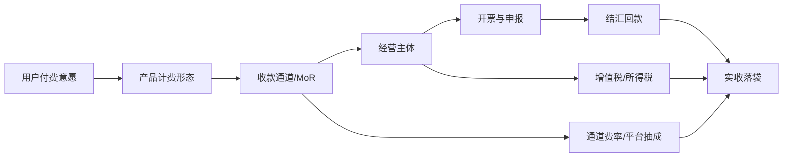

# 个人开发者支付、收款与税务专家学习报告

> 默认假设：地域以中国大陆为主轴、对照全球（美国/欧盟/香港/新加坡）；时间范围为当前至未来 3 年；用途为个人开发者（单人或极小团队、无专职财务）快速建立"收钱与合规"的领域判断力；输出深度为标准版。如需切换口径，可把地域、主体口径或深度改为新的约束后重跑。本报告的关键数字（费率、税率、政策优惠截止期）具有时效性，凡涉及时效的判断均标注 `[待验证]` 并在不确定性日志中列出复核方法。

## 导读摘要

### 这份学习材料解决什么问题

很多个人开发者能把产品做出来，却在"怎么收钱、收到钱之后怎么交税、跨境怎么回款"这几件事上反复踩坑。这些坑不是技术能力问题，而是缺少一个把支付通道、收款工具、税务主体、发票、外汇、平台抽成串起来的整体认知。这份报告就是为补上这一段认知而写的：它不是资料堆砌，也不是某个工具的教程，而是一份帮新人从"能收到第一笔钱"走到"合规地把钱落袋"的学习地图。

读完之后，你应该能够用三句话向别人解释个人开发者的"资金链"由哪些环节构成、每个环节谁在抽成、谁在承担合规责任；能够判断自己当前的产品形态和客户地域该选哪一类收款通道、注册哪一类税务主体；能够说出境内人民币收款、跨境外币收款、应用商店分成这三条主路径各自的费率结构、税务口径和主要风险；并且能够在被问及"我是不是该注册公司""该不该用 Paddle""个人收款码能不能用来收软件钱"时，给出有证据支撑的判断，而不是凭感觉。

需要先声明一个边界：本报告是教育性的领域研究，不是针对你个人情况的法律、税务或财务建议。具体申报、开票、跨境架构落地前，请以当地税务机关、支付机构最新规则和执业专业人士的意见为准。

### 本报告的三个亮点

1. **结构先行，而不是术语罗列**：把"和钱相关的问题"拆成边界、分类、资金链、八维现状、生命周期、竞争、政策、关键词、教程、自测十层，让你知道每个判断落在哪一层，而不是记住一堆孤立名词。
2. **每个关键词都是一张教学卡**：不是"XX 是什么"的一行释义，而是包含一句话通俗理解、底层逻辑、行业真实示例、应用场景、常见误区和证据，把术语变成可使用的理解。
3. **以费曼问题收尾**：学习的终点不是"看完"，而是能不能闭卷讲清楚。报告最后用 10 道自测题和评分标准帮你暴露"只是认识术语"还是"已理解结构"。

### 推荐阅读路径

如果你完全陌生，先读导读、一页速览和边界定义，建立"这个领域到底在管什么"的整体感；再读价值链/资金链一节，看清钱从用户口袋到你口袋中间被谁吃掉了几道。如果你正准备上线收费产品，重点看分类地图、八维诊断、政策与风险，以及机会风险清单，据此决定通道和主体。如果你已经能收到钱、想优化税负或解决跨境回款，重点看代表锚点、关键词库里的"跨境与海外"和"财务与运营"两组，以及不确定性日志。如果要带团队或自己复盘，直接用第 11 节教程路径和第 12 节费曼问题做闭卷自测。

### 底层逻辑说明

本报告按"先定边界、再建结构、再看动态、最后变能力"的顺序展开。先定边界，是因为这个领域最容易把"支付、理财、企业财税、跨境架构"混在一起，越混越焦虑；边界清楚后，分类地图告诉你同一件事在不同人眼里有不同切法，价值链告诉你钱到底怎么流动；接着八维现状、生命周期和竞争帮你判断哪些环节是成熟基础设施、哪些还在变化；然后用代表公司/案例做锚点、用关键词库建语言、用教程和费曼问题把知识变成可复述、可应用、可自查的能力。这个顺序的内核是：**先看见系统，再理解变化，最后形成判断**。

## 0. 默认假设与研究边界

本节先把研究对象说清楚。对新人来说，很多焦虑不是来自资料太少，而是来自一开始就把"收款""税务""理财""公司治理"几件事搅在一起。下面这张表说明本报告采用什么默认口径，也提醒哪些内容暂时不纳入分析，避免范围漂移。

| 项目 | 当前设定 | 说明 |
|---|---|---|
| 主题 | 个人开发者支付、收款与税务 | 含收款通道、税务主体、发票、跨境、应用商店抽成 |
| 地域 | 中国大陆为主，对照全球 | 政策、费率、代表公司都以这条主轴取舍 |
| 用途 | 学习与决策 | 帮个人开发者选通道、选主体、做合规判断 |
| 时间范围 | 当前至未来 3 年 | 时效性数字标注 `[待验证]` |
| 深度 | 标准版 | 50-80 关键词教学卡、10 道费曼题 |
| 排除项 | 企业级财资、上市合规、复杂跨境转让定价、投资理财、薪酬代发 | 仅作背景对照，不展开 |

研究方法上要特别说明一点：本报告撰写时所用网络检索与网页抓取工具在当前环境受限，未能逐条复核最新费率与政策原文。因此所有"会随时间变化的数字"（商户费率、税率、优惠截止期、平台抽成细则）都按训练知识给出并标注 `[待验证]`，证据层级和复核方法统一记录在第 14 节不确定性日志。判断的逻辑骨架（资金链分摊、主体口径差异、通道选择权衡）不依赖这些数字的精确值，即使数字调整，判断框架仍然成立。

## 1. 一页专家速览

这一节先给出整份报告的压缩版，当作入门前的"地图"：先知道一句话定义、几个确定事实和几个需要带着证据去判断的问题，再进入后面的结构化学习。

### 一句话定义

个人开发者的"钱的问题"，本质是给一条从"用户付款"到"税后落袋"的资金链选择组合方案，每个环节都要在**费率成本、合规风险、接入门槛、回款便利**之间权衡。

### 五个核心事实

1. 国内微信/支付宝商户标准费率约 0.6%，但个人接入需营业执照；个人收款码自 2022 年起不得用于经营性收款。`[待验证：具体费率与行业差异]`
2. 苹果 App Store 与谷歌 Google Play 对数字商品普遍抽成 30%，符合小型企业计划条件可降至 15%。`[待验证：各计划最新门槛]`
3. 小规模纳税人增值税法定征收率 3%，近年有减按 1% 征收的阶段性优惠，月销售额未达起征点免征。`[待验证：优惠截止期与起征点]`
4. Merchant of Record（如 Paddle、Lemon Squeezy）以约 5%+ 固定费用代收全球销售税，把"全球收税合规"变成了花钱可买的服务。`[待验证：最新费率]`
5. 个人年度便利化结汇额度为等值 5 万美元，超出需凭来源证明办理；这是跨境回款的核心约束之一。`[待验证：额度政策是否调整]`

### 五个关键判断

| 判断 | 类型 | 证据 | 置信度 |
|---|---|---|---|
| 个人开发者的最优资金链取决于"客户地域 × 产品形态 × 是否需要开票"三者的组合，而非单一最优通道 | inference | 通道费率、税务口径、平台抽成在不同组合下此消彼长 | high |
| 能否开票是 B 端付费的硬门槛，没解决开票就等于放弃企业客户 | inference | 国内 B 端报销需增值税发票，海外 B 端需合规票据 | high |
| 用 Merchant of Record 收跨境 SaaS 订阅，对小开发者通常比自建 Stripe+税务更省心，代价是费率更高 | hypothesis | MoR 代缴全球销售税、处理合规，节省的是隐形成本 | medium |
| 个人收款码收软件钱属于"经营性收款"，长期使用有税务与风控双重风险 | fact | 央行 2021 年终端管理通知及个人收款码新规 | high |
| 跨境架构（香港公司等）只在年收入达到一定量级后才划算，过早搭建是过度工程 | hypothesis | 维护成本、审计、回款链路复杂度随主体数量上升 | medium |

## 2. 领域定义、边界与排除项

理解这个领域，第一步不是记费率，而是知道什么算在里面、什么不算在里面。边界越清楚，后面选通道、选主体、看政策才越不会混用。个人开发者最容易犯的错，就是把"支付通道选择"和"税务主体选择"当成一件事，其实它们是资金链上两段独立的决策。

| 口径 | 定义 | 包含 | 排除 |
|---|---|---|---|
| 宽口径 | 个人开发者把产品变现并合规处理资金的全部环节 | 支付通道、收款工具、计费形态、税务主体、发票、跨境、应用商店、退款风控 | 企业财资管理、投资理财、薪酬社保 |
| 窄口径 | 1 人为主的开发者如何搭建"收款 + 税务"的最小可行方案 | 目标产品、目标客户、目标地域下的通道与主体组合 | 大团队财务流程、多主体集团架构 |
| 数据口径 | 可查证的范围 | 央行/税务/外汇规则、支付机构公示费率、平台开发者协议 | 朋友圈"我的费率"等不可复核实例 |
| 排除口径 | 容易混淆的相邻领域 | —— | 把"理财收益""公司股权激励""跨境转移定价"当成收款问题 |

一个常被忽略的边界点：**"收款"和"开票"是两件事**。能收到钱不等于能开出发票，能开票也不等于税务合规。国内 B 端客户付款前常要求先开票或随款开票，没有开票能力就意味着把这部分客户挡在门外；海外 B 端则要求合规票据或 W-8BEN 等税务文件。这个区别会在价值链和关键词里反复出现。

## 3. 多口径分类地图

同一个"收钱"问题，被支付机构、税务局、应用商店、开发者自己用完全不同的方式分类。本节把这些口径放在一起，让你知道每一种分类适合回答什么问题，避免用错切面做判断。

| 分类视角 | 用途 | 典型问题 | 代表来源/依据 |
|---|---|---|---|
| 按收款通道 | 选"钱从哪条管子进来" | 直连 vs 聚合 vs 平台抽成 vs MoR | 支付机构公示、平台开发者协议 |
| 按税务主体 | 选"以谁的名义收和报税" | 自然人 vs 个体户 vs 公司 vs 境外主体 | 税法、市场主体登记规定 |
| 按商业模式 | 选"怎么计费" | 买断 vs 订阅 vs 内购 vs 打赏 vs 广告 | 产品定价模型 |
| 按客户地域 | 选"境内还是跨境" | 境内 C/B vs 跨境 C/B，影响通道与税务 | 外汇与跨境税收规则 |
| 按产品形态 | 选"在哪个平台卖" | App/桌面/Web SaaS/插件/API | 平店上架规则、应用商店政策 |
| 按是否需要开票 | 选"能否接 B 端" | 自然人代开 vs 个体户/公司自开 vs MoR 代开 | 发票管理办法、全电发票规则 |

这几套口径会相互交叉。一个典型组合是"Web SaaS + 订阅 + 跨境 C 端 + 不开票"，对应的最优解往往是 Merchant of Record；而"桌面软件 + 买断 + 境内 B 端 + 需开票"，对应的是注册小规模公司 + 微信/支付宝商户 + 全电发票。记住结论不如记住"组合决定方案"这个方法。

## 4. 价值链、参与者与利润池

有了分类之后，需要看清楚钱到底怎么流动。这个领域的"价值链"不是传统行业的上下游，而是一条**资金链**：钱从用户口袋出发，每经过一个环节就被抽走一层（通道费、平台抽成、服务费、税），最后落到开发者口袋的是"实收"。理解这条链，才能理解为什么同样的 GMV，不同人的实收可能差很多。

| 环节/角色 | 核心能力 | 收入或价值来源 | 壁垒 | 观察指标 |
|---|---|---|---|---|
| 用户（付款方） | 消费决策 | 提供收入源头 | 付费意愿、支付习惯 | 付费转化、ARPU |
| 支付通道/收单 | 清算网络、风控 | 通道费率 0.6%~3% | 持牌、规模、风控 | 费率、成功率、拒付率 |
| 平台（应用商店） | 分发与支付捆绑 | 抽成 15%~30% | 生态锁定、审核权 | 抽成比例、结算周期 |
| Merchant of Record | 全球税务代收代缴 | 服务费 5%~10%+ | 各国税务合规能力 | 覆盖国家数、代缴范围 |
| 收款/结汇工具 | 跨境资金通道 | 汇兑与提现费 | 牌照、银行关系 | 汇率、到账时效 |
| 经营主体 | 记账、开票、申报 | 承担税负 | 注册成本、合规能力 | 税负率、合规风险 |
| 税务机关 | 征税与监管 | 增值税、所得税 | 法定强制力 | 税率、申报要求 |
| 开发者（落袋） | 产品与运营 | 税后利润 | 全链路组合优化能力 | 实收率、净利润 |

这条链上最关键的认知是：**你不是在和一个对手谈判，而是在和一串"过路费"博弈**。同样卖 100 元，走"应用商店 30% + 所得税"和走"微信商户 0.6% + 小规模 1% 增值税 + 经营所得"，实收可以相差三四十元。利润池不在某一环，而在"组合选择"里——这是后面所有判断的基础。

## 5. 当前状态八维诊断

这一节回答"现在到底发生了什么"。为了避免只看单一指标，本报告从市场、需求、供给、竞争、价值链、政策、技术和资本八个维度交叉观察，帮你判断这个领域是成熟基础设施、还是正在变化、哪里还有机会。

| 维度 | 当前状态 | 关键证据 | 不确定性 |
|---|---|---|---|
| 市场 | 全球开发者经济持续扩张，indie/个人开发者是稳定长尾 | 应用商店分成、SaaS 订阅增长、indie hackers 社区活跃 | 个人开发者收入分布缺权威统计 |
| 需求 | 要"能收到钱、费率低、税务不踩雷、跨境能回款、能开票" | 工具讨论热度集中在通道选择与税务主体 | 需求随政策变化迁移 |
| 供给 | 境内支付成熟但个人接入门槛高；跨境 MoR 工具崛起 | 微信/支付宝开放平台、Paddle/Lemon Squeezy 兴起 | MoR 费率与覆盖国时常调整 |
| 竞争 | 通道与平台侧寡头，MoR 与税务服务侧少数玩家 | 微信/支付宝、Stripe、Apple/Google 双寡头格局 | 新支付方式（数字货币）影响待观察 |
| 价值链 | 通道费 0.6%~3%、平台抽 15%~30%、MoR 抽 5%~10%+、税 0%~6%+ | 各环节公开费率区间 | 组合后的实际税负因主体而异 |
| 政策 | 国内支付持牌化、个人收款码经营化、全电发票普及；跨境 OSS/DAC7/Wayfair | 央行终端管理通知、欧盟 OSS、美国 Wayfair 判例 | 优惠政策截止期与各地执行差异 |
| 技术 | 计费引擎、订阅状态机、Webhook 对账、自动税务计算成熟 | Stripe Billing、Stripe Tax、全电发票系统 | AI 计费等新形态规则未定 |
| 资本/财务 | 个人开发者利润模型为 GMV 减层层过路费 | 实收率是核心财务指标 | 退款与拒付损耗因品类差异大 |

从八维看，这个领域的特点是"基础设施成熟、组合在变"。支付和税务的底层设施都很成熟，你不需要自己造；真正在变化的是"跨境 MoR 把全球税务做成商品"和"国内全电发票 + 个人收款码经营化"这两条线，它们在持续改变最优组合。记住这个判断，后面生命周期和趋势会展开。

## 6. 生命周期与变化变量

生命周期不是给整个领域贴标签，而是帮我们判断下一步该看什么。这个领域整体是成熟基础设施，但不同细分处于不同阶段，用一个"成熟"大词会掩盖真正的机会和风险。本节把细分分开看。

| 细分领域 | 阶段判断 | 证据 | 例外/反例 | 未来变量 |
|---|---|---|---|---|
| 境内人民币支付通道 | 成熟 | 微信/支付宝寡头、费率稳定 | 新场景费率微调 | 数字人民币推广 |
| 跨境 MoR 服务 | 成长 | EU OSS、DAC7 推动合规需求，新玩家进入 | 小开发者仍嫌贵 | 各国税务自动化规则联动 |
| 全电发票 | 成长转成熟 | 国内全面推广，开票门槛下降 | 个体户开票仍有流程成本 | 跨部门数据联网 |
| 个人开发者订阅化 | 成长 | SaaS 订阅成为主流变现 | 买断仍有市场 | 用户订阅疲劳 |
| 应用商店抽成机制 | 成熟但受冲击 | 监管与诉讼迫使开放第三方支付与降费 | 苹果/谷歌仍主导 | 反垄断裁决与第三方支付落地 |
| 加密货币收款 | 导入 | 合规灰色、波动大、工具少 | 部分开发者接受 USDT | 各国监管定性 |

对个人开发者的实际含义是：成熟的部分（境内通道、应用商店）按"接受规则、选费率最优"处理；成长的部分（MoR、全电发票、订阅化）是"早用早受益但要承担工具不完善"的成本；导入期的部分（加密货币）属于"可以了解、谨慎尝试"，不要作为主通道。

## 7. 竞争结构、壁垒与替代风险

知道领域在变化之后，还要看竞争力量。这里不只是列竞品，而是判断通道方、平台方、税务方、用户对你这个"收款组合"的影响。对个人开发者来说，议价能力的方向几乎总是"你不占上风"，理解这一点能避免浪费时间讨价还价。

| 力量 | 当前判断 | 证据 | 对学习/行动的影响 |
|---|---|---|---|
| 现有竞争 | 通道与平台寡头化，同质化靠费率与风控微差 | 微信/支付宝、Stripe、Apple/Google | 别赌"找到更便宜的小通道"，小通道有二清风险 |
| 潜在进入者 | 银行直连、数字货币、新 MoR 玩家可能改变格局 | 数字人民币试点、新 MoR 融资 | 跟踪但不押注，主通道优先选成熟者 |
| 替代品 | 免费/打赏/开源赞助/人工转账是"收款"的替代 | GitHub Sponsors、爱发电、个人转账 | 替代品收入不稳定，适合补充而非主路径 |
| 供应方（通道/平台） | 议价能力极强，开发者是价格接受者 | 持牌壁垒、生态锁定 | 把费率当约束条件，而非可谈变量 |
| 购买方（用户） | 对支付方式有强偏好，影响通道选择 | 中国习惯扫码、海外习惯信用卡/PayPal | 通道要跟用户习惯走，否则流失 |

这张表的核心结论是：**在资金链上，你的自由度不在"和通道谈判"，而在"选哪条链"**。与其纠结 0.6% 还是 0.38%，不如判断该走商户码还是 MoR、该注册公司还是先用个体户。把精力花在组合决策上，回报远高于抠单点费率。

## 8. 政策、标准、技术与资本信号

很多变化不来自产品本身，而来自政策、标准、技术路线和资本动作。本节把这些外部信号放在一起，帮你知道未来该持续跟踪哪些变量。对个人开发者，政策信号往往是"被迫换组合"的最大触发因素。

| 信号类型 | 关键内容 | 为什么重要 | 跟踪方式 |
|---|---|---|---|
| 支付监管 | 支付持牌化、二清违规、个人收款码经营化 | 决定哪些收款方式合法可用 | 央行公告、支付机构通知 |
| 税务政策 | 小规模优惠、核定征收收紧、全电发票 | 影响主体选择与税负 | 国家税务总局公告、地方执行口径 |
| 跨境税收 | 欧盟 OSS、美国 Wayfair、DAC7 平台申报 | 决定跨境是否需要代缴税 | 欧盟税局、IRS、平台政策页 |
| 外汇管理 | 个人 5 万额度、对公回款、结汇凭证 | 决定跨境钱能不能回得来 | 外汇局政策、银行口径 |
| 技术标准 | 3D Secure/SCA、PCI-DSS、全电发票接口 | 影响接入成本与合规 | 卡组织、税务机关技术文档 |
| 资本动作 | MoR 工具融资与并购、支付机构牌照变动 | 预示工具可用性与费率走向 | 行业新闻、平台公告 |

政策信号中最值得长期跟踪的是两条：国内"个人收款码经营化 + 全电发票"把自然人直接收款的灰色空间持续压缩；跨境"OSS/DAC7/Wayfair"把"卖全球不管税"的空间持续压缩。两条线共同指向一个结论——**合规门槛在上升，但合规工具也在商品化**，谁先学会用工具，谁就先拿到规模化的通行证。

## 9. 代表公司、人物、机构、案例或实践场景

抽象概念需要落到真实对象上才容易被新人理解。本节选择一些代表公司、人物、机构或场景作为学习锚点。它们不是排名，也不是推荐，而是用来说明某个概念、机制或行业逻辑。每个对象都服务于一个概念。

### 学习锚点：微信支付

| 字段 | 内容 |
|---|---|
| 类型 | 公司/支付通道 |
| 代表性原因 | 国内扫码支付寡头之一，个人开发者境内收款绕不开 |
| 它说明的底层逻辑 | 通道费率与接入门槛并存：费率低但需营业执照，自然人难以直接接入商户 |
| 新人可学什么 | 0.6% 费率背后是"持牌收单 + 商户资质"的合规前提 |
| 不应过度推断 | 不能把微信支付等同于"个人收款码"，二者用途与合规口径不同 |
| 来源 | 微信支付开放平台公示 `[待验证]` |

### 学习锚点：支付宝

| 字段 | 内容 |
|---|---|
| 类型 | 公司/支付通道 |
| 代表性原因 | 与微信支付并列的国内双寡头，商户接入规则与费率结构可作为对照 |
| 它说明的底层逻辑 | 同类通道在费率与风控上趋同，竞争差异更多在生态与流量 |
| 新人可学什么 | 双寡头意味着"二选一"不如"两个都接"，但接入成本要算清 |
| 不应过度推断 | 不代表所有支付方式费率都这么低，信用卡跨境费率高得多 |
| 来源 | 支付宝开放平台公示 `[待验证]` |

### 学习锚点：Stripe

| 字段 | 内容 |
|---|---|
| 类型 | 公司/支付通道与计费基础设施 |
| 代表性原因 | 跨境信用卡收款的标杆，开发者体验最好，但中国大陆主体不可直接使用 |
| 它说明的底层逻辑 | 通道能力 + 计费引擎 + 税务自动化可以打包，但受地域准入限制 |
| 新人可学什么 | "好用的工具未必对你可用"，地域准入是第一道筛子 |
| 不应过度推断 | Stripe Tax 不等于 Merchant of Record，它算税但不替你代缴全部 |
| 来源 | Stripe 官网定价页 `[待验证]` |

### 学习锚点：Paddle

| 字段 | 内容 |
|---|---|
| 类型 | 公司/Merchant of Record |
| 代表性原因 | 把"全球收税合规"做成商品的典型 MoR，常被 SaaS 开发者用来收跨境订阅 |
| 它说明的底层逻辑 | 多付一层服务费，换"不用自己在各国注册税号、申报销售税" |
| 新人可学什么 | 隐形成本（合规人力）有时比显性费率更贵，MoR 卖的是省心 |
| 不应过度推断 | MoR 费率高于裸通道，量大后自建可能更便宜 |
| 来源 | Paddle 官网定价页 `[待验证]` |

### 学习锚点：Lemon Squeezy

| 字段 | 内容 |
|---|---|
| 类型 | 公司/Merchant of Record |
| 代表性原因 | 以对独立开发者友好的定位切入 MoR 市场，2024 年被 Stripe 收购并整合 |
| 它说明的底层逻辑 | MoR 市场仍在成长，玩家通过定位与集成竞争；被收购预示工具走向整合 |
| 新人可学什么 | 选工具要看"会不会被并购导致规则变动"，平台依赖有风险 |
| 不应过度推断 | 被收购不等于会下线，但迁移成本要提前想 |
| 来源 | 行业新闻报道 `[待验证]` |

### 学习锚点：苹果 App Store / 谷歌 Google Play

| 字段 | 内容 |
|---|---|
| 类型 | 平台/分发与支付捆绑 |
| 代表性原因 | 移动 App 数字商品的事实唯一通道，抽成 30%/15% 是最大单点成本 |
| 它说明的底层逻辑 | 分发与支付捆绑形成锁定，平台抽成是"过路费"而非可谈费率 |
| 新人可学什么 | 移动数字商品要把 30% 当作约束，定价要把它算进去 |
| 不应过度推断 | 桌面软件、Web SaaS 不受此抽成约束，可绕开 |
| 来源 | Apple/Google 开发者协议 `[待验证]` |

### 学习锚点：PayPal / Wise

| 字段 | 内容 |
|---|---|
| 类型 | 公司/跨境收款与结汇工具 |
| 代表性原因 | 个人开发者跨境回款的常见工具，连接外币收款与人民币结汇 |
| 它说明的底层逻辑 | 跨境资金链的"最后一公里"：钱收到外币账户后还要结汇回国内 |
| 新人可学什么 | 跨境不是"收得到"就够，还要想"回得来、额度够不够" |
| 不应过度推断 | 汇率与手续费叠加后实际成本不低，要算总账 |
| 来源 | PayPal/Wise 官网 `[待验证]` |

### 学习锚点：Pieter Levels（实践场景/人物）

| 字段 | 内容 |
|---|---|
| 类型 | 人物/独立开发者案例 |
| 代表性原因 | 以一人公司形态靠多个订阅/买断产品持续盈利的公开代表 |
| 它说明的底层逻辑 | 个人开发者变现的关键是"产品形态 × 通道 × 主体"的最小可行组合，而非复杂架构 |
| 新人可学什么 | 先跑通收款再说优化；过早搭建公司架构是过度工程 |
| 不应过度推断 | 他的地域与通道选择未必适用中国大陆开发者，照搬有风险 |
| 来源 | 公开访谈与博客 `[待验证]` |

### 学习锚点：国家税务总局 / 中国人民银行 / 国家外汇管理局

| 字段 | 内容 |
|---|---|
| 类型 | 机构/监管与规则制定者 |
| 代表性原因 | 决定国内"怎么收合法、怎么报税、外汇怎么回"的规则源头 |
| 它说明的底层逻辑 | 支付、税务、外汇是三条独立的监管线，不能只看一条 |
| 新人可学什么 | 遇到合规疑问回规则源头，而不是听二手转述 |
| 不应过度推断 | 规则原文不等于地方执行口径，落地前要问当地 |
| 来源 | 各机构官网公告 `[待验证]` |

### 学习锚点：个人收款码经营化案例

| 字段 | 内容 |
|---|---|
| 类型 | 场景/政策落地案例 |
| 代表性原因 | 2022 年个人收款码新规后，用个人码收软件钱被归入经营性收款 |
| 它说明的底层逻辑 | "收款工具"与"收款用途"绑定监管，工具合规不等于用途合规 |
| 新人可学什么 | 不要用个人收款码收产品钱，风险是税务与风控双重 |
| 不应过度推断 | 不是所有个人收款都被禁，亲友往来不受影响 |
| 来源 | 央行 2021 年终端管理通知及配套解读 `[待验证]` |

## 10. 关键词库与概念关系图

关键词是进入这个领域的语言入口，但只背词不够。本节把关键词拆成教学卡：先用一句话讲明白，再解释概念、底层逻辑、真实例子和应用场景，帮你把术语变成可使用的理解。标准版输出 50-80 张卡，本报告按模块分组，每张卡用两列表格，避免在 Word/PDF 里挤压。

### 关键词分组

| 模块 | 关键词 |
|---|---|
| 边界与分类 | 收款通道、支付网关、聚合支付、Merchant of Record、二清、备付金、收单/发卡/清算、支付牌照 |
| 需求与客户 | 付费意愿、付费转化、B 端开票需求、退款率、拒付 Chargeback、ARPU/MRR/ARR |
| 产品与计费形态 | 一次性买断、订阅制、应用内购、免费增值、终身买断、按量计费、打赏/赞助、试用期与 churn |
| 技术与工艺 | 计费引擎、订阅状态机、Webhook 回调、幂等与对账、3D Secure/SCA、PCI-DSS/Token 化、计费周期对齐 |
| 价值链/资金链 | 通道费率、平台抽成、结算周期、提现、分账、实收率、外汇结汇、汇兑损益 |
| 商业模式 | SaaS 订阅、应用商店分发、开源赞助、广告分成、联盟营销 |
| 竞争格局 | 微信/支付宝双寡头、Stripe 生态、Paddle/Lemon Squeezy、App Store/Google Play、PayPal/Wise |
| 政策与风险 | 二清违规、ICP 备案/EDI 证、个人收款码经营化、增值税、经营所得税率、核定/查账征收、全电发票、虚开发票、外汇额度 |
| 跨境与海外 | W-8BEN、VAT MOSS/OSS、Wayfair/经济实质、DAC7 平台申报、境外主体 |
| 财务与运营 | 汇算清缴、研发费用加计扣除、分红个税、代账与记账 |
| 趋势与机会 | 全电发票普及、税务自动化、AI 按量计费、加密货币收款 |

### 关键词卡片

#### 关键词：收款通道

| 字段 | 内容 |
|---|---|
| 一句话通俗理解 | 钱从用户账户走到你账户所经过的那条"管子"。 |
| 概念阐述 | 提供资金扣款、清算、结算能力的服务或平台，是资金链的第一段。 |
| 底层逻辑 | 资金不能凭空转移，必须经过持牌机构清算；通道把这件事封装成 API。 |
| 所属模块 | 边界与分类 |
| 作用 | 决定费率、结算时效、风控、接入门槛，是组合决策的第一选择。 |
| 行业真实示例 | 微信支付、支付宝、Stripe、PayPal。 |
| 应用场景 | 上线付费产品前，先按"客户地域 + 是否有执照"筛通道。 |
| 可观察指标 | 费率、结算周期、成功率、拒付率。 |
| 相关概念 | 支付网关、聚合支付、Merchant of Record。 |
| 常见误区 | 以为费率越低越好，忽略风控与二清风险。 |
| 证据 | 支付机构公示 `[待验证]` |

#### 关键词：支付网关

| 字段 | 内容 |
|---|---|
| 一句话通俗理解 | 在你的网站和银行网络之间"翻译"付款请求的那一层。 |
| 概念阐述 | 负责接收、加密、转发卡支付请求并返回结果的技术接入层。 |
| 底层逻辑 | 银行清算网络不直接对接商户，需要网关做协议转换与安全处理。 |
| 所属模块 | 边界与分类 |
| 作用 | 决定接入方式、合规要求（如 PCI-DSS）与跨境可用性。 |
| 行业真实示例 | Stripe、Authorize.net、国内银行网关。 |
| 应用场景 | Web SaaS 收信用卡时选择网关。 |
| 可观察指标 | 接入文档质量、成功率、支持的卡组织。 |
| 相关概念 | 收款通道、收单机构、Token 化。 |
| 常见误区 | 把网关等同于收单机构；网关偏技术，收单偏清算与资质。 |
| 证据 | 卡组织与网关文档 `[待验证]` |

#### 关键词：聚合支付

| 字段 | 内容 |
|---|---|
| 一句话通俗理解 | 一个接口帮你同时对接微信、支付宝、银联等多个通道。 |
| 概念阐述 | 在多通道之上封装统一 API 与后台的中间层服务商。 |
| 底层逻辑 | 商户不想接 N 套接口，聚合层用一套 API 换取费率差价与服务费。 |
| 所属模块 | 边界与分类 |
| 作用 | 降低接入成本，但要警惕"二清"风险（资金先归集到聚合方再下发）。 |
| 行业真实示例 | 收钱吧、Ping++ 等。 |
| 应用场景 | 中小商户想一次接入多种国内支付方式。 |
| 可观察指标 | 是否持牌或与持牌机构资金直连、费率、到账时效。 |
| 相关概念 | 二清、备付金、支付牌照。 |
| 常见误区 | 以为聚合支付一定合规；关键看资金是否经过无牌归集。 |
| 证据 | 央行支付业务监管要求 `[待验证]` |

#### 关键词：Merchant of Record (MoR)

| 字段 | 内容 |
|---|---|
| 一句话通俗理解 | 挂名"卖方"帮你向全球收钱并代缴销售税的服务商。 |
| 概念阐述 | 以自己作为对买方的销售方，承担收款、税务代收代缴、合规责任。 |
| 底层逻辑 | 跨境销售要在各国注册税号并申报，MoR 把这件事集中化、商品化。 |
| 所属模块 | 边界与分类 |
| 作用 | 让小开发者也能"全球卖、合规税"，代价是更高的费率。 |
| 行业真实示例 | Paddle、Lemon Squeezy。 |
| 应用场景 | 跨境 SaaS 订阅、数字商品全球销售。 |
| 可观察指标 | 覆盖国家数、代缴税种、费率、结算周期。 |
| 相关概念 | Stripe Tax、VAT MOSS/OSS、Wayfair。 |
| 常见误区 | 把 MoR 等同于普通支付通道；MoR 多了"代你做卖方+代缴税"。 |
| 证据 | MoR 服务商公示 `[待验证]` |

#### 关键词：二清

| 字段 | 内容 |
|---|---|
| 一句话通俗理解 | 没牌照的人先把别人的钱收进来再分发出去，这是违法的。 |
| 概念阐述 | 无证机构归集商户资金再清算给商户，本质是无证从事支付清算业务。 |
| 底层逻辑 | 资金归集即"沉淀资金池"，涉及备付金安全与反洗钱，必须持牌。 |
| 所属模块 | 边界与分类 |
| 作用 | 选通道时的合规红线：资金是否经过无牌中间方归集。 |
| 行业真实示例 | 部分聚合支付、App 内代收代付被认定为二清的案例。 |
| 应用场景 | 评估"便宜的小通道"时先问资金流向。 |
| 可观察指标 | 资金是否直接从持牌机构结算到商户账户。 |
| 相关概念 | 支付牌照、备付金、聚合支付。 |
| 常见误区 | 以为"大平台担保"就安全；关键是资金归集主体有无牌照。 |
| 证据 | 央行支付监管规则 `[待验证]` |

#### 关键词：备付金

| 字段 | 内容 |
|---|---|
| 一句话通俗理解 | 用户付了钱、商户还没提走时，暂时趴在支付机构账上的那笔钱。 |
| 概念阐述 | 支付机构预收但尚未结算给商户的资金，必须专户存管。 |
| 底层逻辑 | 防止支付机构挪用客户资金、防范挪用与跑路风险。 |
| 所属模块 | 边界与分类 |
| 作用 | 理解结算周期与提现延迟的根源，也是平台合规的监管重点。 |
| 行业真实示例 | 国内支付机构备付金集中存管制度。 |
| 应用场景 | 解释"为什么 T+1 才到账"与"提现为什么有额度限制"。 |
| 可观察指标 | 结算周期、提现时效、备付金存管比例。 |
| 相关概念 | 结算周期、二清、支付牌照。 |
| 常见误区 | 以为钱"立刻就在平台账上"可以随便用；其实是受限资金。 |
| 证据 | 央行备付金管理规定 `[待验证]` |

#### 关键词：收单/发卡/清算

| 字段 | 内容 |
|---|---|
| 一句话通俗理解 | 一笔卡支付背后"替商户收款、替用户付款、做中间轧差"的三个角色。 |
| 概念阐述 | 收单机构服务商户、发卡机构服务持卡人、清算网络负责跨行轧差。 |
| 底层逻辑 | 卡支付涉及两方银行，必须有中间清算网络和两侧服务机构才能完成。 |
| 所属模块 | 边界与分类 |
| 作用 | 理解费率构成（收单费、网络费、交换费）来自哪一层。 |
| 行业真实示例 | 银联（清算）、各银行（发卡）、收单机构。 |
| 应用场景 | 看懂跨境信用卡费率为何比国内扫码高。 |
| 可观察指标 | 交换费、网络费、收单费率分层。 |
| 相关概念 | 支付网关、通道费率。 |
| 常见误区 | 以为费率全是通道赚的；其实很大一部分是交换费给发卡行。 |
| 证据 | 卡组织费率结构 `[待验证]` |

#### 关键词：支付牌照

| 字段 | 内容 |
|---|---|
| 一句话通俗理解 | 国家允许你做支付业务的"通行证"，没有就是非法集资。 |
| 概念阐述 | 央行核发的支付业务许可证，区分储值账户运营、支付交易处理等类型。 |
| 底层逻辑 | 支付涉及公众资金安全与反洗钱，必须准入管理。 |
| 所属模块 | 边界与分类 |
| 作用 | 判断一个支付服务是否合规的根本依据。 |
| 行业真实示例 | 微信支付、支付宝等持牌机构。 |
| 应用场景 | 选通道或聚合工具时核实其持牌或与持牌机构合作。 |
| 可观察指标 | 牌照类型、业务范围、是否在有效期内。 |
| 相关概念 | 二清、备付金。 |
| 常见误区 | 以为"有公司就能做支付"；个人开发者绝不应自建资金归集。 |
| 证据 | 央行许可证公示 `[待验证]` |

#### 关键词：付费意愿

| 字段 | 内容 |
|---|---|
| 一句话通俗理解 | 用户到底愿不愿意为你的东西掏钱，掏多少。 |
| 概念阐述 | 目标用户为某类产品付费的倾向与价格承受度。 |
| 底层逻辑 | 付费意愿决定定价天花板和变现路径，是收款可行性的前提。 |
| 所属模块 | 需求与客户 |
| 作用 | 决定产品能不能直接收费，还是走免费增值/广告/打赏。 |
| 行业真实示例 | 国内 C 端工具付费意愿弱于海外，B 端付费意愿高但需开票。 |
| 应用场景 | 选商业模式前先评估目标用户付费意愿。 |
| 可观察指标 | 试用→付费转化率、客单价、同类产品定价。 |
| 相关概念 | 付费转化、ARPU、免费增值。 |
| 常见误区 | 以为产品好就一定有人付费；付费意愿是独立变量。 |
| 证据 | 行业观察 `[待验证]` |

#### 关键词：付费转化

| 字段 | 内容 |
|---|---|
| 一句话通俗理解 | 看到产品的人里有多少真的掏了钱。 |
| 概念阐述 | 从访问/试用到完成付费的用户比例。 |
| 底层逻辑 | 收款问题的前提是有人付款，转化率决定收入规模。 |
| 所属模块 | 需求与客户 |
| 作用 | 决定通道与计费设计要优先"减少付费摩擦"。 |
| 行业真实示例 | 多加一步支付跳转就可能掉几个百分点转化。 |
| 应用场景 | 优化结账流程、减少表单字段、支持常用支付方式。 |
| 可观察指标 | 转化漏斗各步流失率。 |
| 相关概念 | 付费意愿、ARPU、试用期与 churn。 |
| 常见误区 | 只盯费率不盯转化；转化损失常大于费率差异。 |
| 证据 | 产品运营数据 `[待验证]` |

#### 关键词：B 端开票需求

| 字段 | 内容 |
|---|---|
| 一句话通俗理解 | 企业客户付钱前要你先开发票，不然他报不了销。 |
| 概念阐述 | 企业采购要求供应商提供合规发票作为入账与抵扣凭证。 |
| 底层逻辑 | 企业财务需凭票记账和进项抵扣，没票=不能买。 |
| 所属模块 | 需求与客户 |
| 作用 | 决定你能否接 B 端：自然人开票难，公司/MoR 开票易。 |
| 行业真实示例 | 国内 B 端要求增值税普通/专用发票。 |
| 应用场景 | 决定是否注册公司或用可开票的渠道。 |
| 可观察指标 | B 端订单占比、开票请求率。 |
| 相关概念 | 全电发票、增值税、个体户。 |
| 常见误区 | 以为收到钱就完了；B 端不开票会被退款或丢单。 |
| 证据 | 发票管理办法 `[待验证]` |

#### 关键词：退款率

| 字段 | 内容 |
|---|---|
| 一句话通俗理解 | 卖出去的单里有多少被退了回来。 |
| 概念阐述 | 一定周期内退款金额或笔数占总成交的比例。 |
| 底层逻辑 | 退款既损失收入又可能产生通道成本，是隐形成本。 |
| 所属模块 | 需求与客户 |
| 作用 | 影响实收率与定价，需在财务模型里预留。 |
| 行业真实示例 | 订阅产品退款/取消率、应用商店退款。 |
| 应用场景 | 定价时按历史退款率折算实收。 |
| 可观察指标 | 退款率、退款原因分布。 |
| 相关概念 | 拒付 Chargeback、实收率、试用期与 churn。 |
| 常见误区 | 只算 GMV 不算退款；实际收入常低于预期。 |
| 证据 | 经营数据 `[待验证]` |

#### 关键词：拒付 Chargeback

| 字段 | 内容 |
|---|---|
| 一句话通俗理解 | 用户找银行说"这笔不是我刷的/有问题"，银行直接把钱从你账户扣回去。 |
| 概念阐述 | 持卡人向发卡行发起争议，银行撤销交易并扣回商户资金。 |
| 底层逻辑 | 信用卡体系保护持卡人，商户承担欺诈与争议风险。 |
| 所属模块 | 需求与客户 |
| 作用 | 跨境卡支付的主要风险源，高拒付率会被通道罚款或关停。 |
| 行业真实示例 | 跨境 SaaS 被盗卡刷单导致拒付激增。 |
| 应用场景 | 跨境收款要做风控、对争议快速应诉。 |
| 可观察指标 | 拒付率、争议胜诉率。 |
| 相关概念 | 退款率、3D Secure、风控。 |
| 常见误区 | 以为退款就等于拒付；拒付是银行层面的强制撤销，成本更高。 |
| 证据 | 卡组织争议规则 `[待验证]` |

#### 关键词：ARPU/MRR/ARR

| 字段 | 内容 |
|---|---|
| 一句话通俗理解 | 每个用户平均给你多少钱、每月经常性收入、年化经常性收入。 |
| 概念阐述 | 单用户平均收入、月度/年度经常性收入，订阅业务的核心指标。 |
| 底层逻辑 | 订阅模式收入可预期，用经常性收入衡量规模与增速。 |
| 所属模块 | 需求与客户 |
| 作用 | 把"收了多少钱"变成可预测的财务模型。 |
| 行业真实示例 | SaaS 公司普遍以 MRR/ARR 汇报。 |
| 应用场景 | 评估产品健康度与定价调整效果。 |
| 可观察指标 | MRR、ARR、净留存、churn。 |
| 相关概念 | 订阅制、试用期与 churn、LTV。 |
| 常见误区 | 把一次性收入算进 MRR；只有可重复的才算经常性。 |
| 证据 | SaaS 财务惯例 `[待验证]` |

#### 关键词：一次性买断

| 字段 | 内容 |
|---|---|
| 一句话通俗理解 | 用户付一次钱，永久用这个软件。 |
| 概念阐述 | 单次付款获取永久使用权的计费形态。 |
| 底层逻辑 | 适合功能稳定、迭代少的产品；收入不可预期但心智简单。 |
| 所属模块 | 产品与计费形态 |
| 作用 | 决定通道与税务按"单次交易"处理，无续费逻辑。 |
| 行业真实示例 | 桌面软件、插件买断。 |
| 应用场景 | 工具类产品快速变现。 |
| 可观察指标 | 销量、客单价、退款率。 |
| 相关概念 | 终身买断 LTD、订阅制。 |
| 常见误区 | 以为买断最省心；后续升级如何收费要先想好。 |
| 证据 | 行业惯例 `[待验证]` |

#### 关键词：订阅制 Subscription

| 字段 | 内容 |
|---|---|
| 一句话通俗理解 | 用户每月或每年付一笔钱，持续用、持续收。 |
| 概念阐述 | 按周期付费、按周期提供服务的计费形态。 |
| 底层逻辑 | 收入可预期、LTV 高，但需管理续费与 churn。 |
| 所属模块 | 产品与计费形态 |
| 作用 | 引入订阅状态机、周期对齐、续费与 churn 管理。 |
| 行业真实示例 | SaaS、媒体会员、云服务。 |
| 应用场景 | 持续迭代的在线产品。 |
| 可观察指标 | MRR、churn、净留存。 |
| 相关概念 | 订阅状态机、试用期与 churn、MRR/ARR。 |
| 常见误区 | 以为开了订阅就一劳永逸；churn 会悄悄吃掉收入。 |
| 证据 | SaaS 行业实践 `[待验证]` |

#### 关键词：应用内购 IAP

| 字段 | 内容 |
|---|---|
| 一句话通俗理解 | App 里买虚拟商品/功能，钱必须走应用商店的支付。 |
| 概念阐述 | 应用内通过平台支付系统购买数字内容，受平台抽成约束。 |
| 底层逻辑 | 平台把分发与支付捆绑，数字商品必须走 IAP。 |
| 所属模块 | 产品与计费形态 |
| 作用 | 决定移动数字商品必须承担 30%/15% 抽成。 |
| 行业真实示例 | 游戏、会员、解锁功能。 |
| 应用场景 | 移动 App 变现数字内容。 |
| 可观察指标 | 抽成比例、IAP 收入占比。 |
| 相关概念 | 应用商店分发、平台抽成。 |
| 常见误区 | 以为可以绕开 IAP 用第三方支付收数字商品；平台规则通常禁止。 |
| 证据 | Apple/Google 开发者协议 `[待验证]` |

#### 关键词：免费增值 Freemium

| 字段 | 内容 |
|---|---|
| 一句话通俗理解 | 基础功能免费，进阶功能收费，用免费换规模。 |
| 概念阐述 | 提供免费版本获客，通过付费版本或增值变现的模型。 |
| 底层逻辑 | 用免费降低获客门槛，再从少数付费用户身上变现。 |
| 所属模块 | 产品与计费形态 |
| 作用 | 决定付费转化是核心指标，通道要支持低摩擦升级。 |
| 行业真实示例 | Notion、Figma 等免费档+付费档。 |
| 应用场景 | 用户基数大、边际成本低的产品。 |
| 可观察指标 | 免费转付费率、付费用户占比。 |
| 相关概念 | 付费转化、试用期与 churn。 |
| 常见误区 | 以为免费用户越多越好；转化率不够则只烧服务器钱。 |
| 证据 | 行业实践 `[待验证]` |

#### 关键词：终身买断 LTD

| 字段 | 内容 |
|---|---|
| 一句话通俗理解 | 付一次钱永久用，常作为订阅的促销替代。 |
| 概念阐述 | 一次性付费获得永久使用权，区别于普通买断常含后续更新。 |
| 底层逻辑 | 用"一次性高价值"换短期现金流或早期用户。 |
| 所属模块 | 产品与计费形态 |
| 作用 | 短期提振收入但透支未来订阅，需控制发放量。 |
| 行业真实示例 | 早期 SaaS 的 LTD 促销、AppSumo 上架。 |
| 应用场景 | 早期变现或冷启动。 |
| 可观察指标 | LTD 占比、对 MRR 的蚕食。 |
| 相关概念 | 一次性买断、订阅制。 |
| 常见误区 | LTD 卖太多会长期拖累经常性收入。 |
| 证据 | 行业观察 `[待验证]` |

#### 关键词：按量计费

| 字段 | 内容 |
|---|---|
| 一句话通俗理解 | 用多少算多少，像水电费一样。 |
| 概念阐述 | 根据使用量（次数、Token、存储等）计费的模型。 |
| 底层逻辑 | 把成本与收入对齐到同一计量单位，公平但难预测。 |
| 所属模块 | 产品与计费形态 |
| 作用 | 引入计量、配额、预付费等计费引擎能力。 |
| 行业真实示例 | API 按 Token、云服务按用量。 |
| 应用场景 | AI 产品、API 服务。 |
| 可观察指标 | 单位成本、用量分布、超额率。 |
| 相关概念 | 计费引擎、AI 按量计费。 |
| 常见误区 | 以为按量一定省钱；重度用户反而更贵。 |
| 证据 | 云服务定价 `[待验证]` |

#### 关键词：打赏/赞助

| 字段 | 内容 |
|---|---|
| 一句话通俗理解 | 用户自愿给你钱，不强求回报。 |
| 概念阐述 | 基于自愿捐赠的非对价收入，常见于内容与开源。 |
| 底层逻辑 | 不构成商品交易，法律与税务口径与销售不同。 |
| 所属模块 | 产品与计费形态 |
| 作用 | 作为补充收入，不适合作为主路径。 |
| 行业真实示例 | 爱发电、GitHub Sponsors、Buy Me a Coffee。 |
| 应用场景 | 开源项目、独立内容创作者。 |
| 可观察指标 | 打赏人数、客单价、稳定性。 |
| 相关概念 | 开源赞助、付费意愿。 |
| 常见误区 | 以为打赏不用交税；捐赠性质收入仍可能涉及所得税。 |
| 证据 | 平台规则与税务口径 `[待验证]` |

#### 关键词：试用期与 churn

| 字段 | 内容 |
|---|---|
| 一句话通俗理解 | 免费试几天，以及用户中途不续约跑掉的比例。 |
| 概念阐述 | 试用期内免费、到期转付费；churn 是周期性流失率。 |
| 底层逻辑 | 试用降低决策门槛，churn 衡量留存健康度。 |
| 所属模块 | 产品与计费形态 |
| 作用 | 决定计费系统要处理试用期状态转换与到期续费。 |
| 行业真实示例 | SaaS 7/14 天试用。 |
| 应用场景 | 订阅产品设计获客与留存。 |
| 可观察指标 | 试用转化率、churn、净留存。 |
| 相关概念 | 订阅制、MRR/ARR、订阅状态机。 |
| 常见误区 | 只看新增不看 churn；高 churn 让增长白费。 |
| 证据 | SaaS 实践 `[待验证]` |

#### 关键词：计费引擎

| 字段 | 内容 |
|---|---|
| 一句话通俗理解 | 自动算"谁该付多少、什么时候付、付了没"的系统。 |
| 概念阐述 | 管理定价、计量、出账、扣款、续费、对账的核心模块。 |
| 底层逻辑 | 订阅与按量计费逻辑复杂，手写易出错，需要专门引擎。 |
| 所属模块 | 技术与工艺 |
| 作用 | 决定变现能否规模化，自建 vs 用通道自带引擎的取舍。 |
| 行业真实示例 | Stripe Billing、Lemon Squeezy 内置计费。 |
| 应用场景 | 订阅/按量产品的后端。 |
| 可观察指标 | 出账准确率、计费异常率。 |
| 相关概念 | 订阅状态机、计费周期对齐。 |
| 常见误区 | 以为接了支付接口就够了；计费逻辑是另一层复杂度。 |
| 证据 | 计费平台文档 `[待验证]` |

#### 关键词：订阅状态机

| 字段 | 内容 |
|---|---|
| 一句话通俗理解 | 一个用户在"试用中/付费中/过期/取消"这些状态之间怎么跳转的规则。 |
| 概念阐述 | 描述订阅生命周期状态及迁移条件的模型。 |
| 底层逻辑 | 状态错乱会导致错扣、漏扣、权益错配。 |
| 所属模块 | 技术与工艺 |
| 作用 | 计费系统正确性的基石，边界条件最易出 bug。 |
| 行业真实示例 | 试用转付费、降级升级、宽限期。 |
| 应用场景 | 设计订阅产品时先画状态机。 |
| 可观察指标 | 状态迁移异常数、权益与扣款一致性。 |
| 相关概念 | 计费引擎、计费周期对齐、试用期与 churn。 |
| 常见误区 | 忽略宽限期与重试，导致非主动流失。 |
| 证据 | 计费系统设计经验 `[待验证]` |

#### 关键词：Webhook 回调

| 字段 | 内容 |
|---|---|
| 一句话通俗理解 | 支付平台把"这笔钱到了"主动推给你服务器的一条通知。 |
| 概念阐述 | 支付结果异步推送到商户指定接口的通知机制。 |
| 底层逻辑 | 支付是异步的，不能靠同步返回判断成功，必须以回调为准。 |
| 所属模块 | 技术与工艺 |
| 作用 | 决定"何时发货/开通权益"，是收款的最后一公里技术。 |
| 行业真实示例 | 各支付平台的异步通知。 |
| 应用场景 | 收到回调后才给用户开会员。 |
| 可观察指标 | 回调到达率、处理延迟。 |
| 相关概念 | 幂等与对账、签名验签。 |
| 常见误区 | 用同步跳转结果判断成功；只有回调可信。 |
| 证据 | 支付平台文档 `[待验证]` |

#### 关键词：幂等与对账

| 字段 | 内容 |
|---|---|
| 一句话通俗理解 | 同一笔通知来十次，你只发货一次；每天拿自己的账和通道的账核对。 |
| 概念阐述 | 幂等保证重复请求不重复处理；对账保证两方账目一致。 |
| 底层逻辑 | 网络会重发回调，不做幂等会重复发货；不做对账会漏单错单。 |
| 所属模块 | 技术与工艺 |
| 作用 | 收款正确性的兜底机制。 |
| 行业真实示例 | 用订单号做幂等键、每日对账文件核对。 |
| 应用场景 | 任何接入支付的系统都要做。 |
| 可观察指标 | 重复处理数、对账差异率。 |
| 相关概念 | Webhook 回调、订单号。 |
| 常见误区 | 以为回调一次就够了；不做幂等早晚会重复发货。 |
| 证据 | 工程实践 `[待验证]` |

#### 关键词：3D Secure/SCA

| 字段 | 内容 |
|---|---|
| 一句话通俗理解 | 买信用卡东西时跳一个验证码确认是本人在刷。 |
| 概念阐述 | 卡组织强认证协议（3DS）/欧盟强客户认证要求（SCA）。 |
| 底层逻辑 | 把欺诈与拒付风险在交易前转移一部分给发卡行。 |
| 所属模块 | 技术与工艺 |
| 作用 | 跨境卡支付降低拒付、满足欧盟合规。 |
| 行业真实示例 | 欧洲支付普遍强制 SCA。 |
| 应用场景 | 跨境收信用卡时开启。 |
| 可观察指标 | 3DS 触发率、认证通过率、拒付率。 |
| 相关概念 | 拒付 Chargeback、PCI-DSS。 |
| 常见误区 | 以为加验证会掉转化就不用；合规地区是强制要求。 |
| 证据 | 卡组织与欧盟规则 `[待验证]` |

#### 关键词：PCI-DSS/Token 化

| 字段 | 内容 |
|---|---|
| 一句话通俗理解 | 不要自己存信用卡号，让通道存，你只拿一个代号。 |
| 概念阐述 | 卡数据安全标准；Token 化用令牌替代真实卡号降低合规范围。 |
| 底层逻辑 | 接触卡号就要承担 PCI 合规成本，Token 化把风险转给通道。 |
| 所属模块 | 技术与工艺 |
| 作用 | 个人开发者绝不应自存卡号，用通道 Token 即可。 |
| 行业真实示例 | Stripe 用 Token 代表卡。 |
| 应用场景 | 任何收卡场景。 |
| 可观察指标 | 是否存储明文卡号、PCI 范围。 |
| 相关概念 | 支付网关、3D Secure。 |
| 常见误区 | 以为自己加密存一下就行；合规要求远不止加密。 |
| 证据 | PCI 安全标准委员会 `[待验证]` |

#### 关键词：计费周期对齐 Proration

| 字段 | 内容 |
|---|---|
| 一句话通俗理解 | 用户中途升级套餐，按剩余天数补差价。 |
| 概念阐述 | 周期内变更按比例计算差额的机制。 |
| 底层逻辑 | 保证升级降级公平，避免用户多付或少付。 |
| 所属模块 | 技术与工艺 |
| 作用 | 订阅系统必备能力，影响用户体验与收入准确性。 |
| 行业真实示例 | SaaS 升降级按比例扣补。 |
| 应用场景 | 支持升降级的产品。 |
| 可观察指标 | 升降级投诉率、计费差异率。 |
| 相关概念 | 订阅状态机、计费引擎。 |
| 常见误区 | 忽略按比例会导致用户被多收引发投诉。 |
| 证据 | 计费平台文档 `[待验证]` |

#### 关键词：通道费率

| 字段 | 内容 |
|---|---|
| 一句话通俗理解 | 通道从每笔钱里抽走的百分比。 |
| 概念阐述 | 支付通道按交易金额收取的服务费比例。 |
| 底层逻辑 | 通道提供清算与风控，按规模收取对价。 |
| 所属模块 | 价值链/资金链 |
| 作用 | 资金链第一层成本，是组合决策的关键变量。 |
| 行业真实示例 | 国内扫码约 0.6%、跨境卡约 2.9%+。 |
| 应用场景 | 估算实收率。 |
| 可观察指标 | 费率、是否有固定费。 |
| 相关概念 | 平台抽成、实收率。 |
| 常见误区 | 只比费率不看风控与合规。 |
| 证据 | 通道公示 `[待验证]` |

#### 关键词：平台抽成

| 字段 | 内容 |
|---|---|
| 一句话通俗理解 | 应用商店从你卖的钱里直接拿走的三成。 |
| 概念阐述 | 分发平台对通过其支付成交的收入抽取的分成。 |
| 底层逻辑 | 平台用分发与支付捆绑换取分成，是锁定型成本。 |
| 所属模块 | 价值链/资金链 |
| 作用 | 移动数字商品最大单点成本，定价必须计入。 |
| 行业真实示例 | 苹果/谷歌 30%、小型企业计划 15%。 |
| 应用场景 | 移动 App 定价与盈利测算。 |
| 可观察指标 | 抽成比例、是否符合降费条件。 |
| 相关概念 | IAP、应用商店分发。 |
| 常见误区 | 以为能轻易绕开；绕开通常违反平台规则。 |
| 证据 | 平台协议 `[待验证]` |

#### 关键词：结算周期

| 字段 | 内容 |
|---|---|
| 一句话通俗理解 | 钱到账要等几天，T+1 就是第二天。 |
| 概念阐述 | 从交易完成到资金可用的间隔。 |
| 底层逻辑 | 清算与风控需要时间，备付金存管也有节奏。 |
| 所属模块 | 价值链/资金链 |
| 作用 | 影响现金流，对低利润产品尤其敏感。 |
| 行业真实示例 | T+1、T+0、月结。 |
| 应用场景 | 评估通道对现金流的影响。 |
| 可观察指标 | 到账时效、可提现时点。 |
| 相关概念 | 备付金、提现。 |
| 常见误区 | 以为收款成功就等于钱可用；结算有延迟。 |
| 证据 | 通道规则 `[待验证]` |

#### 关键词：提现

| 字段 | 内容 |
|---|---|
| 一句话通俗理解 | 把通道里的钱转到你的银行账户。 |
| 概念阐述 | 从支付机构备付金账户转出到商户结算账户的操作。 |
| 底层逻辑 | 资金从受限账户转为可自由使用，常受额度与频率限制。 |
| 所属模块 | 价值链/资金链 |
| 作用 | 决定"看得见的余额"何时变成"能用的钱"。 |
| 行业真实示例 | 各平台的提现规则与手续费。 |
| 应用场景 | 现金流规划。 |
| 可观察指标 | 提现时效、手续费、最低额。 |
| 相关概念 | 结算周期、备付金、外汇结汇。 |
| 常见误区 | 把"账户余额"当"已到账现金"。 |
| 证据 | 平台规则 `[待验证]` |

#### 关键词：分账

| 字段 | 内容 |
|---|---|
| 一句话通俗理解 | 一笔钱到账后自动按比例分给几个收款方。 |
| 概念阐述 | 交易资金按规则拆分清算给多个接收方的机制。 |
| 底层逻辑 | 多方参与的交易需要合规分账，避免二清。 |
| 所属模块 | 价值链/资金链 |
| 作用 | 联营、平台型业务的合规清算方式。 |
| 行业真实示例 | 平台分账给入驻商户。 |
| 应用场景 | 多方分成场景。 |
| 可观察指标 | 分账时效、合规性。 |
| 相关概念 | 二清、备付金。 |
| 常见误区 | 自己手动转账分钱可能构成二清。 |
| 证据 | 持牌分账方案 `[待验证]` |

#### 关键词：实收率

| 字段 | 内容 |
|---|---|
| 一句话通俗理解 | 卖 100 块，扣完成本真正落袋的百分比。 |
| 概念阐述 | 税后、费后、退款后实际到手的收入占 GMV 的比例。 |
| 底层逻辑 | 资金链每层都在抽，实收率是组合优化结果的最终度量。 |
| 所属模块 | 价值链/资金链 |
| 作用 | 个人开发者最该盯的财务指标。 |
| 行业真实示例 | 不同通道与主体组合实收率差异大。 |
| 应用场景 | 评估通道与主体选择是否合理。 |
| 可观察指标 | 实收率、各层成本占比。 |
| 相关概念 | 通道费率、平台抽成、汇兑损益。 |
| 常见误区 | 只看 GMV 不看实收率。 |
| 证据 | 自有经营数据 `[待验证]` |

#### 关键词：外汇结汇

| 字段 | 内容 |
|---|---|
| 一句话通俗理解 | 把收到的美元欧元换成人民币拿回国内。 |
| 概念阐述 | 外币收入兑换为本币并入账的过程，受外汇管理。 |
| 底层逻辑 | 跨境资金流入需结汇，受额度与凭证管理。 |
| 所属模块 | 价值链/资金链 |
| 作用 | 跨境回款的"最后一公里"，决定钱能不能用。 |
| 行业真实示例 | PayPal/Wise 结汇到国内银行卡。 |
| 应用场景 | 跨境收款规划。 |
| 可观察指标 | 汇率、结汇手续费、到账时效。 |
| 相关概念 | 外汇额度、汇兑损益。 |
| 常见误区 | 以为收到外币就等于拿到钱；结汇成本不低。 |
| 证据 | 外汇局规则与银行口径 `[待验证]` |

#### 关键词：汇兑损益

| 字段 | 内容 |
|---|---|
| 一句话通俗理解 | 因为汇率变动，你换钱时多赚或多亏的那部分。 |
| 概念阐述 | 外币兑换时因汇率差异产生的收益或损失。 |
| 底层逻辑 | 汇率波动 + 兑换手续费共同构成跨境隐性成本。 |
| 所属模块 | 价值链/资金链 |
| 作用 | 跨境实收率常被忽略的一层成本。 |
| 行业真实示例 | 美元强势时结汇更划算。 |
| 应用场景 | 跨境财务测算。 |
| 可观察指标 | 汇率价差、兑换费。 |
| 相关概念 | 外汇结汇、实收率。 |
| 常见误区 | 只看通道费率忽略汇率成本。 |
| 证据 | 外汇市场与银行报价 `[待验证]` |

#### 关键词：SaaS 订阅

| 字段 | 内容 |
|---|---|
| 一句话通俗理解 | 在线软件按月/年收费的生意模式。 |
| 概念阐述 | 以订阅形式交付的云端软件服务。 |
| 底层逻辑 | 经常性收入 + 低边际成本，是个人开发者最优变现之一。 |
| 所属模块 | 商业模式 |
| 作用 | 决定走 Web 收款、订阅计费、跨境 MoR 等组合。 |
| 行业真实示例 | 各类 indie SaaS。 |
| 应用场景 | 在线工具产品。 |
| 可观察指标 | MRR、churn、净留存。 |
| 相关概念 | 订阅制、计费引擎。 |
| 常见误区 | 以为做了 SaaS 就稳赚；churn 是隐形杀手。 |
| 证据 | 行业实践 `[待验证]` |

#### 关键词：应用商店分发

| 字段 | 内容 |
|---|---|
| 一句话通俗理解 | 把 App 放到苹果谷歌商店卖，用它的流量也交它的过路费。 |
| 概念阐述 | 通过平台应用商店分发并支付抽成的模式。 |
| 底层逻辑 | 分发垄断 + 支付捆绑 = 平台抽成。 |
| 所属模块 | 商业模式 |
| 作用 | 移动数字商品的主通道，决定 30%/15% 成本结构。 |
| 行业真实示例 | App Store、Google Play。 |
| 应用场景 | 移动 App 变现。 |
| 可观察指标 | 抽成、下载转化、商店排名。 |
| 相关概念 | IAP、平台抽成。 |
| 常见误区 | 以为上架就能卖；分发与抽成是两件事。 |
| 证据 | 平台政策 `[待验证]` |

#### 关键词：开源赞助

| 字段 | 内容 |
|---|---|
| 一句话通俗理解 | 开源项目靠用户自愿掏钱养活。 |
| 概念阐述 | 通过赞助平台接受捐款支持开源开发的模式。 |
| 底层逻辑 | 开源免费使用，靠少数受益方赞助覆盖成本。 |
| 所属模块 | 商业模式 |
| 作用 | 作为补充收入，难做主路径。 |
| 行业真实示例 | GitHub Sponsors、Open Collective。 |
| 应用场景 | 维护开源项目的个人开发者。 |
| 可观察指标 | 赞助人数、稳定性。 |
| 相关概念 | 打赏/赞助、付费意愿。 |
| 常见误区 | 以为好项目自然有人赞助；赞助收入通常很低。 |
| 证据 | 平台数据 `[待验证]` |

#### 关键词：广告分成

| 字段 | 内容 |
|---|---|
| 一句话通俗理解 | 在产品里放广告，按展示或点击跟广告平台分钱。 |
| 概念阐述 | 通过接入广告获取分成收入的模式。 |
| 底层逻辑 | 流量变现，收入依赖用户规模与广告填充。 |
| 所属模块 | 商业模式 |
| 作用 | 免费产品的一种变现路径，但个人开发者量级常不够。 |
| 行业真实示例 | 广告联盟、应用内广告。 |
| 应用场景 | 流量大的免费工具。 |
| 可观察指标 | eCPM、填充率、ARPU。 |
| 相关概念 | 免费增值、付费意愿。 |
| 常见误区 | 以为有流量就有广告收入；小流量几乎无意义。 |
| 证据 | 广告平台数据 `[待验证]` |

#### 关键词：联盟营销

| 字段 | 内容 |
|---|---|
| 一句话通俗理解 | 帮别人卖东西，按成交拿佣金。 |
| 概念阐述 | 按推广效果分成的营销变现方式。 |
| 底层逻辑 | 不自己卖货，靠推荐转化赚佣金。 |
| 所属模块 | 商业模式 |
| 作用 | 作为产品外的补充收入。 |
| 行业真实示例 | 推荐 SaaS 赚佣金。 |
| 应用场景 | 内容型产品或导流。 |
| 可观察指标 | 转化率、佣金率。 |
| 相关概念 | 广告分成。 |
| 常见误区 | 把它当主收入；受平台与政策影响大。 |
| 证据 | 联盟平台规则 `[待验证]` |

#### 关键词：微信/支付宝双寡头

| 字段 | 内容 |
|---|---|
| 一句话通俗理解 | 国内扫码支付几乎只有这两家，二选一不如都接。 |
| 概念阐述 | 国内移动支付市场被两家主导的格局。 |
| 底层逻辑 | 网络效应与用户习惯形成寡头，新进入者难破。 |
| 所属模块 | 竞争格局 |
| 作用 | 决定境内收款必须支持两者，单选会丢用户。 |
| 行业真实示例 | 国内消费场景。 |
| 应用场景 | 境内收款通道选择。 |
| 可观察指标 | 费率、接入门槛、风控。 |
| 相关概念 | 聚合支付、通道费率。 |
| 常见误区 | 想找第三家更便宜的；二清风险高。 |
| 证据 | 市场格局观察 `[待验证]` |

#### 关键词：Stripe 生态

| 字段 | 内容 |
|---|---|
| 一句话通俗理解 | 一套以 Stripe 为核心的支付+计费+税务工具链，但对大陆主体不开放。 |
| 概念阐述 | Stripe 提供通道、计费、税务等一体化开发者金融基础设施。 |
| 底层逻辑 | 开发者体验驱动，把金融能力封装成 API。 |
| 所属模块 | 竞争格局 |
| 作用 | 跨境收款的标杆方案，但地域准入是第一道筛子。 |
| 行业真实示例 | 海外 SaaS 普遍用 Stripe。 |
| 应用场景 | 有海外主体的开发者。 |
| 可观察指标 | 可用国家、费率、Tax 覆盖。 |
| 相关概念 | Merchant of Record、税务自动化。 |
| 常见误区 | 以为 Stripe 全球可用；中国大陆主体不能直接用。 |
| 证据 | Stripe 官网 `[待验证]` |

#### 关键词：Paddle/Lemon Squeezy

| 字段 | 内容 |
|---|---|
| 一句话通俗理解 | 两个把"全球收税合规"做成商品的 MoR 服务商。 |
| 概念阐述 | 以 Merchant of Record 模式服务 SaaS 的代表性工具。 |
| 底层逻辑 | MoR 把各国税务合规集中化，卖给不愿自建的开发者。 |
| 所属模块 | 竞争格局 |
| 作用 | 小开发者跨境卖数字商品的首选之一。 |
| 行业真实示例 | Lemon Squeezy 被 Stripe 收购。 |
| 应用场景 | 跨境 SaaS 订阅。 |
| 可观察指标 | 费率、覆盖国、稳定性。 |
| 相关概念 | Merchant of Record、Stripe 生态。 |
| 常见误区 | 把它们当普通支付通道；核心价值是代缴税。 |
| 证据 | 官网与新闻 `[待验证]` |

#### 关键词：App Store/Google Play

| 字段 | 内容 |
|---|---|
| 一句话通俗理解 | 移动应用两大商店，分发与支付捆绑、抽成锁定。 |
| 概念阐述 | 移动应用主流分发平台，对数字商品强制使用其支付。 |
| 底层逻辑 | 生态锁定使开发者成为价格接受者。 |
| 所属模块 | 竞争格局 |
| 作用 | 移动数字商品的主通道，决定 30%/15% 成本。 |
| 行业真实示例 | 移动 App 分发。 |
| 应用场景 | 移动变现。 |
| 可观察指标 | 抽成、政策变动、第三方支付开放进度。 |
| 相关概念 | 平台抽成、IAP。 |
| 常见误区 | 以为桌面/Web 也受此抽成；只限数字商品内购。 |
| 证据 | 平台协议 `[待验证]` |

#### 关键词：PayPal/Wise

| 字段 | 内容 |
|---|---|
| 一句话通俗理解 | 个人开发者跨境收外币、再结汇回国的常用工具。 |
| 概念阐述 | 提供跨境收款、多币种账户与低成本汇款的服务商。 |
| 底层逻辑 | 跨境资金链最后一公里，连接外币收款与本地结汇。 |
| 所属模块 | 竞争格局 |
| 作用 | 跨境回款通道选择。 |
| 行业真实示例 | 自由职业者收海外款。 |
| 应用场景 | 跨境小额收款。 |
| 可观察指标 | 汇率、手续费、到账时效。 |
| 相关概念 | 外汇结汇、汇兑损益。 |
| 常见误区 | 忽略汇率与手续费叠加成本。 |
| 证据 | 平台报价 `[待验证]` |

#### 关键词：二清违规

| 字段 | 内容 |
|---|---|
| 一句话通俗理解 | 没牌照却替别人收钱再发钱，违法。 |
| 概念阐述 | 无证从事资金归集与清算的违法行为。 |
| 底层逻辑 | 资金归集形成资金池，触及支付专营与反洗钱。 |
| 所属模块 | 政策与风险 |
| 作用 | 选通道的合规红线。 |
| 行业真实示例 | 部分聚合支付被认定二清的案例。 |
| 应用场景 | 评估"便宜通道"时核查资金流向。 |
| 可观察指标 | 资金是否经过无牌归集。 |
| 相关概念 | 二清、支付牌照。 |
| 常见误区 | 以为签了合同就合规。 |
| 证据 | 央行监管规则 `[待验证]` |

#### 关键词：ICP 备案/EDI 证

| 字段 | 内容 |
|---|---|
| 一句话通俗理解 | 在国内开收费网站要先备案，做经营性电商还要增值电信证。 |
| 概念阐述 | 网站备案与增值电信业务经营许可的合规要求。 |
| 底层逻辑 | 经营性互联网业务需准入管理。 |
| 所属模块 | 政策与风险 |
| 作用 | 境内收费网站的前置合规门槛。 |
| 行业真实示例 | 国内 SaaS 网站需备案。 |
| 应用场景 | 上线收费网站前办理。 |
| 可观察指标 | 备案状态、是否需 EDI/ICP 经营许可。 |
| 相关概念 | 全电发票、个人收款码经营化。 |
| 常见误区 | 以为备案就够了；经营性业务可能还需许可。 |
| 证据 | 工信部与通信管理局规则 `[待验证]` |

#### 关键词：个人收款码经营化

| 字段 | 内容 |
|---|---|
| 一句话通俗理解 | 用个人微信/支付宝收款码收生意钱，现在被要求升级为商户码并按经营纳税。 |
| 概念阐述 | 2022 年新规将个人收款码用于经营性收款纳入商户与税务管理。 |
| 底层逻辑 | 监管区分个人与经营用途，堵住偷漏税与二清灰色空间。 |
| 所属模块 | 政策与风险 |
| 作用 | 个人开发者不能用个人码收产品钱。 |
| 行业真实示例 | 个体经营收款需商户码。 |
| 应用场景 | 选择收款方式时回避个人码经营。 |
| 可观察指标 | 收款码类型、是否计入经营所得。 |
| 相关概念 | 二清违规、经营所得税率。 |
| 常见误区 | 以为小额无所谓；经营性即触发。 |
| 证据 | 央行终端管理通知 `[待验证]` |

#### 关键词：增值税

| 字段 | 内容 |
|---|---|
| 一句话通俗理解 | 按增值额交的流转税，小规模按征收率、一般纳税人按销项减进项。 |
| 概念阐述 | 对商品与服务增值部分征收的流转税，分小规模与一般纳税人。 |
| 底层逻辑 | 小规模简易计税、一般纳税人抵扣计税，税负与征管不同。 |
| 所属模块 | 政策与风险 |
| 作用 | 主体选择的核心税种之一，影响开票与税负。 |
| 行业真实示例 | 小规模 3%（近年优惠 1%）、一般纳税人 6%/13% 等。 |
| 应用场景 | 注册主体与定价时测算税负。 |
| 可观察指标 | 征收率、起征点、优惠截止期。 |
| 相关概念 | 小规模/一般纳税人、全电发票。 |
| 常见误区 | 以为税率就是税负；小规模与一般纳税人逻辑不同。 |
| 证据 | 税法及最新优惠公告 `[待验证]` |

#### 关键词：经营所得税率

| 字段 | 内容 |
|---|---|
| 一句话通俗理解 | 个体户/个独赚的钱按五档累进交的个人所得税。 |
| 概念阐述 | 个体工商户、个人独资企业经营所得适用 5%-35% 五级超额累进。 |
| 底层逻辑 | 对经营利润征税，与增值税并行。 |
| 所属模块 | 政策与风险 |
| 作用 | 个体户主体的核心税负来源。 |
| 行业真实示例 | 个体户年度经营所得申报。 |
| 应用场景 | 测算个体户综合税负。 |
| 可观察指标 | 适用税率、速算扣除。 |
| 相关概念 | 核定/查账征收、汇算清缴。 |
| 常见误区 | 以为个体户不用交税；只是征管方式不同。 |
| 证据 | 个人所得税法 `[待验证]` |

#### 关键词：核定/查账征收

| 字段 | 内容 |
|---|---|
| 一句话通俗理解 | 税局要么直接按一个比例定你交多少，要么看你真账算你交多少。 |
| 概念阐述 | 核定征收按核定率或定额计税；查账征收按实际利润计税。 |
| 底层逻辑 | 核定降低征管成本但政策在收紧，查账更准确但要求建账。 |
| 所属模块 | 政策与风险 |
| 作用 | 决定个体户综合税负与合规成本。 |
| 行业真实示例 | 部分地区/行业核定征收受限。 |
| 应用场景 | 选择个体户征管方式。 |
| 可观察指标 | 核定率、是否能核定、政策变化。 |
| 相关概念 | 经营所得税率、汇算清缴。 |
| 常见误区 | 以为核定永远最省；政策收紧后未必可得。 |
| 证据 | 税务征管规定 `[待验证]` |

#### 关键词：全电发票

| 字段 | 内容 |
|---|---|
| 一句话通俗理解 | 不用买税控盘，在电子税务局直接开电子发票。 |
| 概念阐述 | 全面数字化的电子发票，通过电子税务局开具与流转。 |
| 底层逻辑 | 降低开票门槛、数据联网、便于监管与报销。 |
| 所属模块 | 政策与风险 |
| 作用 | 让个体户/小公司开票更容易，降低 B 端门槛。 |
| 行业真实示例 | 各省电子税务局推广。 |
| 应用场景 | 注册主体后开票给 B 端。 |
| 可观察指标 | 开票方式、可用票种。 |
| 相关概念 | B 端开票需求、增值税。 |
| 常见误区 | 以为开票很难；全电后门槛大降。 |
| 证据 | 税务总局推广公告 `[待验证]` |

#### 关键词：虚开发票风险

| 字段 | 内容 |
|---|---|
| 一句话通俗理解 | 没真实交易却开发票，是刑事风险，不是罚款了事。 |
| 概念阐述 | 无真实业务支撑开具发票的违法行为。 |
| 底层逻辑 | 发票是抵扣与报销凭证，虚开侵蚀税基，处罚严厉。 |
| 所属模块 | 政策与风险 |
| 作用 | 开票必须与真实交易一致，别为帮客户多开。 |
| 行业真实示例 | 为他人代开被查案例。 |
| 应用场景 | 拒绝客户"多开点"的要求。 |
| 可观察指标 | 开票与合同/收款一致性。 |
| 相关概念 | 全电发票、B 端开票需求。 |
| 常见误区 | 以为只罚点款；虚开可涉刑责。 |
| 证据 | 税法与司法解释 `[待验证]` |

#### 关键词：外汇额度

| 字段 | 内容 |
|---|---|
| 一句话通俗理解 | 个人一年最多换等值 5 万美元外币，超了要凭证说明。 |
| 概念阐述 | 个人年度便利化结汇额度，超过需提供来源凭证。 |
| 底层逻辑 | 平衡跨境资金便利与外汇管理。 |
| 所属模块 | 政策与风险 |
| 作用 | 跨境回款规模的天花板，量大要走对公或境外主体。 |
| 行业真实示例 | 个人结汇超 5 万需凭证。 |
| 应用场景 | 跨境收入规划。 |
| 可观察指标 | 年度额度使用、结汇凭证。 |
| 相关概念 | 外汇结汇、境外主体。 |
| 常见误区 | 以为可以无限结汇；超额度需合规凭证。 |
| 证据 | 外汇局政策 `[待验证]` |

#### 关键词：W-8BEN

| 字段 | 内容 |
|---|---|
| 一句话通俗理解 | 跟美国收款方证明"我不是美国人，别按美国人扣我税"。 |
| 概念阐述 | 非美国居民向美国付款方声明税务身份、享受税收协定的表格。 |
| 底层逻辑 | 美国对非居民收入有预扣税，填表可适用协定优惠税率。 |
| 所属模块 | 跨境与海外 |
| 作用 | 收美国来源收入（含平台分润）常被要求填写。 |
| 行业真实示例 | App Store、Stripe 等要求 W-8BEN。 |
| 应用场景 | 注册海外平台收款时。 |
| 可观察指标 | 表格有效期、预扣税率。 |
| 相关概念 | DAC7、境外主体。 |
| 常见误区 | 以为不填也没事；不填可能被高税率预扣。 |
| 证据 | IRS 规则 `[待验证]` |

#### 关键词：VAT MOSS/OSS

| 字段 | 内容 |
|---|---|
| 一句话通俗理解 | 卖数字服务给欧盟消费者，要按消费者所在国交增值税，可一站式申报。 |
| 概念阐述 | 欧盟对跨境数字服务按消费地征 VAT，OSS 提供一站式申报。 |
| 底层逻辑 | 把税收定在消费地，防止税基流失；OSS 简化多国申报。 |
| 所属模块 | 跨境与海外 |
| 作用 | 跨境卖数字商品到欧盟的合规要求。 |
| 行业真实示例 | MoR 服务商代缴 EU VAT。 |
| 应用场景 | 跨境 SaaS 评估是否用 MoR。 |
| 可观察指标 | 覆盖国、申报方式。 |
| 相关概念 | Merchant of Record、Wayfair。 |
| 常见误区 | 以为小额不用管；门槛很低。 |
| 证据 | 欧盟税局规则 `[待验证]` |

#### 关键词：Wayfair/经济实质

| 字段 | 内容 |
|---|---|
| 一句话通俗理解 | 在美国某州卖够一定量就要向该州交销售税，不一定需要有实体。 |
| 概念阐述 | 美国最高法院 Wayfair 案后，各州可基于经济实质征收销售税。 |
| 底层逻辑 | 取消"必须有实体才征税"的限制，按销售额/交易数触发。 |
| 所属模块 | 跨境与海外 |
| 作用 | 跨境卖美国要关注各州阈值。 |
| 行业真实示例 | 多数州设 $100k 或 200 笔阈值。 |
| 应用场景 | 跨境美国销售的税务评估。 |
| 可观察指标 | 各州阈值、是否已达 nexus。 |
| 相关概念 | VAT MOSS/OSS、税务自动化。 |
| 常见误区 | 以为没办公室就不交；经济实质已足够触发。 |
| 证据 | Wayfair 判例与各州法律 `[待验证]` |

#### 关键词：DAC7 平台申报

| 字段 | 内容 |
|---|---|
| 一句话通俗理解 | 欧盟要求平台把卖家的收入数据报给税局。 |
| 概念阐述 | 欧盟行政合作指令第七修正，要求数字平台报送卖家收入。 |
| 底层逻辑 | 通过平台数据透明化，打击跨境逃税。 |
| 所属模块 | 跨境与海外 |
| 作用 | 在平台卖货的收入会被自动申报，需如实纳税。 |
| 行业真实示例 | 应用商店/MoR 向欧盟报送。 |
| 应用场景 | 跨境欧盟收入合规。 |
| 可观察指标 | 平台申报要求、个人申报一致性。 |
| 相关概念 | VAT MOSS/OSS、W-8BEN。 |
| 常见误区 | 以为平台不报；DAC7 后信息自动透明。 |
| 证据 | 欧盟 DAC7 指令 `[待验证]` |

#### 关键词：境外主体

| 字段 | 内容 |
|---|---|
| 一句话通俗理解 | 为了收款和税务，在海外注册个公司或个体组织。 |
| 概念阐述 | 在境外（香港、美国 LLC、新加坡等）设立的经营主体。 |
| 底层逻辑 | 解决跨境通道准入（如 Stripe）与税务/资金架构问题。 |
| 所属模块 | 跨境与海外 |
| 作用 | 量大后的跨境架构选项，但维护成本高。 |
| 行业真实示例 | 香港公司 + Stripe + 对公回款。 |
| 应用场景 | 年收入达到一定量级后考虑。 |
| 可观察指标 | 注册与年审成本、回款链路、综合税负。 |
| 相关概念 | 外汇额度、W-8BEN。 |
| 常见误区 | 过早搭建是过度工程，量小不划算。 |
| 证据 | 各地公司注册规则 `[待验证]` |

#### 关键词：汇算清缴

| 字段 | 内容 |
|---|---|
| 一句话通俗理解 | 年底把一年的收入成本算总账，多退少补。 |
| 概念阐述 | 年度终了对全年所得进行汇总清算、多退少补的申报。 |
| 底层逻辑 | 预缴与实缴有差，年终统一清算。 |
| 所属模块 | 财务与运营 |
| 作用 | 个体户/个税经营所得的年度合规节点。 |
| 行业真实示例 | 经营所得年度汇算。 |
| 应用场景 | 年初完成上年汇算。 |
| 可观察指标 | 申报准确率、补退金额。 |
| 相关概念 | 经营所得税率、核定/查账征收。 |
| 常见误区 | 以为平时不交年底再说；预缴义务仍在。 |
| 证据 | 税法申报规则 `[待验证]` |

#### 关键词：研发费用加计扣除

| 字段 | 内容 |
|---|---|
| 一句话通俗理解 | 你花在研发上的钱，报税时可以多扣一点，少交税。 |
| 概念阐述 | 符合条件的研发支出在税前加成扣除的优惠。 |
| 底层逻辑 | 鼓励研发投入，按比例在应纳税所得额中多扣。 |
| 所属模块 | 财务与运营 |
| 作用 | 有公司主体且符合条件的开发者可降低所得税。 |
| 行业真实示例 | 科技型中小企业研发加计扣除。 |
| 应用场景 | 公司主体年度报税。 |
| 可观察指标 | 适用比例、备查资料。 |
| 相关概念 | 经营所得税率、查账征收。 |
| 常见误区 | 以为个体户也能享受；多需公司主体与建账。 |
| 证据 | 税收优惠公告 `[待验证]` |

#### 关键词：分红个税

| 字段 | 内容 |
|---|---|
| 一句话通俗理解 | 公司赚的钱想拿回自己口袋，分红时还要再交一道个税。 |
| 概念阐述 | 公司税后利润向股东分配时股东缴纳的个人所得税。 |
| 底层逻辑 | 公司层先交企业所得税，分红再交个税，形成双重征税。 |
| 所属模块 | 财务与运营 |
| 作用 | 公司主体"落袋"成本高于个体户。 |
| 行业真实示例 | 公司分红按比例计个税。 |
| 应用场景 | 测算公司主体综合税负。 |
| 可观察指标 | 分红个税率、综合税负。 |
| 相关概念 | 经营所得税率、境外主体。 |
| 常见误区 | 以为公司利润就是自己的钱；分红还要再交税。 |
| 证据 | 税法 `[待验证]` |

#### 关键词：代账与记账

| 字段 | 内容 |
|---|---|
| 一句话通俗理解 | 自己不会记账报税，花钱请人帮你弄。 |
| 概念阐述 | 委托专业机构或人员完成建账、记账、报税的服务。 |
| 底层逻辑 | 合规要求建账报税，个人开发者通常外包以降低出错。 |
| 所属模块 | 财务与运营 |
| 作用 | 降低合规成本与风险，是公司主体的固定开销。 |
| 行业真实示例 | 小公司请代账公司。 |
| 应用场景 | 注册公司后按月记账报税。 |
| 可观察指标 | 代账费、申报及时性。 |
| 相关概念 | 查账征收、汇算清缴。 |
| 常见误区 | 以为零申报就不用代账；仍需按时申报。 |
| 证据 | 代账行业惯例 `[待验证]` |

#### 关键词：全电发票普及

| 字段 | 内容 |
|---|---|
| 一句话通俗理解 | 电子发票越来越普及，开票门槛越来越低。 |
| 概念阐述 | 全面数字化电子发票推广的趋势。 |
| 底层逻辑 | 监管推动数据化，降低合规成本同时增强透明度。 |
| 所属模块 | 趋势与机会 |
| 作用 | 让小主体更容易开票接 B 端。 |
| 行业真实示例 | 各省电子税务局全面上线。 |
| 应用场景 | 个体户/小公司开票。 |
| 可观察指标 | 推广进度、可用票种。 |
| 相关概念 | 全电发票、B 端开票需求。 |
| 常见误区 | 以为还要买税控盘；全电在替代。 |
| 证据 | 税务总局推广 `[待验证]` |

#### 关键词：税务自动化

| 字段 | 内容 |
|---|---|
| 一句话通俗理解 | 让工具替你算每个国家该交多少税，不用自己查。 |
| 概念阐述 | 通过工具自动计算、申报销售税的能力，如 Stripe Tax、MoR。 |
| 底层逻辑 | 跨境税务规则复杂且多变，自动化降低合规成本。 |
| 所属模块 | 趋势与机会 |
| 作用 | 跨境收款合规的商品化趋势。 |
| 行业真实示例 | Stripe Tax、MoR 代缴。 |
| 应用场景 | 跨境销售税务处理。 |
| 可观察指标 | 覆盖国、税率更新及时性。 |
| 相关概念 | Merchant of Record、Wayfair。 |
| 常见误区 | 以为自动化=免责；责任仍在经营者。 |
| 证据 | 工具文档 `[待验证]` |

#### 关键词：AI 按量计费

| 字段 | 内容 |
|---|---|
| 一句话通俗理解 | AI 产品按用了多少 Token 或次数收钱。 |
| 概念阐述 | AI 产品按用量计量收费的新计费形态。 |
| 底层逻辑 | AI 推理有明确边际成本，按量把成本与收入对齐。 |
| 所属模块 | 趋势与机会 |
| 作用 | 引入计量、配额、预付费等计费新需求。 |
| 行业真实示例 | API 按 Token 计费。 |
| 应用场景 | AI 应用定价。 |
| 可观察指标 | 单位成本、用量分布。 |
| 相关概念 | 按量计费、计费引擎。 |
| 常见误区 | 以为按量一定公平；重度用户与轻度用户体验差异大。 |
| 证据 | AI API 定价 `[待验证]` |

#### 关键词：加密货币收款

| 字段 | 内容 |
|---|---|
| 一句话通俗理解 | 收 USDT/比特币这种数字币当货款。 |
| 概念阐述 | 以加密货币作为收款方式的新形态。 |
| 底层逻辑 | 去中心化、跨境快、低费率，但合规与波动风险大。 |
| 所属模块 | 趋势与机会 |
| 作用 | 导入期的补充通道，谨慎尝试。 |
| 行业真实示例 | 部分开发者接受 USDT。 |
| 应用场景 | 跨境对特定用户群收款。 |
| 可观察指标 | 监管定性、汇率波动。 |
| 相关概念 | 外汇结汇、二清违规。 |
| 常见误区 | 以为加密收款不用交税；收入仍需依法申报。 |
| 证据 | 各国监管动态 `[待验证]` |

### 概念关系图

下面这张图把核心概念串成一条"资金链 + 决策链"。Mermaid 在 Markdown 里可读；HTML/PDF 中若未渲染，下方的文字版同样说明关系。

文字版关系：用户的付费意愿决定可行的计费形态（买断/订阅/IAP/打赏）；计费形态与客户地域共同决定收款通道（境内商户码/MoR/应用商店）；通道产生费率与抽成成本，同时经营主体决定税种与开票能力；开票申报与结汇回款共同决定最终实收。优化实收率，就是在这条链上做组合选择。

## 11. 专家学习教程

前面的章节偏研究报告，这一节把内容重新整理成学习路径，目标是让你知道先学什么、怎么练、如何判断自己是否真的理解。每个模块都给出学习目标、核心概念、通俗示例与练习、成功检查。

| 模块 | 学习目标 | 核心概念 | 通俗示例与练习 | 成功检查 |
|---|---|---|---|---|
| 1. 定义与边界 | 知道领域在管什么、不管什么 | 资金链、收款与开票分离、排除项 | 用一句话向朋友说明"收款和税务是两段决策" | 能说出 3 个被排除的相邻领域 |
| 2. 关键词与语言 | 会说领域的话 | 通道费率、平台抽成、MoR、实收率、增值税 | 把 10 张关键词卡讲给非同行听 | 对方能复述每个词的一句话定义 |
| 3. 分类与结构 | 看见系统 | 通道分类、主体分类、计费分类 | 画出自己产品的资金链与每层成本 | 能列出 3 种组合及各自实收率估算 |
| 4. 动态与变化 | 理解变化 | 个人收款码经营化、全电发票、MoR 成长、OSS/DAC7 | 列出未来 3 年最可能影响自己的 2 个变量 | 能判断该变量对自己的正负影响 |
| 5. 判断与行动 | 做决策 | 通道选择、主体选择、开票能力、跨境回款 | 为自己的产品写一份"收款+税务"最小方案 | 方案能在被质疑时给出证据和取舍理由 |
| 6. 自测与复盘 | 暴露盲点 | 费曼问题 | 闭卷回答第 12 节 10 题 | 平均分达 3.5 以上且能定位弱项 |

学习建议：不要跳过第 1、6 两个模块。第 1 模块防止你把不同问题搅在一起；第 6 模块防止你以为"看过"等于"学会"。中间模块可以结合自己的真实产品边学边做方案，把报告当工具书查。

## 12. 费曼问题、参考答案与评分

学习的最后一步不是"看完"，而是能不能用自己的话讲清楚。本节用费曼问题做闭卷自测，帮助你发现只是认识术语，还是已经理解结构和判断逻辑。建议先闭卷写答案，再对照参考要点打分。

| 题号 | 问题 | 参考答案要点 | 评分标准 |
|---:|---|---|---|
| 1 | 用 3 句话解释个人开发者的"钱的问题"在解决什么。 | 它是给"用户付款→通道→主体→开票→申报→落袋"这条资金链选组合方案；每层都有费率、合规、门槛的权衡；目标是最大化实收率同时不踩合规红线。 | 0-5 |
| 2 | 这个领域的边界在哪，哪些对象容易误放进来。 | 边界是"收款+税务+跨境+开票"的资金链；容易误放投资理财、企业薪酬社保、上市合规、复杂跨境转让定价。 | 0-5 |
| 3 | 描述资金链并说明每段由谁参与。 | 用户→支付通道/平台→MoR/结汇工具→经营主体→税务机关→开发者落袋；每段抽取费率、抽成、服务费或税。 | 0-5 |
| 4 | 比较三类通道（境内商户、应用商店、MoR）的差异。 | 境内商户费率低但需执照且仅人民币；应用商店抽成高但带分发；MoR 费率更高但代缴全球税、省心。 | 0-5 |
| 5 | 判断主要细分的生命周期并给证据。 | 境内通道成熟、MoR 成长、全电发票成长转成熟、加密收款导入；分别举费率稳定、新玩家进入、推广进度、合规灰色为证。 | 0-5 |
| 6 | 实收率的杠杆集中在哪里。 | 集中在"组合选择"而非单点费率；通道/平台是价格接受者，真正的优化空间在计费形态、主体、是否开票、跨境架构。 | 0-5 |
| 7 | 进入这个领域最难的 3 件事。 | 跨境税务合规、境内支付接入门槛（需执照）、开票与申报的持续合规成本。 | 0-5 |
| 8 | 选一个切入点并说明理由。 | 量小先跑通：境内用个体户+聚合商户码+全电发票，跨境用 MoR，避免过早搭境外主体；理由是先验证变现再优化架构。 | 0-5 |
| 9 | 未来 3 年最大变化变量是什么，如何跟踪。 | 国内"个人收款码经营化+全电发票"和跨境"OSS/DAC7/Wayfair"两条合规收紧线；跟踪央行/税务/外汇/欧盟/IRS 公告与平台政策。 | 0-5 |
| 10 | 用外行能懂的类比解释，并说明类比的局限。 | 像一条多级收费的高速公路，钱是货物，每过一个收费站被抽一层，终点是你的口袋；局限在于税费不只是过路费，还涉及合规义务与惩罚，不像缴费那么简单。 | 0-5 |

评分标准：5 分=通俗语言+结构+证据+例子+反例；4 分=核心逻辑清楚有基本证据；3 分=概念对但结构或证据弱；2 分=只列术语无因果；1 分=相关性弱；0 分=答不出。建议目标平均 3.5 以上，低于 3 分的题回看对应章节。

## 13. 机会、风险与验证清单

理解领域之后，下一步是形成行动判断。本节把机会、风险和待验证问题放在一起，让你知道哪些判断可以先用、哪些还需继续找证据。优先级是相对于"个人开发者快速跑通收款"这个目标而言。

| 类型 | 内容 | 优先级 | 下一步验证 |
|---|---|---|---|
| 机会 | 用 MoR 把跨境 SaaS 合规做成花钱可买的服务，小开发者也能全球卖 | 高 | 用 Paddle/Lemon Squeezy 跑一笔真实订阅测试费率与到账 |
| 机会 | 全电发票让个体户开票门槛大降，可低成本接 B 端 | 高 | 注册个体户后在电子税务局实测开普通发票流程 |
| 机会 | 订阅化提升 LTV，AI 产品按量计费对齐成本 | 中 | 设计最小订阅/按量方案并估算 churn 与单位经济 |
| 风险 | 用个人收款码收产品钱，税务与风控双重风险 | 高 | 立即停止该做法，升级商户码或注册个体户 |
| 风险 | 选无牌"便宜通道"构成二清，资金与法律风险 | 高 | 核查通道资金流向是否直连持牌机构 |
| 风险 | 跨境未做税务合规（OSS/Wayfair）被追缴 | 中 | 评估目标国阈值，决定自建或用 MoR |
| 风险 | 过早搭建境外主体，维护成本超过收益 | 中 | 用年收入门槛判断，量小不搭 |
| 待验证 | 微信/支付宝最新商户费率与行业差异 | 高 | 查开放平台最新费率页并咨询服务商 |
| 待验证 | 小规模 1% 优惠与起征点的最新截止期 | 高 | 查税务总局最新公告 |
| 待验证 | Paddle/Lemon Squeezy 最新费率与覆盖国 | 中 | 查官网定价页与开发者协议 |
| 待验证 | 外汇 5 万额度政策是否调整 | 中 | 查外汇局最新政策与银行口径 |

## 14. 不确定性日志

好的学习报告不应该假装所有问题都有答案。本节专门记录不确定性，说明为什么不确定、缺什么证据、下一步如何验证。本报告撰写时网络检索与网页抓取受限，所有时变数字均在此登记复核方法。

| 问题 | 为什么不确定 | 需要什么证据 | 建议验证方法 |
|---|---|---|---|
| 微信/支付宝商户最新费率 | 训练知识可能滞后，行业费率有微调 | 机构最新公示与服务商报价 | 查开放平台费率页并问服务商 |
| 小规模纳税人优惠截止期 | 阶段性优惠有到期续展 | 税务总局最新公告 | 查税务总局官网与当地税务口径 |
| 个人收款码经营化执行口径 | 各地执行与风控松紧不一 | 央行与支付机构执行细则 | 咨询支付机构客服与当地税务 |
| Paddle/Lemon Squeezy 最新费率 | MoR 费率与覆盖国时常调整，且后者被收购整合 | 官网定价页与开发者协议 | 直接查官网与试用 |
| Apple/Google 抽成与小型计划门槛 | 平台政策有调整与诉讼影响 | 平台开发者协议最新版 | 查开发者后台与政策页 |
| 外汇 5 万额度是否调整 | 外汇政策可能调整 | 外汇局最新政策 | 查外汇局官网与银行口径 |
| 核定征收可得性 | 各地与行业收紧程度不同 | 当地税务口径 | 咨询当地税务或代账 |
| 跨境税务阈值与申报 | 各国规则多变 | 欧盟/IRS/平台最新规则 | 用 MoR 或查官方规则 |

重要声明：本报告是教育性领域研究，不是针对你个人情况的法律、税务或财务建议。所有标注 `[待验证]` 的数字在用于实际决策前，请以官方来源与执业专业人士为准。

## 15. 参考资料

最后列出本报告用到的主要来源类别。由于撰写时网络抓取受限，下列为来源类型与出处指引，供读者追溯与复核；所有访问日期按 2026-07-10 计。凡涉及时变数字，请以发布方最新版本为准。

| 来源 | 发布方/机构 | 日期 | 用途 | 置信度 |
|---|---|---|---|---|
| 非银行支付机构监督管理条例及终端管理通知 | 中国人民银行 | 2021-2024 | 支付持牌、二清、个人收款码经营化 | high |
| 增值税及小规模纳税人优惠公告 | 国家税务总局 | 近年滚动 | 税率、征收率、优惠截止期 | medium `[待验证]` |
| 个人所得税法及经营所得规定 | 国家税务总局 | 现行 | 经营所得税率、汇算清缴 | high |
| 全电发票推广公告 | 国家税务总局 | 近年 | 开票门槛与方式 | medium `[待验证]` |
| 个人外汇管理政策 | 国家外汇管理局 | 现行 | 5 万额度与结汇凭证 | medium `[待验证]` |
| Apple/Google 开发者协议 | Apple/Google | 现行 | 平台抽成与小型计划 | medium `[待验证]` |
| Stripe/Paddle/Lemon Squeezy 定价页 | 各服务商 | 现行 | 费率、MoR 覆盖 | low `[待验证]` |
| 欧盟 OSS/DAC7 指令 | 欧盟委员会 | 现行 | 跨境 VAT 与平台申报 | medium `[待验证]` |
| Wayfair 判例与各州销售税法 | 美国最高法院/各州 | 2018 起 | 经济实质 nexus | medium `[待验证]` |
| W-8BEN 表格与预扣税规则 | IRS | 现行 | 非居民税务身份与协定 | medium `[待验证]` |
| ICP 备案与增值电信许可规则 | 工信部/通信管理局 | 现行 | 境内收费网站前置合规 | medium `[待验证]` |
| 公开独立开发者案例与访谈 | 行业公开 | 近年 | 个人开发者变现实践 | low |
