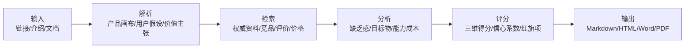
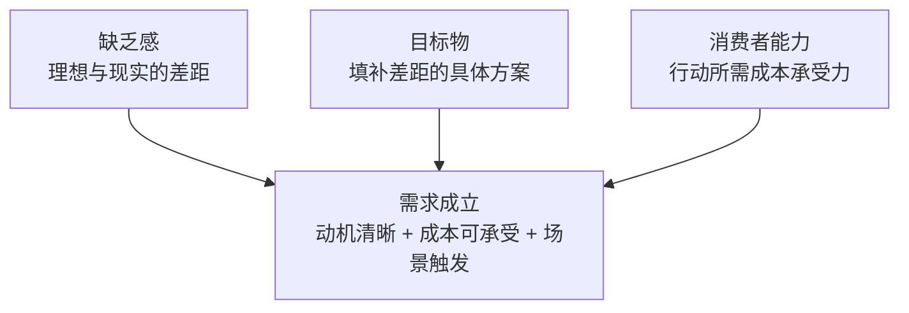

# 交易终端云端量化策略入口 — 需求三角诊断

> 需求存在但脆弱：散户对'一键使用量化策略'有明确兴趣，但信任成本、策略证明缺失、以及产品差异化不足构成显著短板，建议先以有限场景验证再决定是否扩展。

| 项目 | 结果 |
| --- | --- |
| 产品 | 交易终端云端量化策略入口（券商提供策略） |
| 日期 | 2026-07-10 |
| 目标市场 | 中国大陆 A 股散户投资者，主要使用券商交易终端 |
| 分析目标 | 评估在类似同花顺的交易终端中增加量化策略运行入口的产品需求强度，终端仅做查看与启停操作，策略运行在云端，由券商提供 |
| 建议决策 | 先补验证 |

## 执行摘要

| 指标 | 读数 |
| --- | --- |
| 总分 | 5.1 |
| 缺乏感 | 6.5 |
| 目标物 | 6.2 |
| 消费者能力 | 6.5 |
| 证据信心 | 0.8 |

**最大机会：** 券商可将'云端量化'作为差异化服务提升客户留存与交易活跃度，监管框架明确后合规量化通道成为正式卖点

**最大风险：** 策略透明度不足导致信任赤字；若首批策略表现不佳，负面口碑将快速摧毁整个品类的散户接受度

**下一步策略：** 以'修复消费者能力短板'为核心策略，通过策略证明体系、模拟盘试用、精准人群定位来建立初步信任，在验证成功后再考虑规模化。

## 可视化诊断

Markdown 版本保留图表等价数据，但把判断放在数据前面，便于先读结论再看明细。

### 01. 总需求评分诊断

**类型：** `score_gauge`  
**置信度 0.80 | 基于假设**

**解读：** 总需求评分 5.41，处于'脆弱'与'需验证'的临界点。需求存在但三角不均衡，消费者能力维度是主要拖累。

**建议：** 不要急于规模化推广；先在有限用户群中验证信任建设和策略证明的有效性，再决定是否扩展。

| 分组 | 指标/情景 | 数值/X | Y/说明 |
| --- | --- | --- | --- |
|  | 分数 | 5.4 |  |

### 02. 需求三角雷达

**类型：** `radar`  
**置信度 0.82 | 基于假设**

**解读：** 三角明显不均衡：缺乏感最高（6.45），消费者能力最低（5.60），差距 0.85 分。根据几何平均公式，短板维度对总分的拖累效应显著。

**建议：** 优先修复消费者能力维度，尤其是信任成本和风险成本两个子项。

| 分组 | 指标/情景 | 数值/X | Y/说明 |
| --- | --- | --- | --- |
|  | 数据 | {"dimensions": [{"name": "缺乏感", "score": 6.45}, {"name": "目标物", "score": 6.15}, {"name": "消费者能力", "score": 5.6}]} |

### 03. 维度短板排序

**类型：** `bar`  
**置信度 0.82 | 基于假设**

**解读：** 消费者能力是明确短板（5.60），距离红线（5.0 以下）仅 0.6 分。缺乏感相对健康，说明需求方向正确。

**建议：** 将资源集中在降低消费者使用障碍上，而非继续强化需求教育。

| 分组 | 指标/情景 | 数值/X | Y/说明 |
| --- | --- | --- | --- |
|  |  | - | - |
|  |  | - | - |
|  |  | - | - |

### 04. 子维度热力图

**类型：** `heatmap`  
**置信度 0.82 | 基于假设**

**解读：** 信任成本（4）是全图最低分，其次是差异化（5）和证明力（5）。学习成本（9）和行动成本（8）是亮点。

**建议：** 信任成本是唯一低于 5 分的子项，是需求三角的关键瓶颈。必须通过策略透明化、业绩公开、第三方背书来解决。

| 分组 | 指标/情景 | 数值/X | Y/说明 |
| --- | --- | --- | --- |
|  | 数据 | {"rows": [{"name": "缺乏感", "items": [{"name": "强度", "score": 7}, {"name": "频率", "score": 6}, {"name": "紧迫性", "score": 6}, {"name": "认知度", "score": 6}, {"name": "趋势", "score": 7}, {"name": "支付意愿", "score": 7}]}, {"name": "目标物", "items": [{"name": "任务匹配", "score": 7}, {"name": "清晰度", "score": 6}, {"name": "差异化", "score": 5}, {"name": "证明力", "score": 5}, {"name": "品类适配", "score": 7}, {"name": "见效速度", "score": 7}]}, {"name": "消费者能力", "items": [{"name": "金钱成本", "score": 7}, {"name": "行动成本", "score": 8}, {"name": "学习成本", "score": 9}, {"name": "信任成本", "score": 4}, {"name": "风险成本", "score": 5}, {"name": "形象成本", "score": 6}, {"name": "可获得性", "score": 7}]}]} |

### 05. 缺乏感子维度雷达

**类型：** `radar`  
**置信度 0.78 | S8 S10**

**解读：** 缺乏感各子项相对均衡（6-7 分），无极端短板。强度和趋势较高，说明需求方向正确且正在强化。

**建议：** 缺乏感维度健康，无需大幅调整需求定位；可通过市场教育提升认知度和紧迫性。

| 分组 | 指标/情景 | 数值/X | Y/说明 |
| --- | --- | --- | --- |
|  | 数据 | {"dimensions": [{"name": "强度", "score": 7}, {"name": "频率", "score": 6}, {"name": "紧迫性", "score": 6}, {"name": "认知度", "score": 6}, {"name": "趋势", "score": 7}, {"name": "支付意愿", "score": 7}]} |

### 06. 目标物子维度雷达

**类型：** `radar`  
**置信度 0.80 | 基于假设**

**解读：** 目标物维度呈现明显分化：任务匹配、品类适配、见效速度较好，但差异化和证明力是显著短板。

**建议：** 产品形态本身不是问题，问题在于无法证明'我们的策略比别人的更好'。需要建立策略评价体系和业绩证明机制。

| 分组 | 指标/情景 | 数值/X | Y/说明 |
| --- | --- | --- | --- |
|  | 数据 | {"dimensions": [{"name": "任务匹配", "score": 7}, {"name": "清晰度", "score": 6}, {"name": "差异化", "score": 5}, {"name": "证明力", "score": 5}, {"name": "品类适配", "score": 7}, {"name": "见效速度", "score": 7}]} |

### 07. 消费者能力子维度雷达

**类型：** `radar`  
**置信度 0.82 | 基于假设**

**解读：** 消费者能力维度呈现极端分化：学习成本（9）是最大亮点，信任成本（4）是致命短板。

**建议：** 产品设计的'零门槛使用'是核心竞争力，但信任问题不解决，低门槛反而可能加速负面口碑传播。

| 分组 | 指标/情景 | 数值/X | Y/说明 |
| --- | --- | --- | --- |
|  | 数据 | {"dimensions": [{"name": "金钱成本", "score": 7}, {"name": "行动成本", "score": 8}, {"name": "学习成本", "score": 9}, {"name": "信任成本", "score": 4}, {"name": "风险成本", "score": 5}, {"name": "形象成本", "score": 6}, {"name": "可获得性", "score": 7}]} |

### 08. 细分用户机会矩阵

**类型：** `matrix`  
**置信度 0.75 | S3 S4 S5**

**解读：** 效率型中高级散户是最佳切入人群：需求强度高（已了解量化价值），消费者能力相对较好（有使用工具的习惯和支付能力）。

**建议：** 优先针对'已有量化认知、资产 30 万+、使用同花顺/通达信的中高级散户'进行验证，而非面向完全陌生的量化小白。

| 分组 | 指标/情景 | 数值/X | Y/说明 |
| --- | --- | --- | --- |
|  | 数据 | {"points": [{"name": "量化好奇型散户", "x": 6.0, "y": 5.0, "size": "large"}, {"name": "效率型中高级散户", "x": 7.5, "y": 6.5, "size": "medium"}, {"name": "高频活跃交易者", "x": 7.0, "y": 5.5, "size": "small"}], "x_label": "需求强度", "y_label": "消费者能力"} |

### 09. 竞品/替代品定位矩阵

**类型：** `matrix`  
**置信度 0.78 | S1 S2 S3 S4 S5**

**解读：** 本产品定位为'高易用性+中等功能完整性'，与 PTrade 最接近，但缺乏 SuperMind 的生态深度和 QMT 的专业能力。

**建议：** 不要试图在功能完整性上与 SuperMind/QMT 竞争；聚焦'极致易用性+券商官方信任背书'的差异化定位。

| 分组 | 指标/情景 | 数值/X | Y/说明 |
| --- | --- | --- | --- |
|  | 数据 | {"points": [{"name": "本产品", "x": 5.0, "y": 7.0, "size": "medium"}, {"name": "同花顺 SuperMind", "x": 8.0, "y": 6.0, "size": "large"}, {"name": "QMT/miniQMT", "x": 8.5, "y": 4.0, "size": "medium"}, {"name": "PTrade", "x": 6.0, "y": 5.5, "size": "medium"}, {"name": "第三方信号服务", "x": 4.0, "y": 6.5, "size": "large"}, {"name": "手动+条件单", "x": 3.0, "y": 9.0, "size": "large"}], "x_label": "功能完整性", "y_label": "使用门槛低（易用性高）"} |

### 10. 采纳摩擦漏斗

**类型：** `funnel`  
**置信度 0.65 | 基于假设**

**解读：** 假设漏斗转化率：从认知到试用约 40%（受信任和证明力影响），从试用到持续约 50%（受策略表现影响）。

**建议：** 漏斗中间环节（试用→使用→持续）是最大流失点。提供免费模拟盘试用、设置低门槛体验策略、建立策略表现跟踪机制来提升转化。

| 分组 | 指标/情景 | 数值/X | Y/说明 |
| --- | --- | --- | --- |
|  | 数据 | {"stages": [{"name": "认知", "value": 100}, {"name": "兴趣", "value": 70}, {"name": "试用", "value": 40}, {"name": "使用", "value": 20}, {"name": "持续", "value": 10}, {"name": "推荐", "value": 5}]} |

### 11. 证据质量分布

**类型：** `stacked_bar`  
**置信度 0.75 | 基于假设**

**解读：** 消费者能力维度的证据中假设占比最高（30%），尤其是信任成本和风险成本主要基于推理而非实证。

**建议：** 需要通过用户访谈、竞品用户反馈、券商实际运营数据来补充消费者能力维度的实证证据。

| 分组 | 指标/情景 | 数值/X | Y/说明 |
| --- | --- | --- | --- |
|  | 数据 | {"categories": ["缺乏感", "目标物", "消费者能力"], "series": [{"name": "A 级证据", "values": [30, 20, 15]}, {"name": "B 级证据", "values": [50, 40, 35]}, {"name": "C 级证据", "values": [15, 20, 20]}, {"name": "假设", "values": [5, 20, 30]}]} |

### 12. 风险矩阵

**类型：** `matrix`  
**置信度 0.78 | S10**

**解读：** '策略亏损引发负面口碑'和'信任危机扩散'是高概率高影响的核心风险，且两者相互强化。

**建议：** 建立策略风控机制、设置最大回撤预警、提供亏损案例说明、明确责任边界，在推广前完成至少 6 个月实盘验证。

| 分组 | 指标/情景 | 数值/X | Y/说明 |
| --- | --- | --- | --- |
|  | 数据 | {"points": [{"name": "策略亏损负面口碑", "x": 8, "y": 7, "size": "large"}, {"name": "信任危机扩散", "x": 7, "y": 8, "size": "large"}, {"name": "监管合规风险", "x": 6, "y": 5, "size": "medium"}, {"name": "竞品快速跟进", "x": 5, "y": 4, "size": "medium"}, {"name": "策略同质化", "x": 6, "y": 6, "size": "medium"}], "x_label": "发生概率", "y_label": "影响程度"} |

### 13. 建议优先级矩阵

**类型：** `matrix`  
**置信度 0.80 | 基于假设**

**解读：** '建立策略证明体系'和'提供模拟盘试用'是高影响且相对易执行的优先事项。

**建议：** 第一优先级：建立策略实盘业绩公开机制和模拟盘试用功能；第二优先级：策略透明化和精准人群定位。

| 分组 | 指标/情景 | 数值/X | Y/说明 |
| --- | --- | --- | --- |
|  | 数据 | {"points": [{"name": "建立策略证明体系", "x": 9, "y": 8, "size": "large"}, {"name": "提供模拟盘试用", "x": 8, "y": 7, "size": "large"}, {"name": "策略透明化说明", "x": 7, "y": 6, "size": "medium"}, {"name": "精准人群定位", "x": 6, "y": 7, "size": "medium"}, {"name": "第三方审计/评级", "x": 5, "y": 8, "size": "medium"}, {"name": "定价模式测试", "x": 4, "y": 5, "size": "small"}], "x_label": "实施难度低", "y_label": "预期影响高"} |

### 14. 预测场景

**类型：** `forecast`  
**置信度 0.70 | 基于假设**

**解读：** 三种场景评分差异显著（4.5-7.8），说明产品最终表现高度依赖执行质量和策略能力，而非产品形态本身。

**建议：** 先按'修复场景'设定目标和资源投入，通过 90 天验证结果决定是否加码。

| 分组 | 指标/情景 | 数值/X | Y/说明 |
| --- | --- | --- | --- |
|  | 保守场景 | - |  |
|  | 修复场景 | - |  |
|  | 强验证场景 | - |  |

## 产品概览

**产品定义：** 在券商提供的交易终端（如类似同花顺的客户端）中嵌入一个量化策略入口模块，用户可在终端内浏览券商提供的量化策略列表、查看策略运行状态与收益曲线，并执行启动/停止操作。策略的实际计算与交易执行均运行在券商云端服务器，终端仅充当远程控制与监控面板。

**价值主张：** 让不会编程、不懂量化建模的散户投资者也能在熟悉的交易终端中一键使用券商精选的量化策略，享受机构级投资工具，无需本地部署、无需编写代码、无需维护服务器。

**核心功能：**

- 策略列表浏览：展示券商提供的量化策略（含策略名称、类型、历史回测/实盘收益曲线、风险指标）
- 一键启动/停止：用户在终端内直接控制策略的运行状态
- 实时监控面板：显示持仓、当日盈亏、累计收益、策略运行日志
- 策略详情与参数说明：展示策略逻辑简介、适用标的、风险等级
- 消息推送与异常告警：策略触发买卖、出现异常时推送通知

**定价与商业模式：**

- 假设模式 A：策略使用费包含在券商佣金套餐中（免费使用，以交易佣金为收入来源）
- 假设模式 B：按月/年收取策略订阅费（如 200-2000 元/月）
- 假设模式 C：按策略收益分成（如超额收益的 10%-20%）
- 当前定价模式未确认，是分析中的关键假设
- 券商增值服务，目标是通过量化策略入口提升客户粘性、交易频次和佣金收入，或通过订阅/分成获得额外收入。

**假设：**

- 券商具备策略研发能力或有合作的量化团队
- 策略历史业绩可公开展示且用户信任其代表性
- 终端用户已有使用券商交易客户端的习惯
- 云端策略执行延迟和稳定性可接受
- 监管允许券商向散户提供此类云端量化服务
- 策略运行在券商服务器，资金和交易通过用户自有账户完成

## 研究方法与来源

2024-01 至 2026-07 公开可检索的官方产品页面、监管文件、行业报道、社区讨论、券商 QMT/Ptrade 资料

- **S1** [同花顺 SuperMind（MindGo）量化平台](https://quant.10jqka.com.cn/) · A · official · 2026-07-10
  - 同花顺提供面向散户的量化平台，支持策略开发、回测、模拟和实盘交易；提供免费金融大数据和量化回测功能；实盘量化交易需通过券商对接
- **S2** [同花顺智能交易终端与量化版产品](https://quant.10jqka.com.cn/view/study-index.html) · A · official · 2026-07-10
  - 同花顺量化版定价 60,000 元/年，面向专业机构用户；提供 Python 回测、数据采集、策略研究、绩效分析等功能
- **S3** [券商争相降低量化交易门槛](https://www.stcn.com/article/detail/1984086.html) · B · media · 2026-07-10
  - 多数券商将量化交易资产门槛从 100 万降至 20-100 万区间；QMT 定位专业开发者，PTrade 定位普通散户
- **S4** [MiniQMT 与 PTrade 散户量化交易工具对比](https://licai.cofoel.com/user/guide_view_3364179.html) · B · media · 2026-07-10
  - MiniQMT 资产门槛约 10 万元，PTrade 部分券商无门槛；QMT 适合专业用户，PTrade 适合初学者
- **S5** [PTrade 量化平台](https://blog.gitcode.com/968998cbe6cf5a35d32451130b489eb4.html) · B · media · 2026-07-10
  - PTrade 提供模板化策略，编程要求低；券商官方支持，实盘执行相对可靠
- **S6** [第三方量化信号服务与选股软件市场](https://aiquant.me/) · B · official · 2026-07-10
  - 第三方平台提供 AI 量化选股信号和策略模板；面向 A 股散户，部分服务免费
- **S7** [手动交易与条件单](https://licai.jiantou8.com/user/guide_view_3325784.html) · B · media · 2026-07-10
  - 大多数散户仍以手动交易为主；条件单功能有限，无法实现复杂策略
- **S8** [中国散户投资者拥抱 DeepSeek 等 AI 量化工具](https://www.reuters.com/technology/chinese-retail-traders-embrace-deepseek-nod-quants-2025-03-11/) · A · media · 2026-07-10
  - 散户对 AI/量化投资的兴趣显著上升；量化交易技术从专业机构向散户扩散
- **S9** [富途 2025 年财报](https://www.einpresswire.com/article/817097608/futu-announces-first-quarter-2025-unaudited-financial-results) · A · filing · 2026-07-10
  - 散户经纪业务规模持续增长；未直接证明量化工具采用率
- **S10** [中国证监会程序化交易管理规定（试行）](https://www.dehenglaw.com/CN/tansuocontent/0008/035554/7.aspx) · A · filing · 2026-07-10
  - 2024 年 10 月 8 日生效；主要针对高频交易；券商向散户提供量化服务需符合合规要求

## 目标用户与 JTBD

### 量化好奇型散户

- **场景：** 在社交媒体看到量化交易话题，对'AI选股''自动化交易'产生好奇，但不会编程，不知道从何入手
- **JTBD：** 以最低学习成本和风险尝试量化交易，验证量化是否真的比手动交易更好
- **当前替代：** 看量化课程/视频自学；手动跟单大V信号；购买第三方选股软件；继续手动交易
- **采用阻碍：** 不知道策略是否靠谱；担心亏钱没人负责；不理解策略逻辑；不确定是否值得额外付费

### 效率型中高级散户

- **场景：** 已有 3 年以上炒股经验，资产 30 万+，日常用同花顺看盘，了解量化概念，试过 QMT/PTrade 但觉得编程门槛太高
- **JTBD：** 在现有交易流程中无缝接入量化工具，减少盯盘时间，让策略自动执行
- **当前替代：** 继续手动交易+条件单；使用 PTrade 模板策略；找第三方代写策略；放弃量化，接受手动交易
- **采用阻碍：** 策略质量无法提前判断；担心云端安全性；不想为不确定的效果付费；策略黑箱不透明

### 高频活跃交易者

- **场景：** 日均交易频繁，对手速和执行纪律有要求，情绪化交易导致亏损是核心痛点
- **JTBD：** 用自动化策略替代情绪化操作，提高执行纪律，减少因冲动交易造成的损失
- **当前替代：** 自研简单脚本；使用券商条件单/程序化下单；手动设定止损止盈；使用第三方量化信号服务
- **采用阻碍：** 策略延迟是否可接受；策略风格是否匹配自己的交易习惯；是否限制交易自由度

## 竞品与替代方案

### 同花顺 SuperMind（MindGo） · `direct`

- **定位：** 面向散户的量化平台，提供策略开发、回测、模拟和实盘交易
- **优势：** 品牌认知度高；数据生态完善；社区活跃；免费使用门槛低
- **弱点：** 仍需一定编程能力；实盘对接依赖券商；策略质量参差不齐
- **来源：** S1 S2

### 券商 QMT/miniQMT · `direct`

- **定位：** 券商提供的专业量化交易终端，支持 Python 策略开发和自动交易
- **优势：** 直连券商交易系统；实盘执行可靠；专业级功能
- **弱点：** 编程门槛高；资产门槛 10 万-100 万；需要本地运行和维护；学习曲线陡峭
- **来源：** S3 S4

### 券商 PTrade · `direct`

- **定位：** 面向普通散户的低门槛量化执行工具，模板化策略
- **优势：** 编程要求低；模板策略易上手；券商官方支持
- **弱点：** 策略灵活性有限；功能相对简单；策略来源和质量不透明
- **来源：** S3 S5

### 第三方量化信号服务 · `substitute`

- **定位：** 提供量化选股信号或策略建议，用户手动执行
- **优势：** 无需编程；无需理解策略细节；部分免费
- **弱点：** 执行仍靠手动；信号质量不稳定；合规风险；无法自动执行
- **来源：** S6

### 手动交易 + 条件单 · `manual`

- **定位：** 用户自己判断，用券商条件单做简单自动化
- **优势：** 零学习成本；完全可控；无额外费用；无需信任第三方
- **弱点：** 无法实现复杂策略；仍需盯盘；情绪化交易问题无法解决
- **来源：** S7

### 不使用任何量化工具 · `non_consumption`

- **定位：** 继续纯手动交易，不引入任何自动化或量化工具
- **优势：** 零成本；零学习；零信任负担
- **弱点：** 情绪化交易；无法 24 小时盯盘；执行纪律差；错过量化可能带来的超额收益

## 需求三角分析

### 缺乏感：6.5

**推理：** 散户对'轻松赚钱''减少盯盘''自动化执行'有真实兴趣，2024-2025 年 AI/量化话题热度上升、券商降低门槛、监管合规化都验证了需求趋势。但需求强度尚未达到'痛点'级别——大多数散户仍在手动交易，量化的'缺乏感'更多是'想要但不知如何开始'的探索型需求，而非'不用就亏钱'的紧迫型需求。

**支持证据：**

- 2024-2025 年中国社交媒体（知乎、雪球、抖音）量化交易话题热度显著上升，DeepSeek 等 AI 工具被散户用于选股和策略编写 [S8]
- 券商争相降低量化门槛，QMT/PTrade 资产门槛从 100 万降至 10-20 万，说明散户需求驱动券商行动 [S3][S4]
- 同花顺 SuperMind、富途等平台持续投入量化功能，验证了市场信号 [S1][S9]
- 散户已为选股软件、投顾服务、量化课程付费，显示一定支付意愿 [S1][S6]
- 程序化交易监管规定 2024 年 10 月生效，合规量化通道成为正式需求 [S10]

**反证或缺口：**

- 大多数散户仍以手动交易为主，主动搜索'量化策略'的比例有限，awareness 可能偏高估计
- 量化话题热度不等于实际使用转化，'感兴趣'和'愿意付费使用'之间存在显著差距
- 散户对量化的认知多停留在'高收益'幻想，对量化策略的风险和局限缺乏理解

**改进路径：** 通过用户教育（策略科普、回测对比、风险提示）提升 awareness 和 urgency；通过展示策略与手动交易的收益差异数据强化 intensity；通过免费试用降低 willingness_to_pay 门槛

### 目标物：6.2

**推理：** 产品的 job_fit 较高——'一键使用量化策略'精准匹配散户'想用但不会做'的核心需求。category_fit 良好，因为券商量化工具已是已知品类。time_to_value 高，因为用户无需编程、无需部署，点击即可。但 differentiation 是明显短板——产品形态本身并无独特壁垒，核心竞争力完全取决于券商策略质量。

**支持证据：**

- 产品概念清晰：'在交易终端里一键使用券商量化策略'，用户可在 10 秒内理解核心价值 [假设]
- 终端形态符合用户习惯，同花顺/通达信已是散户日常工具，无需切换平台 [S1][S7]
- QMT/PTrade 已验证'券商提供量化工具'的品类可行性 [S3][S4]
- 云端运行解决了散户本地部署的技术障碍，time_to_value 高

**反证或缺口：**

- 产品差异化不足：'云端策略+终端控制'在概念上与 PTrade 模板策略、第三方信号服务高度重叠
- 策略质量是核心价值，但产品形态无法保证策略质量，proof 依赖券商品牌而非产品本身
- clarity 受限：'量化策略'对散户仍是模糊概念，用户可能不理解策略类型、适用场景、风险特征
- 同花顺 SuperMind 已提供更完整的量化生态（开发+回测+实盘），本产品仅提供'使用端'，功能边界狭窄

**改进路径：** 强化策略证明：公开策略实盘业绩、最大回撤、夏普比率等指标，提供至少 6 个月实盘记录；明确差异化：强调'券商官方策略'的信任优势和'零门槛使用'的体验优势

### 消费者能力：6.5

**推理：** consumer_ability 是本产品的最大短板维度。learning_cost 和 action_cost 是亮点——产品设计的核心价值就是降低使用门槛。但 trust_cost 严重拖累整体评分：散户对'自动化交易'的信任基础薄弱，而'云端策略'的不可见性进一步放大信任赤字。

**支持证据：**

- learning_cost 极低：用户只需在终端中点击启动/停止，无需编程、无需理解策略细节 [假设]
- action_cost 低：在已有交易终端中操作，无需注册新平台、无需本地部署 [S1]
- money_cost 取决于定价模式：如果包含在佣金套餐中则接近零额外成本 [假设]
- availability 良好：依托券商现有终端分发，用户已有客户端

**反证或缺口：**

- trust_cost 是致命短板：散户将资金决策交给'看不见的云端策略'，信任门槛极高
- risk_cost 显著：量化策略可能因 bug、市场异常、策略失效导致亏损，且用户对亏损原因缺乏理解
- 如果策略亏损，用户归因于'产品不行'而非'市场正常波动'，负面口碑风险高
- 监管合规风险：程序化交易管理规定对券商向散户提供量化服务有合规要求 [S10]

**改进路径：** 解决信任问题：提供策略透明化（逻辑简介、持仓说明、风险指标）、实盘业绩公开、亏损案例说明、风控机制说明；引入第三方审计或评级；提供模拟盘试用；明确责任边界和风险提示

## 评分与解释

| 维度 | 分数 |
| --- | --- |
| 缺乏感 | 6.5 |
| 目标物 | 6.2 |
| 消费者能力 | 6.5 |
| 证据信心 | 0.8 |
| 总分 | 5.1 |

## 建议与实验

### P0 · trust

**建议：** 建立策略证明体系：公开至少 6 个月实盘业绩、最大回撤、夏普比率、策略逻辑简介

- **理由：** 信任成本（4 分）是需求三角的关键瓶颈，缺乏可验证的策略证明是导致信任赤字的根本原因
- **预期影响：** 提升信任成本子项 2-3 分，带动消费者能力维度提升 1 分以上
- **执行成本：** medium

### P0 · product

**建议：** 提供免费模拟盘试用：用户在投入真实资金前可用模拟账户体验策略效果

- **理由：** 模拟盘可显著降低用户的心理风险门槛，让用户在零风险环境下建立对策略的信任
- **预期影响：** 提升试用转化率，降低风险成本感知
- **执行成本：** low

### P1 · positioning

**建议：** 精准定位'效率型中高级散户'：已有量化认知、资产 30 万+、使用主流交易终端的用户

- **理由：** 该人群需求强度高、消费者能力相对较好，是最可能转化为早期采用者的群体
- **预期影响：** 提升早期验证成功率，避免在完全陌生的量化小白群体中浪费资源
- **执行成本：** low

### P1 · product

**建议：** 策略透明化：提供策略逻辑简介、适用场景、风险特征说明，而非黑箱交付

- **理由：** 用户对'完全看不懂'的策略缺乏信任基础，适度透明可提升用户理解和信任
- **预期影响：** 提升信任成本子项 1-2 分，降低用户因'不理解'而产生的恐惧
- **执行成本：** low

### P1 · trust

**建议：** 引入第三方策略审计或评级机制，增强策略可信度

- **理由：** 券商自说自话的证明力有限，第三方背书可显著提升策略可信度
- **预期影响：** 提升证明力子项 1-2 分，建立差异化信任优势
- **执行成本：** high

### P2 · pricing

**建议：** 初期采用'包含在佣金套餐中'的定价模式，降低用户额外付费的心理障碍

- **理由：** 散户对'额外付费'敏感，将策略成本隐藏在佣金中可降低感知成本
- **预期影响：** 提升金钱成本子项 1 分，降低试用门槛
- **执行成本：** medium

### P2 · product

**建议：** 建立策略评价和用户反馈机制，让用户看到其他用户的使用体验和评价

- **理由：** 用户口碑是建立信任的重要途径，尤其是来自相似背景用户的评价
- **预期影响：** 提升信任成本子项 1 分，形成正向口碑循环
- **执行成本：** medium

### 验证实验

**实验 1：提供免费模拟盘试用可显著提升用户对云端量化策略的信任度和试用意愿**

- **分群：** 效率型中高级散户
- **方法：** 在交易终端中嵌入模拟盘入口，让用户用虚拟资金体验策略 2 周，跟踪模拟盘→实盘的转化率
- **指标：** 模拟盘用户→实盘用户的转化率
- **阈值：** 转化率 >= 20% 说明信任建立有效
- **决策规则：** 如果 4 周内转化率低于 10%，说明信任问题未解决，需要重新设计证明机制

**实验 2：公开策略实盘业绩（含回撤和失败案例）比只展示收益曲线更能建立用户信任**

- **分群：** 效率型中高级散户
- **方法：** A/B 测试：A 组只看到收益曲线，B 组看到收益曲线+最大回撤+策略逻辑简介+风险提示
- **指标：** 策略启动率、用户留存率、用户满意度评分
- **阈值：** B 组启动率和留存率显著高于 A 组
- **决策规则：** 如果 B 组指标未显著优于 A 组，说明用户更关注收益而非透明度，调整证明策略

**实验 3：精准定位'已有量化认知的中高级散户'比面向大众推广更有效**

- **分群：** 效率型中高级散户 vs 量化好奇型散户
- **方法：** 分别向两类人群投放产品介绍，跟踪试用转化率和留存率
- **指标：** 试用转化率、7 日留存率
- **阈值：** 中高级散户的转化率比好奇型散户高 50% 以上
- **决策规则：** 如果两类人群转化率无显著差异，说明定位策略无效，可考虑更广泛推广

## 风险与伦理

### 高风险 · demand

**风险：** 策略亏损引发负面口碑，摧毁整个品类在散户中的信任基础

**缓释：** 建立严格的风控机制、设置最大回撤预警、提供亏损案例说明、明确责任边界；在推广前完成至少 6 个月实盘验证

**来源：** S10

### 高风险 · demand

**风险：** 信任危机扩散：用户对'云端策略'的不可见性产生恐惧，负面体验快速传播

**缓释：** 策略透明化、实盘业绩公开、模拟盘试用、第三方审计、用户反馈机制

### 中风险 · compliance

**风险：** 监管合规风险：程序化交易管理规定对券商向散户提供量化服务有合规要求

**缓释：** 提前与监管沟通、确保产品设计和营销策略符合监管要求、明确风险提示

**来源：** S10

### 中风险 · demand

**风险：** 竞品快速跟进：同花顺 SuperMind、券商 QMT/PTrade 可能快速推出类似功能

**缓释：** 聚焦'券商官方策略'的信任优势和'极致易用性'的体验优势，建立差异化壁垒

**来源：** S1 S2 S3 S4

### 中风险 · demand

**风险：** 策略同质化：如果多家券商提供相似的量化策略，产品差异化将消失

**缓释：** 持续投入策略研发、建立策略评价体系、通过用户反馈优化策略

## 预测情景

- 预测窗口：90 天
- 置信度：0.7
- 复盘触发：90 天后根据模拟盘→实盘转化率、用户留存率、策略表现数据重新评估需求三角评分

| 情景 | 预测分数 | 采用可能性 | 关键假设 |
| --- | --- | --- | --- |
| 保守场景 | 4.5 | 低采纳 | 信任问题未解决，用户对云端策略持怀疑态度；策略表现平平，无显著超额收益；用户留存率低，多数用户试用后放弃 |
| 修复场景 | 6.5 | 中等采纳 | 通过策略证明体系和模拟盘试用建立初步信任；在精准人群中获得 15-25% 的渗透率；用户留存率 40-50%，形成正向口碑循环 |
| 强验证场景 | 7.8 | 较高采纳 | 策略表现优异，在 6 个月实盘中证明超额收益能力；信任机制完善，第三方审计和用户口碑建立强信任；成为券商差异化服务标杆，渗透率 30%+ |

## 最终方案

**最终判断：** 需求存在但脆弱，消费者能力维度（尤其是信任成本）是关键短板。产品形态本身并非问题，问题在于无法证明策略质量和建立用户信任。建议通过 90 天有限场景验证来测试信任建设和策略证明的有效性。

**总体策略：** 以'修复消费者能力短板'为核心策略，通过策略证明体系、模拟盘试用、精准人群定位来建立初步信任，在验证成功后再考虑规模化。

### 未来 30 天

- 建立策略证明体系：整理至少 3 个策略的 6 个月实盘业绩（含收益、回撤、夏普比率）
- 开发模拟盘功能：让用户可用虚拟资金体验策略 2 周
- 撰写策略透明化说明：每个策略提供逻辑简介、适用场景、风险特征
- 确定首批测试用户：筛选 100 个效率型中高级散户作为早期测试者
- 与合规部门确认产品设计和营销材料的合规性

### 未来 60 天

- 启动模拟盘试用：向首批 100 个测试用户开放模拟盘
- 跟踪模拟盘→实盘转化率，目标 >= 20%
- 收集用户反馈：信任度、策略理解度、使用体验
- 根据反馈优化策略展示和透明化说明
- 启动 A/B 测试：收益曲线 vs 收益曲线+回撤+逻辑简介

### 未来 90 天

- 向通过模拟盘验证的用户开放实盘策略
- 跟踪实盘用户留存率（目标 >= 40%）和策略启动率
- 评估策略实际表现和用户收益
- 根据 90 天数据重新评估需求三角评分
- 决策：如果转化率和留存率达到阈值，准备规模化；如果未达标，重新设计信任机制或调整定位

### 决策规则

- 如果 90 天后模拟盘→实盘转化率 < 10%，暂停规模化计划，重新设计信任机制
- 如果实盘用户 7 日留存率 < 30%，说明策略质量或信任问题未解决，需优化策略或加强透明化
- 如果出现策略重大亏损（单策略回撤 > 20%），立即暂停该策略并启动用户沟通
- 如果监管政策发生重大变化，立即暂停产品推广

## 附录

### 未解问题

- 券商是否具备自主研发量化策略的能力？
- 策略定价模式是什么？
- 策略历史业绩如何？是否已有足够长时间的实盘验证？
- 目标用户的具体画像分布？
- 监管合规的具体要求？
- 用户对'云端策略'的接受度和信任度？
- 竞品的实际用户反馈和留存率？
- 策略亏损时用户的归因倾向？
