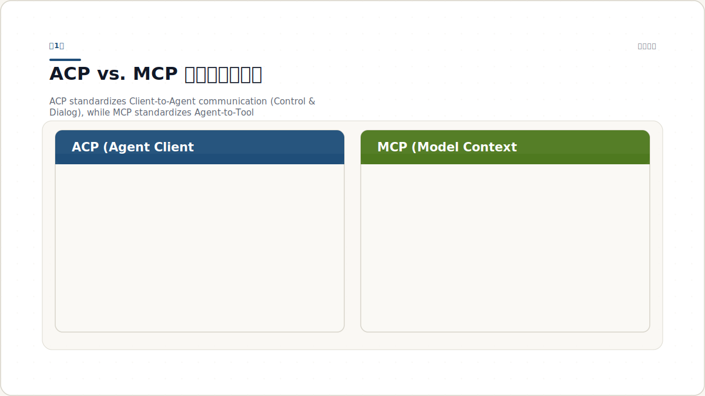
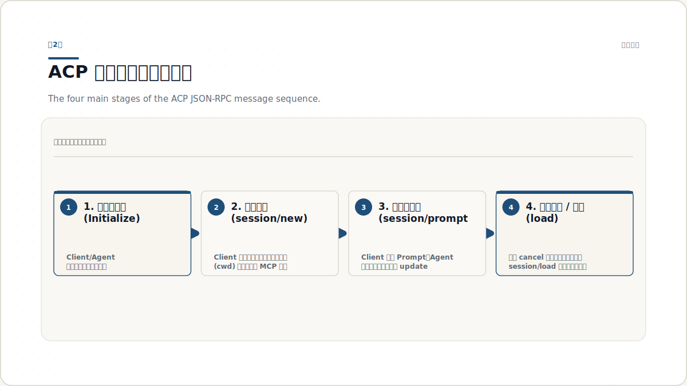
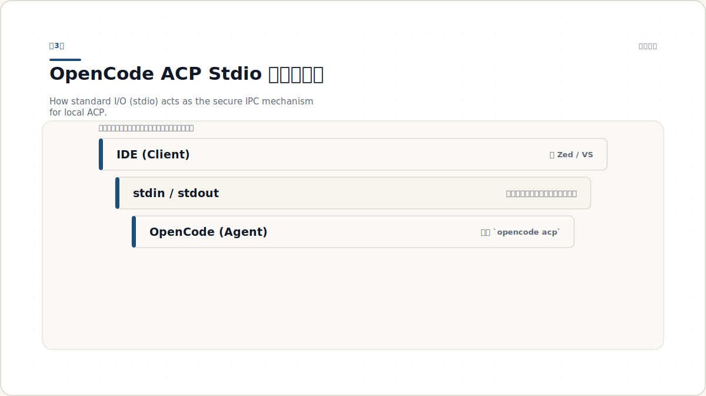
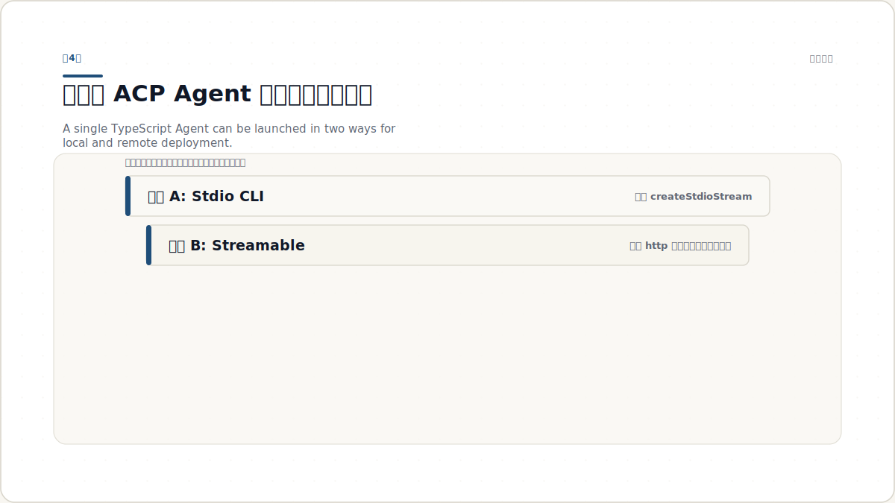
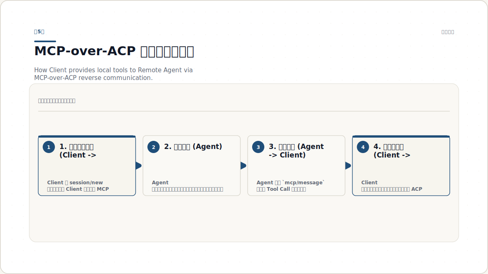

# ACP 入门到落地：看懂 AI Agent 的 Agent Client Protocol，并学会对接 OpenCode 与自部署服务

更新日期：2026年7月8日

很多人第一次接触 AI Agent 协议时，最容易把几件事混在一起：编辑器怎么和 Agent 说话？Agent 怎么调工具？像 OpenCode 这种“以 ACP 提供服务”的程序，到底应该被当成命令行工具、SDK，还是一个标准协议端点？

如果你明天就要接入一个 ACP 服务，真正难的通常不是“写几行代码”，而是先把边界想清楚：**谁是 Client，谁是 Agent，谁负责会话，谁负责工具，谁负责权限和安全。**

这份教程按这个顺序展开。读完后，你应该能做到三件事：

1. 用清晰的心智模型理解 ACP 是什么，为什么它会出现。
2. 知道像 OpenCode 这种通过 `opencode acp` 暴露服务的 Agent 应该怎么对接和使用。
3. 知道自研或自部署服务要支持 ACP，最少需要实现哪些能力、采用什么架构、注意哪些安全边界。

---

## 第1章 ACP 到底是什么：先把 Client、Agent、MCP 三层关系分开

**本章目标**：建立对 ACP 的最小正确理解，避免一开始就把“编辑器协议”和“工具协议”混为一谈。



*图 1.1：ACP 解决“编辑器如何与 Agent 协作”的问题；MCP 解决“Agent 如何调用工具与资源”的问题。*

### 1.1 为什么 ACP 会出现：AI 编码生态太碎了

在没有 ACP 之前，编辑器和 AI 编码 Agent 往往是强绑定的。

比如一个编辑器想支持三个不同的 Agent，常见做法是：

- 为每个 Agent 单独写适配代码
- 为每个 Agent 处理不同的会话接口
- 为每个 Agent 重新处理权限、文件访问、终端交互、消息流展示

这会带来三个直接问题：

1. **集成成本高**：每多支持一个 Agent，就多一套对接工作。
2. **用户被锁定**：你选了某个 Agent，往往就被迫接受它当前支持的那些入口。
3. **生态创新被拖慢**：编辑器团队和 Agent 团队都在重复造轮子。

ACP 的目标就是把这件事标准化。它有点像 AI 编码场景里的 LSP：

- LSP 标准化了编辑器和语言服务之间的关系
- ACP 标准化了编辑器和编码 Agent 之间的关系

所以最短的一句话定义是：

> **ACP（Agent Client Protocol）是一个基于 JSON-RPC 2.0 的协议，用来标准化代码编辑器/IDE 与 AI Agent 之间的通信。**

> **你要注意**：ACP 不是“大模型协议”，也不是“工具调用协议”。它是“Client 和 Agent 之间”的协议。

### 1.2 ACP 里的 Client 和 Agent，各自到底负责什么

理解 ACP 的关键，不是记住几个方法名，而是先知道双方分工。

| 角色 | 典型是谁 | 主要职责 |
|---|---|---|
| Client | Zed、JetBrains、某个自定义 IDE、你自己写的前端或控制台 | 发起会话、接收用户输入、展示更新、控制权限、决定是否允许敏感操作 |
| Agent | OpenCode、你自己实现的 ACP 服务、某个远程编码代理 | 理解任务、规划步骤、决定何时读写文件、何时请求权限、何时调用工具 |

也就是说：

- **Client 更像“人机交互壳”**
- **Agent 更像“执行任务的大脑”**

Client 不一定懂怎么改代码，但它掌握工作区、终端、权限界面、文件视图。Agent 不一定拥有本地权限，但它知道要完成什么任务。

ACP 做的事情，就是把这两边的责任边界说清楚。

### 1.3 ACP 和 MCP 的区别：不要把前台协议和后台协议混成一层

很多人一听到“Agent 协议”，马上会想到 MCP。这里必须分开。

**ACP（Agent Client Protocol）** 负责的是：

- 编辑器如何把用户请求发给 Agent
- Agent 如何把中间进度发回编辑器
- Agent 如何申请权限
- 会话如何创建、取消、恢复

**MCP（Model Context Protocol）** 负责的是：

- Agent 如何接入工具
- Agent 如何访问资源
- Agent 如何调用外部服务

如果把它们放到一条链路里，可以这样看：

**用户 → 编辑器（Client） → ACP → Agent → MCP → 工具 / 资源 / 外部服务**

所以：

- ACP 在 **Agent 前面**
- MCP 在 **Agent 后面**

这也是为什么教程后面会反复强调：

- 当你在问“OpenCode 怎么让编辑器连接上它”时，你问的是 ACP
- 当你在问“Agent 怎么接文件系统、终端、搜索工具”时，你问的是 MCP

> **常见误区**：把 ACP 当成“工具协议”。这会导致你设计自部署服务时，把很多本该在 Client 侧处理的权限逻辑错误地塞进 Agent 内部。

### 1.4 用一个真实场景记住边界

假设用户在编辑器里说：

> “帮我检查这个 TypeScript 项目里的构建错误，并给出修复方案。”

这时会发生什么？

1. 编辑器把用户消息包装成 ACP 请求发给 Agent。
2. Agent 分析任务，决定先看 `package.json`、`tsconfig.json`、构建日志。
3. 如果 Agent 需要读文件、开终端、执行命令，它可能：
   - 直接使用自己内置能力
   - 或通过 MCP 连接到工具服务器
   - 或通过 ACP 请求 Client 提供权限和工具能力
4. Agent 持续把中间状态、工具调用状态、最终结果通过 ACP 发回 Client。
5. Client 把这些更新显示给用户，并对敏感操作做确认。

这就是 ACP 的工作现场。

**练习任务**：拿一张纸，画出“编辑器、Agent、工具”三层结构，并标出 ACP 与 MCP 分别在哪一层。

**检查点**：如果一个协议描述的是“让 IDE 启动 `opencode acp` 并和它对话”，它更接近 ACP 还是 MCP？为什么？

---

## 第2章 ACP 怎么工作：从 initialize 到 session/prompt 的完整消息流

**本章目标**：理解 ACP 的底层交互顺序，知道一个兼容实现最少要说哪些话。



*图 2.1：一个 ACP 会话必须先完成 initialize，之后才能 session/new，再进入 prompt/update 循环。*

### 2.1 ACP 的底层基石其实很朴素：JSON-RPC 2.0

ACP 不是某种神秘专用总线。它底层使用的是 **JSON-RPC 2.0**。

这意味着它继承了两类基础消息：

1. **Methods**：请求-响应型消息，有 `id`，要等对方回 `result` 或 `error`
2. **Notifications**：单向消息，没有返回值

在本地模式下，ACP 常通过 **stdio** 传输，也就是：

- Client 启动 Agent 子进程
- 双方通过 stdin/stdout 交换按行分隔的 JSON 消息

在远程模式下，ACP 可以跑在：

- HTTP
- WebSocket

协议还规定了两个很容易忽略但很重要的细节：

- **所有文件路径必须是绝对路径**
- **行号是 1-based**

这两个约束看起来小，但它们能减少大量跨平台和跨编辑器差异。

### 2.2 第一步永远是 initialize：先谈版本，再谈能力

在 ACP 里，会话不是上来就建的。**任何会话前，Client 都必须先调用 `initialize`。**

一个典型的请求像这样：

```json
{
  "jsonrpc": "2.0",
  "id": 0,
  "method": "initialize",
  "params": {
    "protocolVersion": 1,
    "clientCapabilities": {
      "fs": {
        "readTextFile": true,
        "writeTextFile": true
      },
      "terminal": true
    },
    "clientInfo": {
      "name": "my-client",
      "title": "My Client",
      "version": "1.0.0"
    }
  }
}
```

Agent 的响应通常会告诉你三件事：

1. 它最终接受哪个协议版本
2. 它支持哪些能力
3. 它是否需要认证，以及如何认证

例如：

```json
{
  "jsonrpc": "2.0",
  "id": 0,
  "result": {
    "protocolVersion": 1,
    "agentCapabilities": {
      "loadSession": true,
      "promptCapabilities": {
        "image": true,
        "audio": false,
        "embeddedContext": true
      },
      "mcpCapabilities": {
        "http": true,
        "sse": true
      }
    },
    "agentInfo": {
      "name": "my-agent",
      "title": "My Agent",
      "version": "1.0.0"
    },
    "authMethods": []
  }
}
```

这里最重要的认知是：**能力协商是诚实申报，不是装饰字段。**

比如：

- 你没实现 `session/load`，就不要宣称 `loadSession: true`
- 你不支持 HTTP 型 MCP server，就不要宣称 `mcpCapabilities.http: true`

> **你要注意**：ACP 对“省略 capability”的解释是“不支持”。所以缺省字段不能随便依赖。

### 2.3 会话建立：`session/new` 不只是拿一个 sessionId

初始化之后，Client 可以调用 `session/new` 创建会话。

最简请求通常包括：

- `cwd`：工作目录，必须是绝对路径
- `mcpServers`：当前会话要连接的 MCP 服务列表

例如：

```json
{
  "jsonrpc": "2.0",
  "id": 1,
  "method": "session/new",
  "params": {
    "cwd": "/home/user/project",
    "mcpServers": []
  }
}
```

成功后，Agent 必须返回一个唯一的 `sessionId`。

这里要重点理解：**session 不是“聊天窗口标题”，而是一个上下文容器。**

它承载的是：

- 对话历史
- 当前工作区上下文
- 可能的持久化状态
- 这个会话下的 Agent 决策过程

如果 Agent 宣称支持 `loadSession`，那它还要能在之后重新装载这个上下文。

### 2.4 真正的工作循环：`session/prompt`、`session/update`、`session/cancel`

当会话建立完，Client 才能把真正的用户请求发进去。

最核心的方法是：

- `session/prompt`：Client 把用户输入发给 Agent
- `session/update`：Agent 把过程中的变化通知给 Client
- `session/cancel`：Client 终止一个正在进行的任务

一个很重要的细节是：**Agent 的执行过程往往不是“一问一答”，而是一个持续更新流。**

典型更新可能包括：

- `agent_message_chunk`：Agent 逐步输出文本
- `tool_call`：Agent 宣布要发起某个工具调用
- `tool_call_update`：工具调用结束或状态变化

这就是为什么 ACP 很适合“编码 Agent”而不是普通聊天接口：它需要表达的不只是最终答案，还包括中间的行动轨迹。

### 2.5 哪些方法是最小实现必须有的

如果你要做一个最小兼容 Agent，至少先盯住这些：

| 类型 | 必需项 | 说明 |
|---|---|---|
| Request | `initialize` | 版本与能力协商 |
| Request | `session/new` | 创建会话 |
| Request | `session/prompt` | 接受用户请求 |
| Notification | `session/cancel` | 允许取消运行中的任务 |
| Notification | `session/update` | Agent 持续把状态发回 Client |

如果再往前走一步，常见增强项包括：

- `authenticate`
- `session/load`
- `session/resume`
- `session/close`
- `session/set_mode`

**练习任务**：手写一个最小消息序列，顺序必须包含 `initialize`、`session/new`、`session/prompt`。

**检查点**：为什么 `session/new` 不能跳过 `initialize` 直接调用？如果你是 Client，这种跳过会带来什么风险？

---

## 第3章 怎么对接 OpenCode：把它当成一个 ACP Agent 服务来接

**本章目标**：知道“OpenCode 以 ACP 提供服务”这句话在工程上到底意味着什么，以及如何接入。



*图 3.1：当 OpenCode 通过 `opencode acp` 启动时，它在本地通常作为 IDE 拉起的子进程，通过 stdio 和 Client 交换 JSON-RPC 消息。*

### 3.1 `opencode acp` 的本质：启动一个兼容 ACP 的子进程

OpenCode 官方文档给出的核心用法非常直接：

```bash
opencode acp
```

这个命令的含义不是“打开一个交互式终端 UI”，而是：

- 启动 OpenCode 的 ACP 模式
- 让它作为一个 **ACP-compatible subprocess** 运行
- 通过 **JSON-RPC over stdio** 与外部编辑器通信

所以当你说“我要对接 OpenCode”，你的心智模型应该是：

- **OpenCode = Agent 端**
- **你的 IDE / 你的自定义客户端 = Client 端**
- **二者之间用 ACP 说话**

这也是为什么 OpenCode 的文档里，会直接给出各类编辑器配置，而不是让你去 import 一个私有 SDK。

### 3.2 最常见的接入方式：在支持 ACP 的编辑器里注册它

OpenCode 官方给了多个编辑器配置示例。最直观的是 Zed：

```json
{
  "agent_servers": {
    "OpenCode": {
      "command": "opencode",
      "args": ["acp"]
    }
  }
}
```

JetBrains 也是同样思路，只是配置位置不同，本质仍然是：

- 指定可执行命令
- 指定参数 `acp`
- 由编辑器把它当成 ACP Agent 拉起

这说明一个很关键的事实：

> **ACP 的接入单位不是“某个模型 API”，而是“一个会说 ACP 的进程或服务”。**

OpenCode 之所以好接，就是因为它已经把自己包装成了这个标准形态。

### 3.3 如果不是 IDE，而是你自己写 Client，该怎么接

如果你不是在现成编辑器里配置，而是自己写一个 Client，本质步骤也一样：

1. 启动 `opencode acp` 子进程
2. 通过它的 stdin/stdout 建立双向流
3. 先发 `initialize`
4. 再发 `session/new`
5. 然后循环发送 `session/prompt`，接收 `session/update`

你可以把它想成“自己做一个很薄的 IDE 壳”。

对接 OpenCode 时，最重要的不是 UI，而是**把消息顺序跑对**。

一个最小的逻辑顺序是：

```text
spawn("opencode", ["acp"])
  -> send initialize
  -> receive initialize result
  -> send session/new
  -> receive sessionId
  -> send session/prompt
  -> receive session/update notifications
  -> receive prompt result
```

### 3.4 对接 OpenCode 时，应该预期它会替你保留什么能力

OpenCode 官方文档明确提到，走 ACP 方式时，它依然支持：

- 内置工具（文件操作、终端命令等）
- 自定义工具和 slash commands
- 在 OpenCode 配置中声明的 MCP servers
- 项目级 `AGENTS.md` 规则
- 自定义 formatters 与 linters
- agents 与 permissions system

这点很重要，因为它告诉你：

**ACP 不是“阉割版接入层”。**

如果一个 Agent 把核心能力都保留在 ACP 服务后面，那 Client 基本不需要重新实现它的内部工具链，只要按协议把它接上即可。

### 3.5 对接时最容易踩的坑

**坑 1：把 OpenCode 当普通 CLI，而不是协议服务。**

如果你期待它像 `some-command --task "..."` 一样同步返回结果，你会很快发现不对。ACP 模式是流式的、会话化的。

**坑 2：没有先做 initialize。**

很多人会想当然地先发任务。规范上这是错的。

**坑 3：忽略 stdio 是长连接。**

ACP 的 stdio 不是“发一条命令就结束”的一次性输入，而是一个要持续读写的双向流。

**坑 4：以为权限和会话状态都在 Client 里。**

其实很多任务状态在 Agent 一侧，Client 只是协作方。

> **你要注意**：如果你的 Client 要做日志、调试、审计，最好把每条 JSON-RPC 消息都结构化记录下来。调试 ACP 时，这比只看 UI 有用得多。

**练习任务**：不用写真代码，先画出一个“自写 Client 对接 `opencode acp`”的顺序图，标出谁先发 `initialize`，谁返回 `sessionId`。

**检查点**：为什么说 OpenCode 的 ACP 接入，更像“接一个协议服务”，而不是“调用一个命令行工具”？

---

## 第4章 如果要自部署支持 ACP：最少要实现什么，推荐怎么写

**本章目标**：知道自研 ACP 服务的最小实现面，以及本地和远程两种部署方式。



*图 4.1：同一个 Agent 核心逻辑可以被包装成两类入口：本地 stdio 进程，或远程 HTTP/WebSocket 服务。*

### 4.1 最小实现思路：先做一个能跑通的 Agent，不要一上来做全量平台

如果你现在的目标是“让自部署服务支持 ACP”，最稳的路线不是先做完整平台，而是先做一个**最小兼容 Agent**。

官方 TypeScript SDK 给的方向很清楚：

```bash
npm install @agentclientprotocol/sdk
```

如果你在写 Agent，最核心的形态是：

- 创建一个 agent builder
- 注册请求处理器
- 连接一个 stream

SDK 示例里的最小结构大致是：

```ts
acp
  .agent({ name: "example-agent" })
  .onRequest("initialize", ...)
  .onRequest("session/new", ...)
  .onRequest("session/prompt", ...)
  .onNotification("session/cancel", ...)
  .connect(stream)
```

这背后的设计很值得学：

- **协议层** 和 **你的业务逻辑** 是分开的
- 你的业务逻辑只要实现“收到这些方法后该做什么”
- 至于流怎么连、消息怎么封装，SDK 帮你做掉一部分

### 4.2 一个最小的本地 stdio Agent 长什么样

下面这个例子是按官方 `agent.ts` 示例思路压缩后的最小骨架。它已经足够说明“自建 ACP 服务”的最小形态：

```ts
#!/usr/bin/env node
import * as acp from "@agentclientprotocol/sdk";
import { Readable, Writable } from "node:stream";

class MyAgent {
  private sessions = new Map<string, { pending?: AbortController }>();

  async initialize(): Promise<acp.InitializeResponse> {
    return {
      protocolVersion: acp.PROTOCOL_VERSION,
      agentCapabilities: {
        loadSession: false,
      },
    };
  }

  async newSession(): Promise<acp.NewSessionResponse> {
    const sessionId = crypto.randomUUID();
    this.sessions.set(sessionId, {});
    return { sessionId };
  }

  async prompt(params: acp.PromptRequest, cx: acp.AgentContext) {
    const session = this.sessions.get(params.sessionId);
    if (!session) throw new Error("session not found");

    await cx.notify(acp.methods.client.session.update, {
      sessionId: params.sessionId,
      update: {
        sessionUpdate: "agent_message_chunk",
        content: { type: "text", text: "我已经收到请求，开始处理。" }
      }
    });

    return { stopReason: "end_turn" };
  }

  async cancel(params: acp.CancelNotification) {
    this.sessions.get(params.sessionId)?.pending?.abort();
  }
}

const input = Writable.toWeb(process.stdout);
const output = Readable.toWeb(process.stdin) as ReadableStream<Uint8Array>;
const stream = acp.ndJsonStream(input, output);
const impl = new MyAgent();

acp
  .agent({ name: "my-agent" })
  .onRequest(acp.methods.agent.initialize, (ctx) => impl.initialize())
  .onRequest(acp.methods.agent.session.new, (ctx) => impl.newSession())
  .onRequest(acp.methods.agent.session.prompt, (ctx) => impl.prompt(ctx.params, ctx.client))
  .onNotification(acp.methods.agent.session.cancel, (ctx) => impl.cancel(ctx.params))
  .connect(stream);
```

这个版本已经说明了一件很重要的事：

> **“支持 ACP”不等于“必须先做复杂 UI”。它本质上是把你的 Agent 能力挂到一个标准消息流上。**

### 4.3 如果你要远程部署：HTTP / WebSocket 版的思路是什么

官方 SDK 示例还给了一个 `http-server.ts`。它展示的不是“另起一套业务逻辑”，而是把同一类 Agent 能力暴露为远程服务。

它的关键点包括：

- 用 Node `http` server 暴露一个 `/acp` 端点
- 用 `createNodeHttpHandler` 处理 ACP HTTP 流
- 用 `createNodeWebSocketUpgradeHandler` 处理 WebSocket 升级
- 在入口层做认证，比如 `Authorization` header
- 在会话层保存可恢复状态，例如 `durableSessions`

这个示例非常适合回答“自部署服务如何支持 ACP”这个问题。答案不是抽象概念，而是下面这几条：

1. **把你的 Agent 逻辑包装成一个 ACP server**
2. **选择传输层：stdio、HTTP、WebSocket 至少选一种**
3. **在远程模式下补上认证与会话持久化**
4. **把会话恢复、权限、审计当成一等公民设计**

一个极简远程入口大概长这样：

```ts
const httpServer = createServer((req, res) => {
  if (!isAcpPath(req.url)) {
    res.writeHead(404).end("Not Found");
    return;
  }

  if (!isAuthorized(req.headers.authorization)) {
    res.writeHead(401).end("Unauthorized");
    return;
  }

  acpHttpHandler(req, res);
});
```

这段代码传递的重点不是语法，而是部署思路：

- **协议处理** 和 **业务鉴权** 是两层
- 认证必须在进入 Agent 逻辑前完成
- 远程会话不能只依赖进程内存

### 4.4 想让自部署服务“真的可用”，至少补齐这五件事

很多人把“能接上 ACP”当成终点，其实那只是起点。要让一个自部署服务可用，建议至少补齐这五件事：

#### 1）会话状态设计

如果你支持：

- `session/load`
- `session/resume`
- `session/close`

那你就必须认真设计 session state。

最小要明确：

- sessionId 如何生成
- 历史消息是否持久化
- 恢复时是否回放 `session/update`
- 是否允许跨进程恢复

官方 HTTP 示例用内存 `Map` 做演示，但生产上更合适的是：

- Redis
- Postgres
- 共享对象存储
- 或至少 sticky session + 明确重启策略

#### 2）能力申报要和真实实现一致

不要为了“看起来全”而乱报 capability。

如果你报了：

- `loadSession: true`
- `mcpCapabilities.http: true`
- `mcpCapabilities.acp: true`

那 Client 就会按这个能力来调用你。虚报只会把互操作性搞坏。

#### 3）远程认证要先于会话恢复

`session/load` 是高风险操作，因为它可能重放用户历史。

如果是远程部署，至少要回答：

- 谁可以恢复这个 session？
- 不同租户如何隔离？
- 会不会有人拿到 sessionId 就越权加载？

#### 4）文件系统边界要明确

规范要求 `cwd` 是主工作目录，且可有 `additionalDirectories`。这本质上是在说：

- 你的 Agent 应该有一个明确的工作空间边界
- 不要默认整个宿主机文件系统都可见

#### 5）把取消、超时、审计做好

Agent 不是每次都能顺利完成任务，所以你至少要有：

- `session/cancel`
- 工具调用超时
- 结构化日志
- 请求 ID / sessionId / userId 关联能力

> **常见误区**：先实现“聪明的规划器”，却不实现取消、权限和恢复。真正难维护的往往不是模型回答，而是这些边界条件。

### 4.5 如果你的服务还要支持工具生态：ACP 和 MCP 怎么一起设计

一条实用建议是：

- **ACP 用来暴露你的 Agent 服务**
- **MCP 用来给这个 Agent 挂工具**

这意味着你的自部署服务可以分成三层：

1. 对外是 ACP 接口，供编辑器或其他 Client 来接
2. 中间是 Agent 核心逻辑
3. 对内通过 MCP 或自有工具层接文件、终端、检索、知识库

这样设计的好处是：

- 客户端对接更标准
- 工具层可替换
- 以后要支持更多编辑器时，复用 ACP 即可

**练习任务**：列出你自己的服务若要支持 ACP，第一版必须实现的 5 个能力。不要写“智能规划”，要写协议和运维层能力。

**检查点**：如果你打算让远程服务支持 `session/load`，为什么仅靠进程内 `Map` 往往不够？

---

## 第5章 进阶理解：MCP-over-ACP、安全边界，以及你真正该怎么规划生产架构

**本章目标**：理解 ACP 的扩展方向，以及“对接能跑”和“生产可用”之间的差距。



*图 5.1：MCP-over-ACP 让工具能力可以沿着同一条 ACP 通道反向回流，而不必额外开 side channel。*

### 5.1 MCP-over-ACP 为什么重要：让 Client 也能把工具安全地交给 Agent

一个很现实的问题是：很多工具天然更适合待在 Client 一侧。

比如：

- 当前 IDE 已经持有本地工作区权限
- 当前桌面环境才能安全访问某些本地资源
- 某些工具只存在于 Client 所在机器

如果没有 MCP-over-ACP，常见做法往往是：

- 再开一个 HTTP 端口
- 再起一个 shim 进程
- 或用其他 side channel 把工具接给 Agent

这样会让架构越来越乱。

MCP-over-ACP 的思路是：**直接把 MCP tool server 的通信也放回 ACP 这条通道里。**

如果 Agent 宣告 `mcpCapabilities.acp: true`，Client 就可以在 `session/new` 里声明一个 `type: "acp"` 的 MCP server。之后：

- Agent 发 `mcp/connect`
- 双方用 `mcp/message` 交换真正的 MCP 消息
- 结束时发 `mcp/disconnect`

它的意义不是“多一个功能”，而是：

- 少开 side channel
- 更适合沙箱环境
- 更适合跨机器和代理链路
- 更方便做统一审计与封装

### 5.2 如果下游 Agent 还不支持 MCP-over-ACP，该怎么办

这时就需要 **bridge**。

官方 RFD 明确提到一种很实用的兼容思路：

- 对上游 Client，桥接层宣称支持 `mcpCapabilities.acp: true`
- 对下游老 Agent，桥接层把 ACP transport 的 MCP server 改写成 stdio 或 HTTP transport
- 再由桥接层负责消息转发

这说明一个很重要的架构观点：

> **ACP 的生态设计不是“要么全量支持，要么不能用”，而是允许中间层做透明兼容。**

如果你未来想自部署一个“企业版 Agent 网关”，这个思路非常重要。它允许你：

- 上游统一暴露 ACP
- 下游同时兼容不同 Agent 能力成熟度
- 在中间做认证、审计、租户隔离、能力重写

### 5.3 生产环境里最该重视的不是“协议有没有实现”，而是安全边界有没有站住

一个能通过本地 demo 的 ACP 服务，不代表它已经适合生产。

真正要问的是：

#### 1）认证放在哪一层

- 本地 stdio：更多依赖宿主机进程边界
- 远程 HTTP/WS：必须有明确认证机制

#### 2）权限由谁做最终裁决

- Agent 可以提出敏感操作请求
- 但最终是否允许，通常应由 Client 或策略层做裁决

#### 3）工作区边界如何防越权

- `cwd` 和 `additionalDirectories` 需要严格控制
- 不应把“绝对路径可传”理解成“整个机器都能访问”

#### 4）多租户怎么隔离

- sessionId 不应成为唯一安全凭证
- 用户身份、租户身份、会话身份要分开

#### 5）恢复与回放是否可审计

- 谁恢复了会话
- 回放了哪些历史更新
- 是否触发了工具调用
- 是否跨越了权限上下文

### 5.4 一个实用的生产规划建议

如果你的目标是“自部署一个真正能被团队或客户使用的 ACP 服务”，推荐按下面三阶段走：

**阶段 A：本地兼容验证**

- 先实现 stdio 版 ACP Agent
- 跑通 `initialize`、`session/new`、`session/prompt`
- 用一个简单 Client 或支持 ACP 的编辑器验证协议正确性

**阶段 B：远程托管化**

- 包装成 HTTP / WebSocket 入口
- 增加认证
- 做基础日志、超时、取消、限流

**阶段 C：生产治理**

- 加 durable session storage
- 加多租户隔离
- 加 MCP-over-ACP 或 bridge 层
- 加权限策略和审计报表

这样做的好处是：你不会一开始就把“协议接入、平台治理、工具生态”三件事绑死在一起。

### 5.5 现在你应该如何判断一个服务“是否支持 ACP”

以后你看到任何一个 AI Agent 产品，可以用这几个问题快速判断：

1. 它是不是明确暴露了 ACP 端点或启动方式？
2. 它是不是先做 `initialize` 能力协商？
3. 它有没有 `session/new` / `session/prompt` 这样的会话模型？
4. 它能不能通过 `session/update` 把过程流式发回来？
5. 它的本地或远程部署方式是否清晰？
6. 它的认证、恢复、权限边界是不是说得明白？

如果这几项都答得上来，它大概率不是“套了个壳的 CLI”，而是真正按 ACP 形态提供服务。

**练习任务**：拿你感兴趣的一个 Agent 产品，按上面 6 个问题做一次协议评估。

**检查点**：为什么说 MCP-over-ACP 的价值，不只是“多一种 transport”，而是减少 side channel、改善沙箱与桥接能力？

---

## 实战练习与自检

如果你想把这份教程转成真正的工程能力，建议按下面顺序练：

#### 练习 1：只做协议观察，不急着写完整 Agent

目标：确认你已经理解消息流。

任务：

- 选一个 ACP Agent（例如 OpenCode）
- 用支持 ACP 的编辑器接上它
- 打开 ACP 日志
- 观察 `initialize`、`session/new`、`session/prompt`、`session/update` 的出现顺序

做完后你应该能回答：

- 哪些消息是 request-response
- 哪些消息是 notification
- 哪一步在创建 sessionId

#### 练习 2：自己做一个最小 ACP Agent

目标：从“会用”变成“会实现”。

任务：

- 用 TypeScript SDK 实现一个只会返回固定文本的 Agent
- 只实现 `initialize`、`session/new`、`session/prompt`、`session/cancel`
- 用 stdio 方式跑起来

验收标准：

- Client 能收到 `sessionId`
- Agent 能发出至少一次 `session/update`
- `session/prompt` 能得到一个完成结果

#### 练习 3：把它改成远程服务

目标：理解“自部署支持 ACP”到底多了什么。

任务：

- 给你的 Agent 增加 HTTP / WebSocket 入口
- 路由固定为 `/acp`
- 增加一个最简单的 Bearer Token 认证
- 记录每次请求的 sessionId 和 userId

验收标准：

- 非法 token 请求返回 401
- 合法请求能完成一次会话
- 日志里能关联用户、会话、任务

#### 自我核对量表

如果下面 8 条你能清楚回答 6 条以上，说明你已经不是“只听过 ACP”了：

- 我知道 ACP 的 Client 和 Agent 各自负责什么
- 我知道 ACP 和 MCP 的边界
- 我知道为什么 `initialize` 必须先于 `session/new`
- 我知道 `session/update` 为什么是 ACP 的关键能力
- 我知道 OpenCode 的 `opencode acp` 实际上暴露了什么
- 我知道自建 ACP 服务的最小实现面
- 我知道远程部署时必须补哪些安全与状态能力
- 我知道 MCP-over-ACP 为什么对生产架构有价值

---

## 参考资料

- Agent Client Protocol 官方文档：<https://agentclientprotocol.com/>
- ACP 协议简介：<https://agentclientprotocol.com/get-started/introduction>
- ACP 协议总览：<https://agentclientprotocol.com/protocol/v1/overview>
- ACP 初始化规范：<https://agentclientprotocol.com/protocol/v1/initialization>
- ACP 会话建立规范：<https://agentclientprotocol.com/protocol/v1/session-setup>
- MCP-over-ACP RFD：<https://agentclientprotocol.com/rfds/mcp-over-acp>
- ACP TypeScript SDK：<https://github.com/agentclientprotocol/typescript-sdk>
- ACP TypeScript 示例：<https://github.com/agentclientprotocol/typescript-sdk/tree/main/src/examples>
- OpenCode ACP 文档：<https://opencode.ai/docs/acp/>

## 下一步建议

如果你现在是“想把事情做出来”的状态，最值得做的下一步不是继续看概念，而是立刻二选一：

1. **对接路线**：在一个支持 ACP 的编辑器里把 OpenCode 接起来，亲眼看一遍真实消息流。
2. **实现路线**：照着官方 TypeScript SDK 的最小示例，写一个只会返回固定文本的 ACP Agent。

前者帮你建立“怎么用”，后者帮你建立“怎么造”。把这两步走完，你对 ACP 的理解会从名词级，进入工程级。