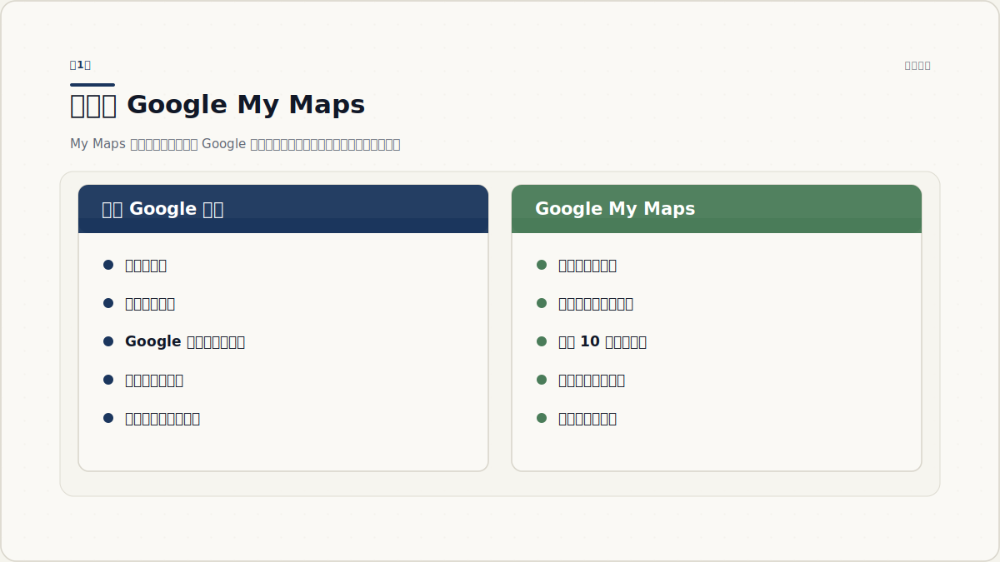
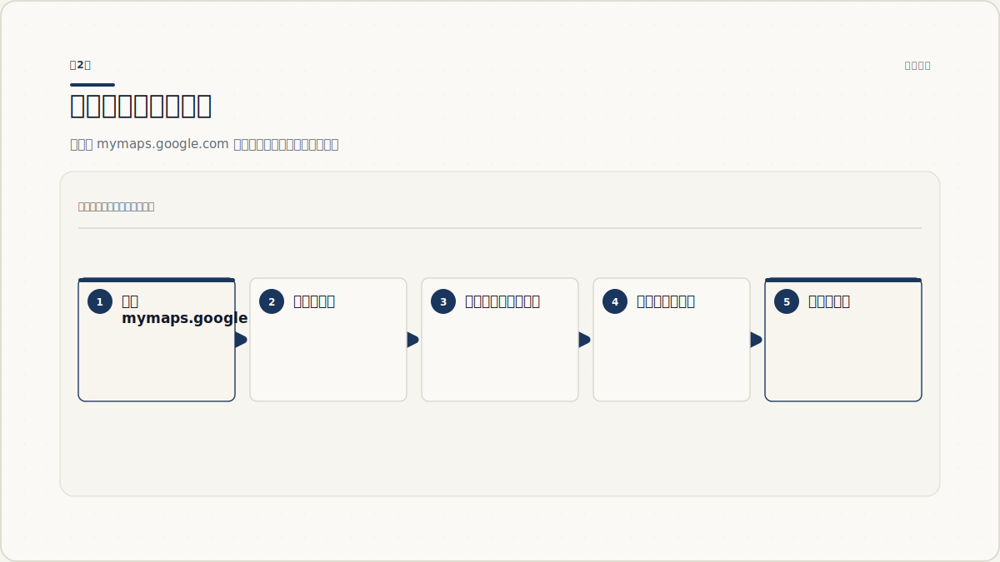
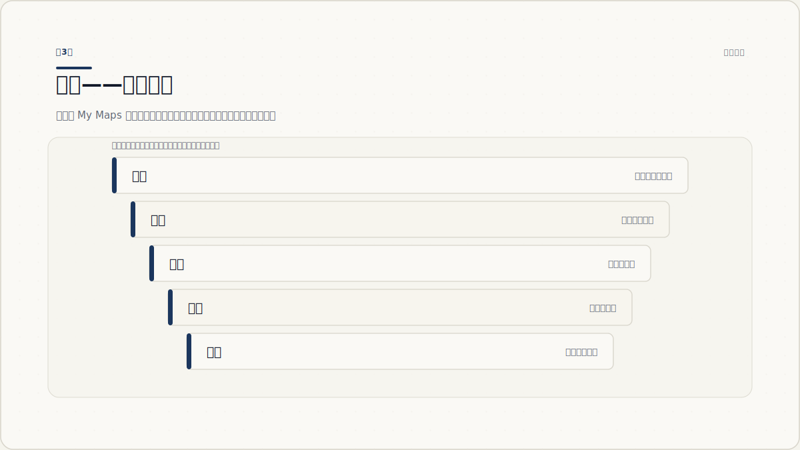
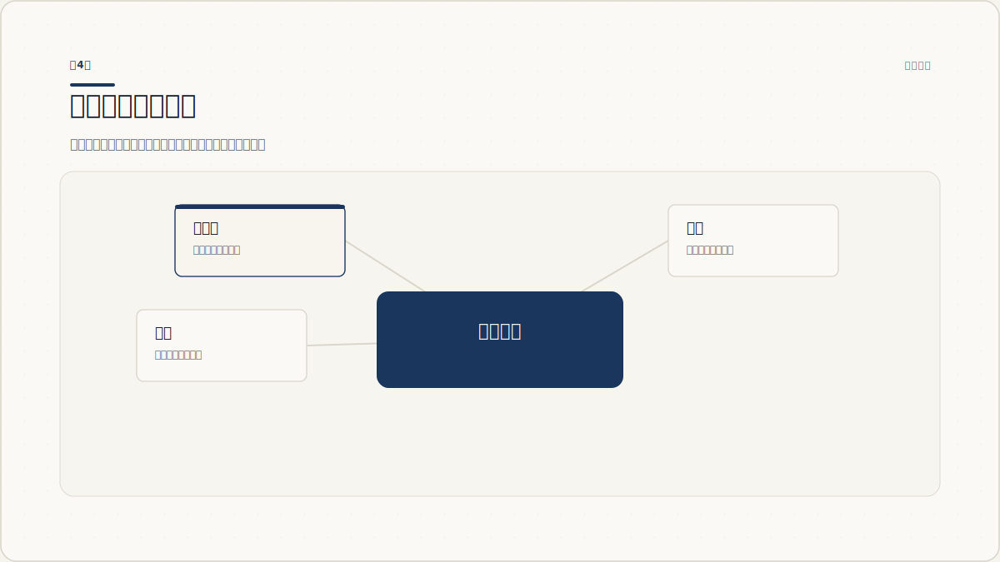
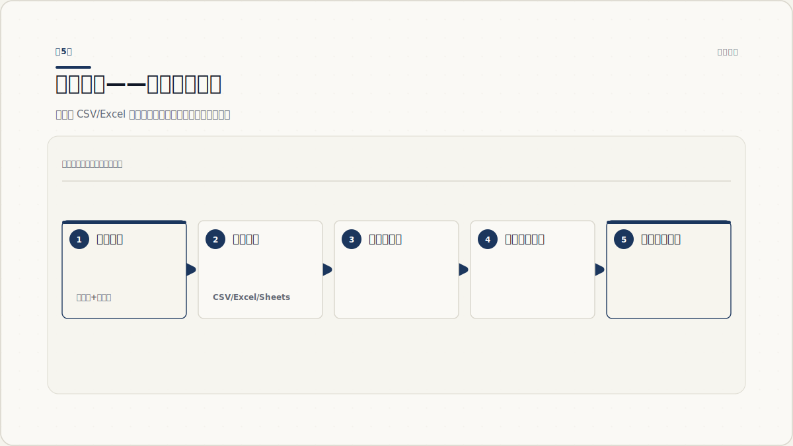
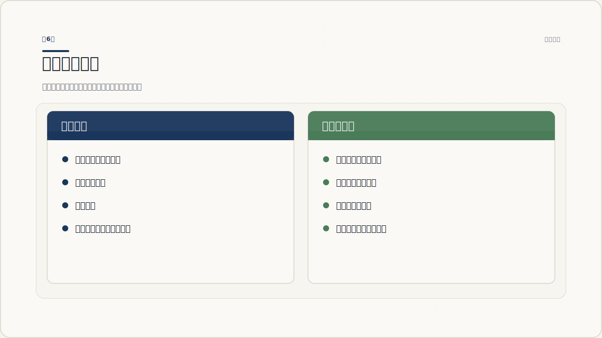
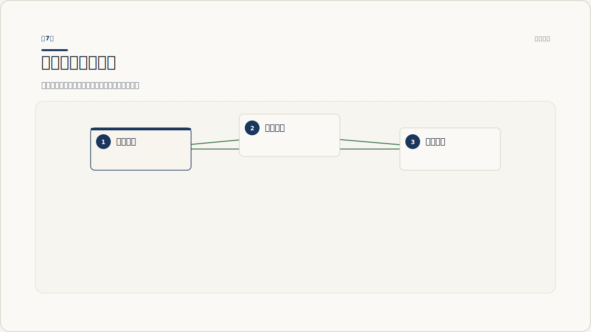
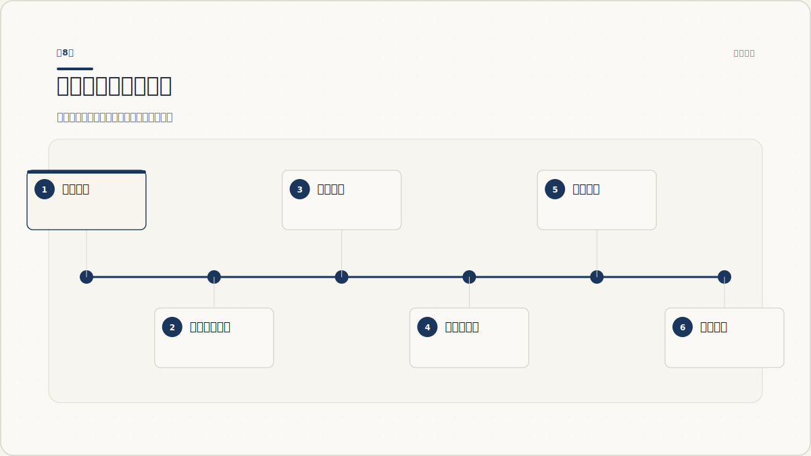

# Google My Maps 自定义地图完全指南：从入门到实战

你有没有遇到过这样的场景：计划一次长途旅行，收藏了几十个地点散落在各个笔记里，每到一处都要重新搜索地址；或者公司有十几家门店，你想在一张图上直观展示分布，却发现普通地图只能一个个点开查看。Google My Maps 就是来解决这些问题的——它让你在 Google 地图的基础上，创建属于你自己的个性化地图。

本文将从零开始，带你逐步掌握 My Maps 的所有常用功能。你不需要任何编程基础，只需要一个 Google 账号。

---

## 第1章 什么是 Google My Maps



### 1.1 My Maps 的定位：地图编辑器，不是导航器

Google My Maps（以下简称 My Maps）是 Google 提供的一款免费工具，位于 `mymaps.google.com`。它的目标不是取代你日常用的 Google 地图导航，而是在 Google 地图的基础数据上，让你叠加自己的信息层。

你可以把它理解成"地图编辑器"：普通 Google 地图是别人做好给你用的，My Maps 是你自己做给自己用（或给别人用）的。

### 1.2 My Maps 与普通 Google 地图的区别

很多人刚接触时会混淆这两个概念。下面这个表格帮你快速区分：

| 对比维度 | 普通 Google 地图 | Google My Maps |
|---------|----------------|---------------|
| 主要用途 | 导航、路况、探索周边 | 创建和管理自定义地图 |
| 数据来源 | Google 提供 | 用户自己添加或导入 |
| 图层数量 | 固定（交通、卫星等） | 用户创建，最多 10 层 |
| 标记方式 | 搜索后保存为"已保存" | 自由添加、批量导入 |
| 共享能力 | 分享单个地点或清单 | 分享整张地图，可协作编辑 |
| 移动端 | 完整功能 | 只能查看，不能编辑 |
| 使用场景 | 日常出行导航 | 旅行规划、数据可视化、活动地图 |

简单来说：如果你需要导航到某个地方，用 Google 地图 APP；如果你想规划一张包含所有目的地的地图并分享给别人，用 My Maps。

### 1.3 谁在用 My Maps

- **旅行者**：规划旅行路线，把所有景点、餐厅、住宿标注在一张图上
- **活动组织者**：制作会议场地地图、婚礼场地指引
- **小企业主**：展示门店分布、服务区域
- **教育工作者**：制作地理教学地图、历史事件地图
- **数据爱好者**：将 CSV 数据可视化到地图上

### 1.4 能力边界

**你能做的事：**
- 创建最多含 10 个图层、20000 个单元格的自定义地图
- 添加 50000 个标记点、10000 条线或形状
- 导入 CSV、Excel、KML、GPX 等多种数据格式
- 通过链接分享、嵌入网页、导出 KML

**你不能做的事：**
- 在手机 APP 中编辑地图（只能在电脑浏览器或手机浏览器中编辑）
- 实时导航（My Maps 没有路线语音引导）
- 交通流量显示（My Maps 使用静态地图数据）
- 高度定制标记尺寸或字体

> 需要留意：My Maps 和 Google 地图"已保存的地点"是不同的功能。已保存的地点是个人收藏，My Maps 是独立的项目式地图，功能强大得多。

---

## 第2章 创建你的第一张地图



本章的目标是让你在 5 分钟内创建一张可以用的地图，先获得"做成了一件事"的成就感。

### 2.1 进入 My Maps

打开浏览器，访问 `mymaps.google.com`，用你的 Google 账号登录。

你会看到一个简洁的界面：左边是地图列表，中间是"创建新地图"按钮。如果你之前从未使用过，列表是空的。

### 2.2 界面介绍

点击蓝色"创建新地图"按钮，进入地图编辑器。

编辑器的布局分为三个区域：

1. **左上方面板**：显示地图标题和图层列表。默认有一个名为"未命名图层"的图层。
2. **中央地图区**：标准的 Google 地图视图，可拖拽缩放。
3. **左下方搜索框**：搜索地点、地址或坐标。

### 2.3 添加第一个标记

这是你的第一个操作：

1. 在搜索框中输入一个你熟悉的地点，比如"天安门广场"。
2. 搜索结果出现后，点击它，地图会跳转到该位置。
3. 在弹窗中点击"添加到地图"，一个标记就出现了。
4. 如果想在任意位置自行放置标记，点击搜索框上方的图钉图标，然后在地图上点击即可。

**添加后的弹窗**允许你修改标记的名称和添加详细描述。例如你可以写"第一次来的必经之地"，描述框中可以写具体信息。

### 2.4 保存、命名和基本设置

地图会自动保存在你的 Google 账户中，但你需要注意：

1. 点击左上方的"未命名地图"，给你的地图起一个有意义的名字。
2. 在描述框中写一句话说明这张地图的用途（可选）。
3. 默认情况下，地图是"私有的"——只有你能看到。发布设置将在第7章详细介绍。

**现在你已经完成了第一张地图**。虽然目前只有一个标记，但你已经掌握了最基本的工作流：搜索或放置 → 命名描述 → 保存。

> 需要留意：My Maps 的自动保存是实时的，不需要手动点击保存按钮。但建议每次修改后确认左上角没有显示"未保存的更改"提示。

---

## 第3章 图层——地图的组织骨架



当你只有几个标记时，所有东西都放在一个图层就够了。但当你规划一次旅行，城市景点、餐厅、住宿、交通方式都有好几类时，一个图层会变成一团乱麻。图层就是来解决这个问题的。

### 3.1 图层是什么

图层是 My Maps 中组织数据的容器。你可以把图层想象成透明胶片，每张胶片上画着不同的信息，叠加在一起就是完整的地图。

- 每个图层可以有自己的可见性（显示/隐藏）
- 每个图层可以统一设置样式
- 图层之间可以移动数据

### 3.2 创建和管理图层

你的地图默认有一个图层。添加更多图层：

1. 在图层面板中，点击"添加图层"按钮（面板底部的"添加图层"文字链接）。
2. 新图层会以"未命名图层"出现，点击名字给它重命名。好的命名习惯很重要，比如"景点"、"餐饮"、"住宿"、"交通"。
3. 最多可以添加 10 个图层。

### 3.3 在图层间移动数据

有时候你可能会把标记放错了图层。修正方法：

1. 在图层中找到要移动的标记（点击地图上的标记，或者在图层面板中点击该标记行）。
2. 点击编辑菜单（标记弹窗中的编辑图标），选择"移动到此图层"或类似选项。
3. 选择目标图层即可。

### 3.4 图层可见性和顺序

- **显示/隐藏图层**：每个图层名称左侧有一个复选框。取消勾选，该图层上的所有内容都会消失（对合作者同样生效）。这在你需要专注于某一类数据时非常有用。
- **调整图层顺序**：拖拽图层名右侧的拖动手柄可以上下移动图层。上面的图层会覆盖下面的图层。

> 需要留意：图层顺序影响视觉效果，但不会影响数据。如果你有线状路线和底部的区域标记，把路线图层放在上面会更清晰。

图层是 My Maps 的核心组织能力。任何超过 15 个标记的地图都建议使用多个图层。

---

## 第4章 标记、线条和形状



标记点（俗称图钉）是地图最基本的元素，但 My Maps 能做的远不止放图钉。

### 4.1 标记点

标记点有两种添加方式：

- **搜索添加**：通过搜索框找到地点后点击"添加到地图"。
- **手动放置**：点击图钉图标后在地图上点击。

每个标记点都可以：
- 修改名称和描述
- 添加图片或视频链接
- 更换颜色和图标（详见第6章）
- 在弹出窗口中显示富文本描述

手动放置标记时，你可以按住标记并拖动来微调位置。

### 4.2 绘制线条

线条工具位于图钉图标旁边的下拉菜单中（点击下拉箭头展开）：

- **绘制路线**：点击起点，然后逐个点击途经点，双击结束。适合标注自驾路线、跑步路径等。
- **线条的用途**：标注通勤路线、徒步路径、飞行线路等。每条线都可以命名和着色。

### 4.3 绘制形状

形状工具在同一个下拉菜单中，图标是一个多边形。

- **绘制多边形**：点击地图开始绘制，每点一次增加一个顶点，双击结束闭合。
- **用途场景**：标注一个区域（比如某个公园的范围、某个商圈的覆盖范围）、热区、服务区域等。

### 4.4 添加详情到元素

无论标记、线条还是形状，点击编辑都可以添加：

- **文字描述**：详细的说明文字
- **图片 URL**：直接粘贴图片链接，地图弹窗会显示图片
- **视频链接**：YouTube 视频链接可以直接嵌入

**一个实用的例子**：假设你在标记一个餐厅，可以在描述中写上营业时间、推荐菜品、联系电话，并附上招牌菜的照片链接。

> 需要留意：线条和形状会占用图层的视觉空间。如果地图上线条太多，可以把它放在单独的图层中，需要时再打开查看。

---

## 第5章 数据导入——从表格到地图



如果你有几十个、上百个地点需要标注，一个个手动添加是不现实的。My Maps 支持从表格文件批量导入数据，这是它最强大的功能之一。

### 5.1 支持的格式

- **CSV**（逗号分隔值）：最常见，可关联地址或经纬度坐标
- **TSV**（制表符分隔值）：类似 CSV
- **Excel**（.xlsx）：可直接导入
- **Google Sheets**：从 Google 表格直连导入
- **KML / KMZ**：Google Earth 和其他地图工具的通用格式
- **GPX**：GPS 设备导出的轨迹数据

### 5.2 准备数据

导入之前，你的数据文件需要满足几个条件：

1. **文件首行必须是标题行**：每一列需要有一个名字。
2. **必须有一列包含位置信息**：可以是地址文本（如"北京市东城区东华门街道"），也可以是经纬度（纬度、经度分开两列），或者 WKT 几何数据格式。
3. **建议有一列作为标记标题**：虽然不是必须的，但有一个标题列会让标记清晰很多。

以 CSV 为例，一个良好的数据文件长这样：

```csv
门店名称,地址,电话,营业时间
朝阳门店,北京市朝阳区建国路88号,010-12345678,9:00-21:00
海淀门店,北京市海淀区中关村大街1号,010-87654321,9:00-22:00
西城门店,北京市西城区金融街15号,010-11223344,10:00-20:00
```

### 5.3 导入流程

1. 点击图层面板中"导入"链接（在图层名下方）。
2. 选择文件（或直接将 CSV/XLSX 文件拖入浏览器窗口）。
3. My Maps 会解析文件内容，弹出对话框让你选择哪一列包含位置信息。
4. 选择位置列（地址或经纬度）后，点击"继续"。
5. 选择哪一列作为标记的标题（可选）。
6. 点击"完成"——几十个标记会在一瞬间全部出现在地图上。

**导入 Google Sheets 的方法**：在导入对话框中选择 Google 云端硬盘，找到你的表格文件，其他步骤相同。

### 5.4 导入后的检查和调整

数据导入完成后，花几分钟检查：

1. **是否有飘到错误位置的标记**？大概率是地址列选择有误或数据格式问题。
2. **标题是否正确**？每个标记的名称是否来自正确的列？
3. **图层分组**：如果需要，把刚导入的数据移动到专门的图层中。
4. **修正个别标记**：双击任何标记可以编辑其名称和描述。

> 需要留意：地址匹配并不是 100% 准确的。如果 Geocoding（地理编码）未找到完全匹配的地址，标记可能会出现在近似位置。建议导入后快速浏览一遍地图，手动调整不准确的位置。

---

## 第6章 样式与个性化



当你有几十个标记出现在地图上时，如果全是统一的蓝色图钉，读起来会很吃力。本章教你如何让地图清晰且美观。

### 6.1 统一修改标记颜色和图标

在图层中，鼠标悬停到图层名上，你会看到一个油漆桶图标（统一样式按钮）。

1. 点击油漆桶图标。
2. 弹窗中你可以选择：
   - **颜色**：从调色板中选择一种颜色，该图层所有标记都会变成这个颜色。
   - **图标**：选择一个预设图标（箭头、餐饮、购物、住宿、医疗等分类图标）。

这是快速区分不同图层内容的最佳方式。比如"景点"图标设为蓝色、"餐饮"设为红色、"住宿"设为黄色。

### 6.2 为不同类型设置不同样式

有时候同一个图层内的数据也需要视觉区分。比如同一层中既有"高优先级的景点"也有"备选景点"。

1. 在图层中选择一个或多个标记（按住 Shift 或 Ctrl 多选）。
2. 点击选中的标记，在弹出菜单中选择颜色/图标更改。
3. 这种修改只影响选中的标记，不影响同层其他标记。

**推荐的分色方案：**
- 红色：必去/紧急/重要
- 蓝色：中性/已确认
- 绿色：已完成/可选
- 黄色：待确认/待定

### 6.3 自定义图标库

My Maps 提供了一组分类图标——餐厅、购物袋、帐篷、飞机、医院等。选择"更多图标"或"MORE ICONS"可以看到完整的图标库。

图标库是按分类排列的，虽然没有搜索功能，但滚屏浏览可以找到大部分常见图标。

如果你需要完全自定义的图标，可以考虑：
- 在标记描述中添加图片链接来展示标志性照片
- 通过 KML 导入支持自定义图标 URL（需要手动编辑 KML 文件）

### 6.4 调整底图样式

My Maps 允许你更改地图的底图样式：

1. 在左下面板找到"基础地图"选项（通常在图层面板下方）。
2. 点击展开，你会看到多种地图样式：
   - **地图**：标准 Google 地图样式
   - **卫星**：卫星图
   - **地形**：显示等高线
   - **浅色**/**深色**/**极简**等主题

对于数据展示型地图，**浅色**或**极简**样式通常效果最好，因为它会减少街道细节的干扰，让你的标记更突出。

> 需要留意：My Maps 的自定义选项其实比较有限。你不能改变标记的尺寸、线条的虚线类型、或者添加阴影。如果你需要更精确的设计控制，可以考虑导出 KML 后用 Google Earth 打开。

---

## 第7章 分享、协作与嵌入



地图做好了，现在你想让别人看到它。本章涵盖所有发布方式。

### 7.1 隐私设置

在编辑器左侧面板中，点击"分享"按钮（在标题下方）。

弹窗中有三个权限层级：

1. **私密**：只有你自己能看到。适合个人规划。
2. **知道链接的用户**：获得链接的人可以查看。最适合大多数分享场景。
3. **公开**：所有人都可以通过搜索找到（在 Google 地图和 Google 搜索中）。适合公共场所指引或对外发布。

### 7.2 生成分享链接

1. 点击"分享"按钮。
2. 在权限中选择"知道链接的用户"或"公开"。
3. 复制显示出的链接。
4. 把链接发给别人即可。对方用手机浏览器打开链接就可以直接查看地图，不需要安装任何 APP。

**在手机上查看**：收件人打开链接后，可以点击右上角的"在 Google 地图中打开"按钮，地图标记会自动导入 Google 地图 APP。不过请注意：在手机 APP 中只能查看，不能编辑标记。

### 7.3 添加协作者

如果你需要和别人一起编辑地图：

1. 在分享弹窗中，底部有一个"添加协作者"区域。
2. 输入对方的邮箱地址。
3. 对方登录自己的 Google 账号后，会收到通知，可以在自己的 My Maps 列表中看到这张地图。
4. 所有协作者的修改会实时同步。

**协作最佳实践**：如果多人编辑，建议提前约定图层的命名规范和标签颜色规则，避免冲突。

### 7.4 嵌入网页

如果你有自己的网站或博客，可以把地图直接嵌入：

1. 点击地图标题旁的三个点菜单（⋮），选择"嵌入到我的网站"。
2. 复制生成的 HTML 代码。
3. 粘贴到你网站的 HTML 中。

嵌入代码会生成一个可交互的地图窗口，不需要 API 密钥，完全免费。嵌入的地图会实时更新——你在 My Maps 中做的任何修改都会自动反映在嵌入页面中。

### 7.5 导出为 KML/KMZ

如果你需要把地图数据迁移到其他平台，或者备份数据：

1. 点击三个点菜单（⋮），选择"导出为 KML/KMZ"。
2. 你的浏览器会自动下载一个 .kmz 文件。
3. 这个文件可以在 Google Earth（PC 版）中打开，也可以导入其他支持 KML 的 GIS 工具。

> 需要留意：嵌入地图虽然在网页上工作良好，但移动端适配取决于网站本身的响应式设计。确保你的网站容器能自适应手机屏幕。

---

## 第8章 实战场景与综合案例



本章将前面所有知识点串起来，通过三个真实场景和一个综合练习帮助你融会贯通。

### 8.1 场景一：旅行路线规划

假设你要计划一次"北京-西安-成都"的自由行。

**步骤：**

1. **创建地图**：命名为"2026 秋旅行计划"。
2. **建立图层**：分为"城市交通"、"景点"、"餐饮"、"住宿"四个图层。
3. **添加城市间主要交通**：在"城市交通"图层，使用线条工具绘制北京→西安→成都的路线，标注高铁站点。
4. **逐个添加景点**：搜索各城市景点添加到"景点"图层，统一使用橙色标记。
5. **添加餐厅和住宿**：在"餐饮"和"住宿"图层中添加，分别使用不同颜色。
6. **标注详细说明**：在每个标记中写入开放时间、门票价格、实用贴士。
7. **分享**：设置为"知道链接的用户"，把链接发给同行的朋友。

### 8.2 场景二：会议或活动场地地图

公司要在某个城市举办大会，需要给参会者一张指引地图。

**步骤：**

1. **底图**：选择"浅色"样式，以减少颜色干扰。
2. **核心图层**："主会场"——在会场位置放置特殊图标（如星形），颜色突出（红色）。
3. **辅助图层**：
   - "分会场"——用不同颜色分别标注
   - "交通"——标注最近的地铁站、停车场
   - "餐饮配套"——附近餐厅和咖啡店
   - "住宿推荐"——合作酒店
4. **嵌入网站**：将地图嵌入活动官网，参会者可以直接在页面上查阅。
5. **打印备用**：导出为 KML 后，可以在 Google Earth 中打开打印纸质版。

### 8.3 场景三：数据可视化（门店分布）

你有一份包含 50 家门店地址和销售数据的 Excel 表格，想直观地在图上看到分布。

**步骤：**

1. **准备数据**：确保 Excel 文件有"门店名"、"地址"、"月销售额"、"门店类型"等列。
2. **导入数据**：新建地图 → 导入 → 选择 Excel 文件 → 指定地址列和标题列。
3. **分层管理**：导入后，使用"统一样式"功能为"门店类型"分配不同颜色。
4. **图例说明**：在地图描述区域写一个简短的图例，说明颜色对应关系。
5. **发布**：设置为公开或知道链接，分享给管理层查看。

### 8.4 综合练习

**任务**：从零开始创建一个"我的城市生活地图"，包含：

- 至少 3 个图层（如"常去的地方"、"想去的地方"、"推荐给朋友的"）
- 每个图层至少 5 个标记
- 至少一条线路或一个形状
- 每个图层使用不同的颜色
- 为地图启用了适当的基础地图样式
- 设置了分享权限

**自检清单：**

| 检查项 | 完成情况 |
|--------|---------|
| 地图有清晰的名字和描述 | □ |
| 至少创建了 3 个有意义的图层 | □ |
| 每个图层标记颜色不同 | □ |
| 有一条绘制的线路或一个形状 | □ |
| 至少一个标记包含图片链接或详细描述 | □ |
| 基础地图使用了非默认样式 | □ |
| 地图分享设置为"知道链接的用户" | □ |
| 整体地图布局清晰，标记不重叠混乱 | □ |

### 8.5 下一步学习

恭喜你，到这里你已经掌握了 Google My Maps 的核心功能。如果你想进一步探索：

- **Google Earth**：在 PC 端 Google Earth 中打开导出的 KML 文件，可以进行 3D 浏览
- **Google Tables + My Maps**：Google 表格中的数据可以用 Apps Script 自动同步到 My Maps
- **GIS 工具**：如果对地理信息感兴趣，可以了解 QGIS（免费开源 GIS 软件）

---

## 延伸阅读

- [Google My Maps 官方帮助中心](https://support.google.com/mymaps/#topic=3024924)
- [在自定义地图上可视化数据 - Google Earth Outreach](https://www.google.com/earth/outreach/learn/visualize-your-data-on-a-custom-map-using-google-my-maps/)
- [使用 Google My Maps 规划旅行 - Sitebuilder Report](https://www.sitebuilderreport.com/google-my-maps-tutorial)
- [How to Create a Custom Map in Google Maps - The Cartographic Institute](https://thecartographicinstitute.com/how-to-make-a-custom-map-in-google-maps-add-pins-routes-layers-and-more/)
