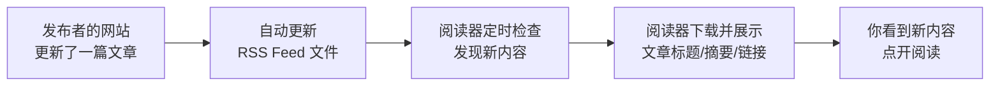
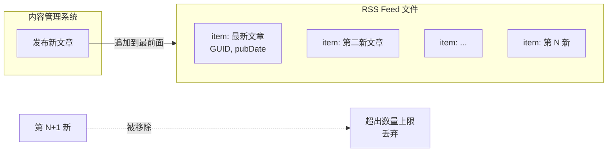
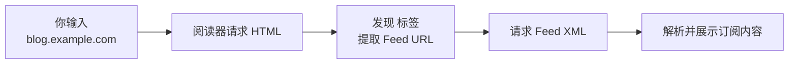
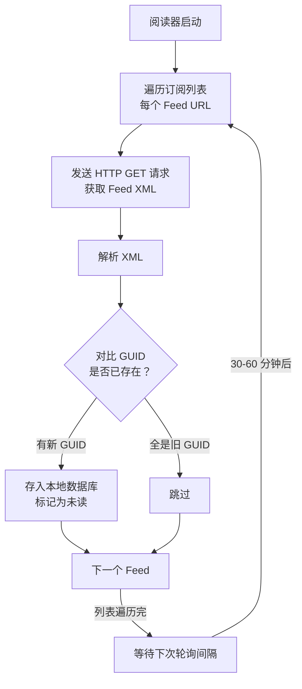
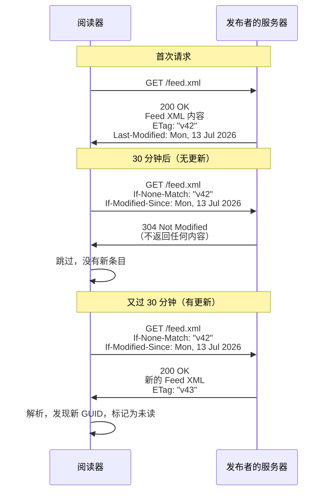
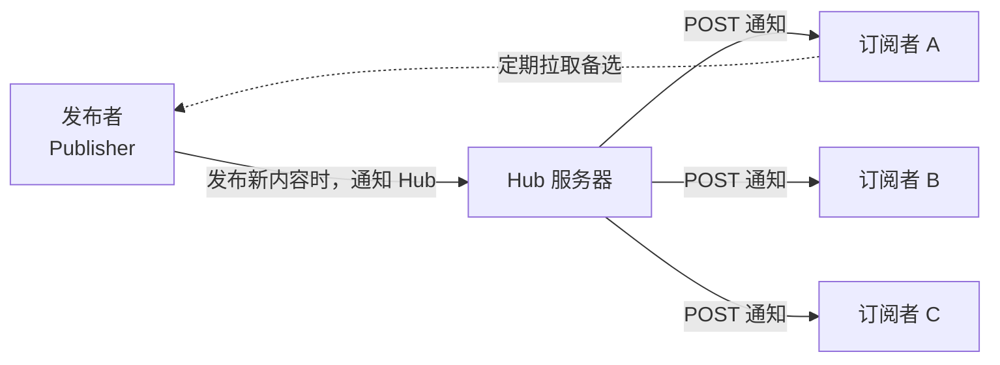

# RSS 信息传播工作流：从发布到获取的完整链路

> 发布日期：2026-07-14

你每天会看多少个网站？博客、新闻站、论坛、社交平台……要一个个点开检查有没有更新，光想想就累。RSS 就是为这个场景设计的。这篇教程带你从零理解 RSS 的信息传播链路——内容是怎么从发布者一步步走到你面前的。

---

## 第1章 RSS 是什么：内容世界的"订报系统"

### 1.1 一个熟悉的问题，一个古老的解法

想象你订了《南方周末》。邮递员每天早上把报纸塞进你家的信箱——你不需要每天跑去报摊问"今天出新版了吗"。报纸出版一次，整座城市的订户都能收到。

RSS 干的是一样的活。

但网站不是报纸，不会主动给你"投递"。RSS 的妙处在它用了一种更轻量的方式模拟这个流程：

- **发布者**每次更新内容时，顺便更新一个纯文本的"目录文件"
- **阅读器**（你的邮箱）定期去检查这个目录文件有没有变化
- 如果有新内容，阅读器就下载回来，整齐地摆在你面前

你不需要访问任何网站，也不需要给任何网站留下邮箱。你只需要一个阅读器，和一个 Feed 地址。

### 1.2 三句话概括 RSS 工作流



这个过程分三步：**发布 → 订阅 → 获取**。听起来简单，但每一步都有自己的细节和坑。接下来三章，一章讲一个角色。

### 1.3 三个角色

| 角色 | 做什么 | 谁来做 |
| --- | --- | --- |
| **发布者** | 生产内容，生成 Feed 文件 | 博客、新闻站、播客等 |
| **订阅者** | 提供 Feed URL，决定关注什么 | 你 |
| **阅读器（聚合器）** | 定期拉取 Feed，解析 XML，展示内容 | Feedly、Inoreader、NetNewsWire 等 |

> **什么是阅读器/聚合器？** 一个专门用来管理 RSS 订阅的工具。你把 Feed URL 添加进去，它帮你定期检查更新、下载内容、整理展示。就像一个"收件箱"，只不过信是由阅读器主动去拿的。

> **Feed 是什么？** 一个 XML 文件，按标准格式列出网站最近发布的内容条目（标题、链接、摘要、时间等）。阅读器认识这个格式，能自动解析。

---

## 第2章 发布端：Feed 文件是怎么诞生的

### 2.1 每一篇新文章都会触发一次"发报"

你在博客上写了一篇新文章，点击"发布"。CMS（WordPress、Hugo、Ghost 等）会做两件事：

1. 把文章写入数据库，生成 HTML 页面
2. **同步更新 RSS Feed 文件**——把新文章的信息追加到 XML 文件的最前面

这个 Feed 文件通常放在一个固定 URL 上，比如 `https://example.com/feed.xml` 或 `https://example.com/feed/`。

任何人访问这个 URL，看到的就是结构化的 XML，而不是花哨的网页。

### 2.2 Feed 文件长什么样

一个 RSS 2.0 格式的 Feed 长这样：

```xml
<?xml version="1.0" encoding="UTF-8"?>
<rss version="2.0">
  <channel>
    <title>张三的博客</title>
    <link>https://example.com</link>
    <description>关于技术和生活的一些思考</description>
    <language>zh-cn</language>

    <item>
      <title>用 Rust 写了一个命令行工具</title>
      <link>https://example.com/rust-cli-tool</link>
      <description>这篇文章介绍了我最近用 Rust 写的一个小工具……</description>
      <pubDate>Tue, 14 Jul 2026 09:00:00 GMT</pubDate>
      <guid>https://example.com/rust-cli-tool</guid>
    </item>

    <item>
      <title>前一篇</title>
      <link>https://example.com/previous-post</link>
      <description>……</description>
      <pubDate>Mon, 06 Jul 2026 14:30:00 GMT</pubDate>
      <guid>https://example.com/previous-post</guid>
    </item>
  </channel>
</rss>
```

关键字段：

| 字段 | 含义 |
| --- | --- |
| `<channel>` | 整个频道，包含博客本身的元信息 |
| `<title>` / `<link>` / `<description>` | 频道的标题、网址、介绍 |
| `<item>` | 单篇文章，每个 `<item>` 就是一条独立内容 |
| `<guid>` | 全局唯一标识符，阅读器靠它判断"这篇是不是新的" |
| `<pubDate>` | 发布时间，阅读器据以排序 |

> **什么是 GUID？** Globally Unique Identifier。阅读器通过 GUID 来判断一篇文章是否已经在本地存过。如果两篇文章的 GUID 一样，阅读器就知道是重复条目，不会再展示。常见做法：直接用文章 URL 做 GUID。

### 2.3 一个 Feed 里放多少条？

通常只保留最近的 **10–50 条**。Feed 文件是增量的一种记录，不是历史存档。

旧条目的处理方式：当 CMS 发布新文章，最旧的 `<item>` 被移除，新的插到最前面。所以阅读器必须及时拉取，否则会漏掉已被挤出 Feed 的内容。



### 2.4 不只文章——播客、视频、天气都能用 RSS

RSS 的 `<item>` 可以附带 `<enclosure>` 标签，指向一个媒体文件：

```xml
<enclosure url="https://example.com/episode-42.mp3"
           length="12345678"
           type="audio/mpeg" />
```

这就构成了**播客**的基础。播客客户端本质就是一个专门听音频的 RSS 阅读器。Apple Podcasts、Spotify、小宇宙——底层都是 RSS。

---

## 第3章 订阅端：告诉阅读器"我想看这个"

### 3.1 找到那条 Feed 链接

订阅的第一步，是找到网站的 Feed URL。

常见位置：
- URL 末尾加 `/feed/`、`/feed.xml`、`/rss/`、`/atom.xml`
- 浏览器地址栏右侧的 RSS 图标（如果网站支持）
- 网页源代码里搜索 `<link type="application/rss+xml">`
- 用 RSS 浏览器扩展自动探测

看起来原始，但实际上浏览器和阅读器大多支持**自动发现**——你输入网站的首页 URL，阅读器会自动在 HTML 头部找这个标签：

```html
<link rel="alternate" type="application/rss+xml"
      title="张三的博客" href="https://example.com/feed.xml">
```

> **自动发现是什么？** 阅读器在你输入博客主页 URL 时，先请求该页面的 HTML，从中查找 `<link rel="alternate" type="application/rss+xml">` 标签，提取 Feed URL，再请求 Feed。你甚至不需要手动输入 Feed 地址。



### 3.2 订阅在阅读器里意味着什么

订阅不是"登录"或"关注"，它只是一条记录：

```
"用户张三" 关注了:
  - https://blog.example.com/feed.xml  (上次检查: 2026-07-14 10:00)
  - https://news.other.com/rss          (上次检查: 2026-07-14 09:45)
  - https://podcast.third.com/feed.xml  (上次检查: 2026-07-14 09:30)
```

每个阅读器实现不一样，但逻辑几乎一样：

```
订阅列表 = [
  { url: "https://.../feed.xml", last_check: "2026-07-14T10:00Z", etag: "abc123" },
  ...
]
```

没有密码、没有关注按钮、没有算法推荐。就是一条 URL + 上次检查的结果缓存。

### 3.3 常见的订阅方式

| 方式 | 说明 |
| --- | --- |
| 在阅读器里**直接搜索**博客名称 | 阅读器后台用搜索引擎找 Feed |
| 手动**粘贴 Feed URL** | 最直接，适合知道 Feed 地址的人 |
| 浏览器插件**一键订阅** | 检测到页面支持 RSS，点击即订阅 |
| **NewsBlur / Feedly 导入 OPML** | 批量迁移用 OPML 文件（订阅列表的"格式文件"） |

> **OPML 是什么？** 一种 XML 格式，专门用来导入导出 RSS 订阅列表。你的收藏清单可以导出为一个 OPML 文件，分享给朋友或迁移到另一个阅读器。

---

## 第4章 获取端：阅读器怎么把内容拿回来

### 4.1 核心机制：定时轮询（Polling）

阅读器没有"上帝视角"，它不知道发布者什么时候更新。所以它用了一个朴素的策略——**定期检查**。



不同阅读器的轮询间隔：

| 阅读器 | 典型间隔 |
| --- | --- |
| Feedly / Inoreader（云服务） | 每 15–60 分钟 |
| NetNewsWire / 本地客户端 | 每 30–60 分钟 |
| Miniflux / 自部署 | 可自定义，常用 30 分钟 |
| 浏览器内置 RSS | 每小时甚至更长 |

### 4.2 不要浪费带宽：条件请求（304 / ETag）

如果每次检查都完整下载整个 Feed XML，对发布者和阅读器都是浪费——绝大多数时候，Feed 没变。

所以 HTTP 协议提供了两个机制：

**Last-Modified / If-Modified-Since**

- 阅读器第一次获取时，服务器在响应头里返回：`Last-Modified: Tue, 14 Jul 2026 09:00:00 GMT`
- 阅读器记下这个时间。下次检查时在请求头里带：`If-Modified-Since: Tue, 14 Jul 2026 09:00:00 GMT`
- 如果服务器判断 Feed 没更新，直接返回 **304 Not Modified**，不返回任何内容。阅读器知道"没有新东西"。

**ETag / If-None-Match**

- 服务器返回：`ETag: "abc123"`
- 阅读器下次带：`If-None-Match: "abc123"`
- 服务器比对 ETag，没变就返回 304。

ETag 比 Last-Modified 更精确——因为 Feed 可能在其他维度变了但时间戳没变。



> **304 Not Modified 不返回内容** — 这意味着你订阅 100 个源，90% 的检查请求都几乎不消耗流量。一个靠谱的阅读器必然实现了这两种缓存机制。

### 4.3 实时推送：WebSub

Polling 有一个天然延迟——如果发布者刚发了文章，阅读器可能在 30 分钟后才来检查。对于新闻、Alert 这类场景，太慢了。

**WebSub**（前身 PubSubHubbub）解决了这个问题。它不是推翻了 RSS，而是在 RSS 之上加了一个"通知层"。



流程：

1. 发布者在 Feed XML 里加入一个 `<link rel="hub" href="https://hub.example.com/">`
2. 阅读器解析到时，向 Hub 注册：有新内容通知我
3. 发布者发布内容 → 通知 Hub → Hub 批量通知所有注册的阅读器
4. 阅读器收到通知，再去拉取最新 Feed（或者 Hub 直接推送内容）

> **WebSub 的"通知"不是说 Hub 把文章内容推送给所有人**——Hub 发一个"有更新了"的信号，阅读器收到信号后还是要去 HTTP GET 一次 Feed。这个信号把等待时间从轮询间隔（30 分钟）缩短到了几秒。

### 4.4 渲染：内容如何呈现给你

当阅读器拿到了新的 `<item>`，它做这些事：

1. 读取 `<title>` — 显示在文章列表
2. 读取 `<description>` — 显示摘要（支持 HTML）
3. 读取 `<link>` — 做成可点击的标题
4. 读取 `<pubDate>` — 按时间排序
5. 读取 `<guid>` — 去重

最终你看到的就是一个时间倒序的信息流，类似：

```
┌─────────────────────────────────────────────┐
│  张三的博客                         已更新 3 条│
├─────────────────────────────────────────────┤
│  ● 用 Rust 写了一个命令行工具     │  2026-07-14 │
│     这篇文章介绍了我最近用 Rust……           │
├─────────────────────────────────────────────┤
│  ● Docker 容器化实践              │  2026-07-12 │
│     在生产环境用 Docker 部署应用……           │
├─────────────────────────────────────────────┤
│  ● 2026 年中读书总结              │  2026-07-08 │
│     上半年读过的 12 本书和我的推荐……         │
└─────────────────────────────────────────────┘
```

有些阅读器支持**全文抓取**——如果 Feed 只提供了摘要（部分 `<description>`），阅读器可以进一步请求文章原文 HTML，解析正文并展示。这需要阅读器有抓取引擎，也是它消耗资源最多的地方。

---

## 第5章 完整链路图与工程细节

### 5.1 全流程总览

```mermaid
flowchart TB
    subgraph Publish[发布阶段]
        W[博主写完文章<br/>点击发布] --> CMS[CMS 生成 HTML 页面]
        CMS --> Feed[更新 Feed XML 文件<br/>放在固定 URL]
    end

    subgraph Subscribe[订阅阶段]
        U[你想到<br/>"我想关注这个博客"] --> URL[获取 / 发现<br/>Feed URL]
        URL --> Reader[在阅读器中添加<br/>Feed URL]
        Reader --> DB[阅读器将 URL<br/>存入订阅列表]
    end

    subgraph Fetch[获取阶段]
        Poll[阅读器定时轮询<br/>每个订阅的 Feed URL] --> Req[HTTP GET 请求<br/>带条件缓存头]
        Req --> Resp{服务器响应}
        Resp -->|304 Not Modified| Skip[无新内容<br/>跳过]
        Resp -->|200 OK + XML| Parse[解析 XML]
        Parse --> Items[遍历 <item>]
        Items --> Check{GUID 对比<br/>是否已存在？}
        Check -->|否| Save[存入数据库<br/>标记未读]
        Check -->|是| Ignore[忽略]
    end

    subgraph Read[阅读阶段]
        Save --> UI[阅读器界面<br/>显示新内容]
        UI --> You[你打开阅读器<br/>点开感兴趣的]
    end

    Publish --> Subscribe
    Subscribe --> Fetch
    Fetch --> Read
```

### 5.2 一张表总结：发布者在服务器上做了什么

发布者不需要写代码。CMS 帮你做了所有事。但你应该了解底层发生了什么：

| 时间 | 事件 | 服务器发生了什么 |
| --- | --- | --- |
| 14:00 | 博主发布新文章 | CMS 写数据库 + 静态页面渲染 |
| 14:00:01 | CMS 更新 Feed 文件 | 新 `<item>` 写入 XML 最前面，最旧的被移出 |
| 14:03 | 阅读器 A 来检查 | 发现新 GUID，拉取，你看到新文章 |
| 14:15 | 阅读器 B 来检查 | 同上 |
| 14:30 | 阅读器 C 来检查 | 同上 |
| 14:45 | 所有阅读器再次检查 | ETag 匹配，全部 304，零内容传输 |

### 5.3 两个你一定会遇到的坑

**坑一：Feed 只保留最近 N 条**

如果你一个月没打开阅读器，你的阅读器可能漏掉了文章——因为 Feed 文件只保留最近的 10–50 条，旧的已经被挤出去了。

大多数云阅读器（Feedly、Inoreader）有**内容存档机制**——它们会保存所有拉取过的条目，即使这些条目已经从 Feed 里消失了。但本地阅读器只存储拉取时看到的内容，一旦错过就再也拿不回来。

> 解决方案：要么用云阅读器，要么自部署一个（如 Miniflux、FreshRSS）自己做存档。

**坑二：不是所有 Feed 都提供全文**

有些博客的 Feed 只输出摘要（几十个字），你必须在阅读器里点进原文去看。阅读速度被打断。

> 解决方案：选择支持"全文抓取"的阅读器（如 Inoreader 付费版、Miniflux 等）。

---

## 练习与自查

### 练习 1：手动追踪一条 Feed 的全生命周期

选一个你常看的博客，打开开发者工具（F12）：

1. 在 HTML 的 `<head>` 中找到 `<link rel="alternate" type="application/rss+xml">`，复制它的 `href`
2. 在浏览器中打开这个 URL，观察 XML 结构——找到 `<item>`、`<guid>`、`<pubDate>`
3. 打开浏览器的 Network 面板，刷新 Feed URL 的请求，观察响应头里的 `ETag` 和 `Last-Modified`
4. 再次请求，观察请求头是否带上了 `If-None-Match` 和 `If-Modified-Since`

完成这四步，你就亲眼看到了 RSS 的信息传播全链路。

### 练习 2：在本地启动一个最小 RSS 系统

1. 用你家人的博客，或者直接在本地创建一个 `feed.xml` 文件
2. 任意选一个 RSS 客户端（如 Fluent Reader、NetNewsWire），添加这个本地文件 URL
3. 修改 `feed.xml`，加一条新的 `<item>`，用浏览器刷新
4. 观察阅读器是否检测到了更新

### 自查清单

- [ ] 我能说清 RSS 的"拉取"模式是什么意思
- [ ] 我能区分 `<guid>` 和 `<pubDate>` 的作用
- [ ] 我知道为什么会出现"信息断层"（一个月后打开阅读器发现旧文章消失了）
- [ ] 我知道 `ETag` 和 `304 Not Modified` 是用来干什么的
- [ ] 我能说出 WebSub 和传统轮询的区别
- [ ] 我能找到任何一个网站的 RSS Feed URL

---

## 延伸阅读

| 资源 | 说明 |
| --- | --- |
| [RSS 2.0 规范](https://www.rssboard.org/rss-2-0-11) | 官方规范，读一遍 `<rss>` 到 `<item>` 的定义就能搞懂 Feed 格式 |
| [RSS 维基百科](https://en.wikipedia.org/wiki/RSS) | 历史和版本差异（RSS vs Atom） |
| [WebSub W3C 规范](https://www.w3.org/TR/websub/) | 推送机制的完整说明 |
| [开源阅读器 Miniflux](https://miniflux.app/) | 用 Go 写的最小化 RSS 阅读器，可自部署，适合深入学习 |

### 下一步学什么

- 学习 **Atom Feed 格式**（RSS 的竞争对手，格式更严格但更现代化）
- 搭建一个自部署 RSS 阅读器（Miniflux、FreshRSS）——体验当"自己的信息管家"
- 了解 RSS 在 Podcast 中的完整工作流（Apple 有一个专门的 Podcast Feed 规范）
- 用 RSS 配合自动化工具（如 Make、n8n）搭建自己的信息处理流水线
