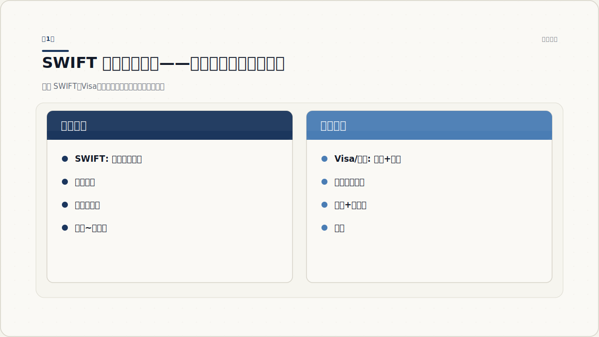
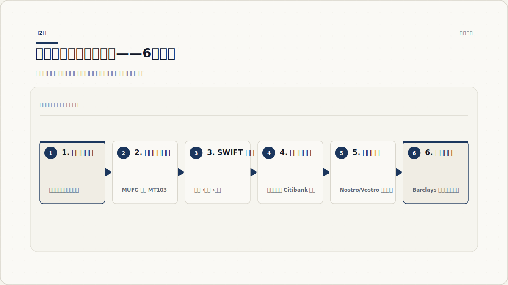
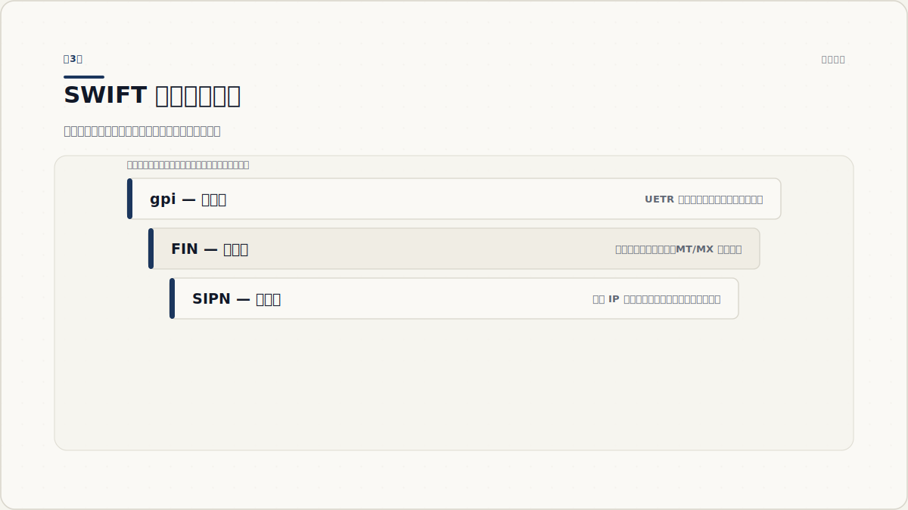
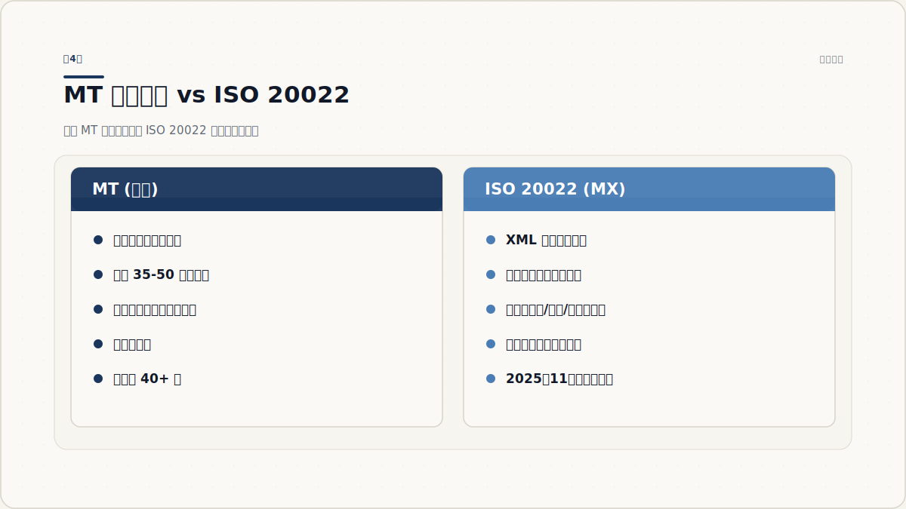
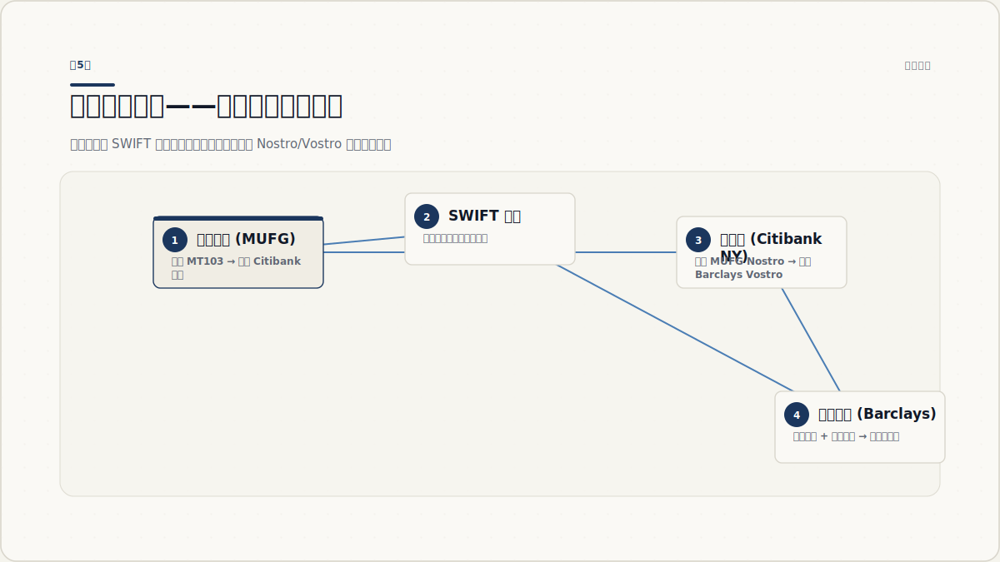
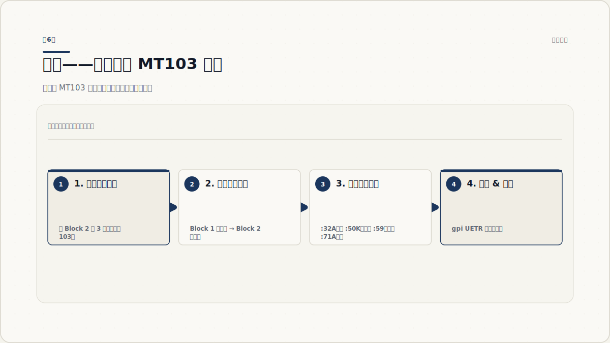

# SWIFT 系统工作原理——从门外汉到能看懂报文

2026 年 7 月

你向境外汇一笔款，银行说"3-5 个工作日到账"。过去这一周里，你的钱到底走了哪条路？谁碰过它？为什么不是秒到？

绝大多数人——甚至不少金融从业者——对 SWIFT 只有一个模糊的印象："国际汇款用的系统"。这个印象没错，但漏掉了最关键的一件事：**SWIFT 不碰钱**。

本教程从零开始，把 SWIFT 到底是什么、报文怎么流转、钱怎么到账、以及你以后怎么看懂 SWIFT 报文，一层层讲清楚。

---

## 第1章 SWIFT 到底是什么？

### 1.1 最常见的误解

很多人以为 SWIFT 就像国际版的支付宝或微信支付——你发起转账，系统把钱从你的账户扣掉，然后加到对方账户。

这个理解对支付宝是对的，对 SWIFT 完全是错的。

支付宝是一个**资金系统**。你往里存了钱，系统里的余额就是真实的资金。转账时，系统在自己的账本上执行一笔内部记账：你的余额减少，对方余额增加。

SWIFT 恰恰相反——它是一个**消息系统**。它只负责传递一个格式化的电子消息，内容是："A 银行，请把 X 金额付给 B 银行的客户 C。" 至于 A 银行怎么付、什么时候付、用什么钱付——那是银行之间的事，SWIFT 不参与。

> **一句话定义**: SWIFT 是全球银行间的消息传送网络。它传递的是"付款指令"（message），不是钱本身。

### 1.2 SWIFT vs Visa vs 支付宝——核心区别

| 对比维度 | SWIFT | Visa / 银联 | 支付宝 / 微信支付 |
|---|---|---|---|
| 传送什么？ | 付款指令（消息） | 授权 + 清算指令 | 内部账本记账 |
| 碰不碰资金？ | 不碰 | 不直接碰（通过清算行） | 碰（有备付金） |
| 速度 | 分钟级~天数级 | 秒级 | 秒级 |
| 参与方 | 银行间 | 商户 + 发卡行 + 收单行 | 用户 + 平台 + 银行 |
| 覆盖范围 | 200+ 国家，11,000+ 机构 | 全球商户网络 | 部分国家和地区 |

SWIFT 实际上更接近电子邮件系统——它保障的是消息的**安全、可靠、标准化送达**，至于收件人看到消息后做什么，不在它的职责范围内。

### 1.3 为什么世界需要 SWIFT？

在 SWIFT 出现之前（1973 年成立前），国际银行间的通信靠电传（telex）。每家电传格式不同，人工解读容易出错，安全漏洞也多。1973 年，239 家银行在布鲁塞尔共同创立了 SWIFT，目标很简单：**给全球银行定一套统一的、安全的电子消息格式和传输网络**。

到今天，SWIFT 连接了 200 多个国家和地区的 11,000 多家金融机构。每天处理超过 4,200 万条消息。但它始终没变的，是"消息网络"这个定位。



*图 1.1：SWIFT 的核心定位——消息层与资金层分离。SWIFT 使命完成在"消息送达"这一步。*

### 1.4 实践：找到身边的 SWIFT 时刻

下次收到国际汇款时，注意看银行回执上的这些信息：

- **SWIFT Code (BIC)**: 8 或 11 位字符，如 `BOFAUS3N`（Bank of America, US）
- **IBAN**（欧洲常见）: 国际银行账号，含国家码 + 校验位
- **Reference**: 银行的交易参考号

这些都是 SWIFT 系统中用来唯一标识参与方和交易的元素。

### 1.5 核心区分自我检测

用你自己的话解释：SWIFT 和支付宝的核心区别是什么？如果说不清楚"消息 vs 资金"这个区分，重读 1.1。

---

## 第2章 一次跨境支付的全过程

### 2.1 场景设定

假设你在东京（付款人），要向伦敦的一家供应商（受益人）支付 10,000 美元。

- 你的银行：**MUFG Bank**（三菱 UFJ 银行，东京）
- 对方的银行：**Barclays**（巴克莱银行，伦敦）
- 中间可能经过：**Citibank New York**（美元清算中心）

### 2.2 六步流程

#### 第一步：付款人发起指令
你登录网银，填写收款人姓名、账号、Barclays 的 SWIFT Code、金额。点击"发送"。

这时你的银行（MUFG）收到了一个指令："从我的账户扣 10,000 美元，加上手续费，汇到 Barclays 的客户 X。"

#### 第二步：发送行创建 SWIFT 报文
MUFG 核对你账户余额后，创建一个 SWIFT 报文——通常是 **MT103**（单笔客户汇款）。报文内容包含：

- 发报行：MUFG 的 SWIFT Code
- 收报行：Barclays 的 SWIFT Code
- 金额、币种、日期
- 你的账户信息
- 受益人的账户信息
- 交易参考号

这个报文就是一条标准化的付款指令。

#### 第三步：SWIFT 网络的验证与路由
MUFG 将 MT103 发送到 SWIFT 网络。SWIFT 做三件事：

1. **格式验证**：报文是否符合 MT 规范？字段是否必填？格式正确吗？
2. **身份验证**：MUFG 是否有权限发送此类报文？
3. **路由**：根据收报行（Barclays）的 SWIFT Code，确定送达路径

#### 第四步：报文传递（直连或代理行）

**场景 A — 直连**：MUFG 和 Barclays 有直接的代理账户关系（互相持有对方的本币账户）。SWIFT 直接将报文发给 Barclays。

**场景 B — 通过代理行**：MUFG 和 Barclays 没有直接账户关系。报文经过代理行链路：

```
MUFG (东京) → Citibank New York (美元清算) → Barclays (伦敦)
```

Citibank New York 看到报文后，在自己的账本上处理对应的资金划拨，然后转发通知给 Barclays。

#### 第五步：资金结算（关键！）
SWIFT 报文已经送达了，但钱呢？

结算发生在**另一条平行线上**。MUFG 和 Citibank 之间有账户关系，Citibank 和 Barclays 之间也有。实际的资金移动是通过这些**代理账户（Nostro/Vostro）**完成的：

- MUFG 在 Citibank 存有美元（这叫 Nostro 账户——"我们的钱存在你们行"）
- Citibank 给 Barclays 的美元账户增加余额（这叫 Vostro——"你们的钱存在我们行"）

整个结算过程 SWIFT **看不到也不参与**。SWIFT 的报文可能几秒就到了，但结算需要几个钟头甚至几天，取决于时区、清算系统、反洗钱检查等因素。

#### 第六步：受益人收到款项
Barclays 收到报文 + 结算确认后，将 10,000 美元（扣除可能的中转费）记入供应商的账户。供应商登录网银看到"到账"。整个过程完成。



*图 2.1：从付款人发起指令到受益人收款，消息流（实线）与资金流（虚线）是两条独立的线。*

### 2.3 什么情况下会慢？

- **代理行链路太长**：每增加一个中间行，多一次处理延迟
- **反洗钱/合规检查**：报文可能被标记为可疑，需要人工审核
- **非工作时间**：SWIFT 网络 7×24 运行，但很多银行的结算部门不是
- **中间行扣费**：每经过一个代理行，可能扣除一笔手续费，导致受益人收到金额少于预期

### 2.4 动手练习：画出完整流程

拿起笔，画一遍从东京到伦敦的 6 步流程。标出"消息流"和"资金流"在哪个节点分叉。

---

## 第3章 SWIFT 网络架构——SIPN · FIN · gpi

### 3.1 一层一层拆开

SWIFT 不是一个"黑盒子"。它由三个清晰的层次组成：

```
  ┌─────────────────────────────────────┐
  │  gpi（追踪层）                        │  ← 增值服务
  │  实时查询交易状态                     │
  ├─────────────────────────────────────┤
  │  FIN（服务层）                        │  ← 核心业务
  │  报文验证、存储转发、MT/MX 处理        │
  ├─────────────────────────────────────┤
  │  SIPN（网络层）                       │  ← 基础设施
  │  安全链路、加密传输、分布式接入点       │
  └─────────────────────────────────────┘
```

### 3.2 SIPN——安全 IP 网络（网络层）

SIPN（SWIFT Secure IP Network）是 SWIFT 的物理/网络基础设施。银行通过专线或 VPN 接入 SIPN，而不是通过公共互联网传输 SWIFT 报文。

特点：
- 全球分布式的接入点（PoP），确保冗余
- 端到端加密
- 内置防拒绝服务攻击（DDoS）保护
- 99.999% 的可用性目标

银行接入 SIPN 需要通过 SWIFT 认证的硬件和软件，不是随便连个网线就能用的。

### 3.3 FIN——核心金融消息服务（服务层）

FIN 是 SWIFT 最核心的服务，也是大多数人说的"SWIFT 系统"的实际所指。

FIN 做的事情：
1. **接收**银行发送的报文
2. **验证**格式是否符合标准
3. **存储转发**（Store-and-Forward）：如果收报行暂时离线，FIN 会保存报文，直到对方在线后再投递
4. **加密**传输内容
5. **确认**送达（发送行会收到确认通知）

FIN 支持的消息格式包括：
- **MT**（Message Type）：传统格式，如 MT103、MT202、MT199
- **MX**（ISO 20022）：新一代 XML 格式

FIN 不是 SIPN 之外的另一套网络——它**运行**在 SIPN 之上，是 SIPN 提供的最主要服务。你之前看到的那个常见误解（把 FIN 画成一个独立节点）就是这么来的——FIN 是"服务"而不是"网络"。

### 3.4 gpi——全球化支付创新（追踪层）

2017 年，SWIFT 推出了 gpi（Global Payments Innovation），在 FIN 之上增加了**实时追踪能力**。

gpi 的核心机制：
- **UETR**（Unique End-to-end Transaction Reference）：每笔交易一个 36 字符的唯一标识符（格式如 `a1b2c3d4-e5f6-7890-abcd-ef1234567890`）
- 报文在代理链中每经过一个节点，该节点都会更新这笔交易的状态
- 付款行和收款行可以实时查询："这笔支付现在在哪个银行？状态是什么？预计何时到账？"

gpi 推出后，SWIFT 支付的透明度大幅提升。以前跨国汇款是"丢出去就不知道到哪了"，现在像查快递一样可追踪。

目前超过 80% 的 SWIFT 跨境支付通过 gpi 处理。



*图 3.1：SIPN → FIN → gpi 三层架构。下层为上层提供基础能力，每层解决不同的问题。*

### 3.5 其他服务简介

- **InterAct**: 实时交互式消息服务，适用于需要即时响应的场景
- **FileAct**: 大文件传输服务，用于批量数据交换
- **SWIFTRef**: 参考数据服务（BIC 查询、IBAN 校验等）

### 3.6 三层职责复述

解释 SIPN、FIN、gpi 各负责什么。如果只能说出一层，重读 3.2-3.4。

---

## 第4章 报文标准——MT 与 ISO 20022

### 4.1 银行为什么需要统一报文格式？

想象一下：全球 11,000 多家银行，每家有自己的内部系统、字段名称、数据格式。如果 A 银行发给 B 银行的报文里写 "CUST NAME: John Smith"，而 B 银行只认识 "CustomerName=John Smith"，这笔支付就卡住了。

SWIFT 做了两件事解决这个问题：

1. **定义了一套标准化的报文格式**（MT 和 ISO 20022）
2. **强制所有接入方使用这套格式**

结果：不管发出银行是东京的 MUFG 还是南非的 Standard Bank，接收行收到的报文结构完全一样。

### 4.2 MT 报文体系

MT（Message Type）报文是 SWIFT 的传统格式，用 3 位数字区分类型：

| 类别 | 范围 | 用途 |
|---|---|---|
| 1xx | MT100-199 | 客户汇款（个人/企业对公） |
| 2xx | MT200-299 | 银行间转账 |
| 3xx | MT300-399 | 外汇交易确认 |
| 4xx | MT400-499 | 托收 |
| 5xx | MT500-599 | 证券 |
| 6xx | MT600-699 | 贵金属 |
| 7xx | MT700-799 | 信用证（跟单信用证） |
| 9xx | MT900-999 | 系统消息 |

最常用的几个：
- **MT103**：单笔客户汇款（最常见）
- **MT202**：银行间资金调拨
- **MT199**：自由格式消息
- **MT700**：开立信用证

### 4.3 MT103 报文结构详解

一条 MT103 报文包含 5 个 Block（块）：

| Block | 名称 | 内容示例 |
|---|---|---|
| Block 1 | 基本头（Basic Header） | `{1:F01BANKJPJTAXXX0000000000}` — 含发报行 BIC、终端代码 |
| Block 2 | 应用头（Application Header） | `{2:I103BARCGB22XXXXN}` — 含收报行 BIC、报文类型 |
| Block 3 | 用户头（User Header） | `{3:{108:REF123456}}` — 可选，交易参考号 |
| Block 4 | 文本块（Text Block） | 核心内容——见下方字段详解 |
| Block 5 | 尾（Trailer） | `{5:{CHK:1234567890}}` — 校验和/签名 |

Block 4（文本块）的关键字段：

| 字段 | 名称 | 含义 | 示例 |
|---|---|---|---|
| `:20` | 发送行参考号 | 交易唯一标识 | `:20:TX20260717001` |
| `:32A` | 金额/币种/日期 | 交易金额、币种、起息日 | `:32A:240717USD10000,00` |
| `:50K` | 付款人 | 付款人名称和地址 | `:50K:YAMADA TARO\nTOKYO JP` |
| `:59` | 受益人 | 受益人名称和账号 | `:59:/GB123456\nSMITH JOHN\nLONDON GB` |
| `:71A` | 费用承担 | 谁付手续费（BEN/SHA/OUR） | `:71A:SHA` |
| `:70` | 附言 | 汇款用途说明 | `:70:INVOICE NO. 2024-789` |

> **费用代码**: `BEN`（受益人承担全部费用）、`SHA`（双方各自承担）、`OUR`（付款人承担全部费用）

### 4.4 ISO 20022——新一代报文标准

MT 格式用了 40 多年，优点是简洁紧凑，缺点是：

- 字段长度有限（很多字段限制 35 或 50 个字符）
- 结构化信息不足（地址、名称混在同一个字段里）
- 不能表达复杂的数据关系

ISO 20022 是 SWIFT 联合 ISO 推出的新一代报文标准，基于 XML。它的优势：

| 对比项 | MT | ISO 20022 (MX) |
|---|---|---|
| 格式 | 固定宽度、定长字段 | XML（可扩展） |
| 结构化程度 | 低——地址、名称在一个字段 | 高——地址拆分为街道/城市/邮政编码 |
| 数据容量 | 受限（最大 35-50 字符/字段） | 几乎没有上限 |
| 扩展性 | 需 SWIFT 批准新类型 | 支持自定义扩展 |
| 人类可读性 | 差——需要查表解读 | 良好——XML 标签自说明 |

对应的迁移关系：
- MT103 → **pacs.008**（付款指令）
- MT202 → **pacs.009**（银行间转账）
- MT900/910 → **camt.054**（到账通知）

### 4.5 迁移时间线

SWIFT 设定了明确的迁移路径：

- **2022 年 11 月**：启动 MT 与 ISO 20022 并行运行（共存期）
- **2025 年 11 月 22 日**：共存期结束。此后 SWIFT 网络将**拒绝**新发送的 MT 格式报文（仅接收原有协议中的 ISO 20022 格式）
- **2026 年 11 月**：开始强制结构化地址——不再允许非结构化地址字段

到 2026 年初，每天已经有超过 160 万笔 ISO 20022 格式的支付指令在 SWIFT 网络上传输。



*图 4.1：传统 MT 格式与 ISO 20022 格式的字段粒度对比。ISO 20022 的数据结构更丰富、更清晰。*

### 4.6 实践：解读一段简化 MT103

看下面这段 MT103 报文，试着找出：

```
{1:F01MUFGJPJTAXXX0000000000}
{2:I103BARCGB22XXXXN}
{4:
:20:TXN20260717001
:32A:240717USD10000,00
:50K:YAMADA TARO
TOKYO JP
:59:/GB123456789
SMITH JOHN
LONDON GB
:71A:SHA
-}
```

你能找出以下信息吗？
1. 发报行是哪个银行？
2. 收报行是哪个银行？
3. 金额是多少？
4. 手续费谁承担？

*答案：1. MUFG（三菱 UFJ） 2. Barclays（巴克莱） 3. 10,000 美元 4. 双方各自承担（SHA）*

### 4.7 MT103 字段记忆测试

不用看笔记，列出 MT103 报文 Block 4 里至少 4 个关键字段及其含义。然后解释一下 ISO 20022 为什么比 MT 好。

---

## 第5章 代理行与资金结算

### 5.1 核心问题：银行之间怎么互相"给钱"？

第 2 章我们说了 SWIFT 只传消息。但这里的"钱"最终怎么到对方银行账上的？

关键概念：**大多数银行之间没有直接给对方转账的通道。**

银行 A 和银行 B 要做国际支付，不需要"拉一条电缆互相转账"。它们通过**代理行**来完成结算。

### 5.2 Nostro 和 Vostro——一组对应的术语

假设 MUFG（东京）和 Citibank（纽约）有代理关系。

- **Nostro**（拉丁语："我们的"）：MUFG 称它在 Citibank 存的美元账户为 Nostro 账户
- **Vostro**（拉丁语："你们的"）：Citibank 称 MUFG 存在这里的美元账户为 Vostro 账户

本质上它们描述的是**同一个账户**，只是视角不同：

```
MUFG 视角: "我们在 Citibank 的 Nostro 账户上还有 500 万美元"
Citibank 视角: "MUFG 在我们行的 Vostro 账户上还有 500 万美元"
```

### 5.3 消息流与资金流——两条平行线

```
时间轴 →
┌─────────────────────────────────────────┐
│  消息流 (SWIFT FIN)                       │
│  MUFG → SWIFT → Citibank → SWIFT → Barclays  │
│  几秒到几分钟                               │
├─────────────────────────────────────────┤
│  资金流 (代理账户结算)                      │
│  MUFG Nostro ↓ (在Citibank的余额减少)       │
│  Citibank 内部记账                          │
│  Barclays Vostro ↑ (在Citibank的余额增加)  │
│  几小时到几天                               │
└─────────────────────────────────────────┘
```

两条线完全独立运行。消息可能已经确认送达，但资金还在路上。

### 5.4 结算的真实场景

沿用第 2 章的 MUFG → Barclays 场景：

1. MUFG 在 Citibank New York 有一个 Nostro 美元账户（余额约 5 亿美元）
2. Barclays 在 Citibank New York 也有一个 Nostro 美元账户
3. MUFG 发 MT103 给 Barclays，通过 Citibank 中转
4. Citibank 执行内部记账：
   - 借记 MUFG 账户（-10,000 美元）
   - 贷记 Barclays 账户（+10,000 美元）
5. 钱从 MUFG 账上"移动"到了 Barclays 账上——全部发生在 Citibank 的账本内

**关键洞察**：国际汇款的资金通常不是在两个国家之间"飞"过去的，而是在一个共同的代理行内部完成的账本调整。真正跨越国境的，是那条 SWIFT 消息。

### 5.5 结算风险

| 风险类型 | 含义 | SWIFT 的应对 |
|---|---|---|
| 对手方风险 | 一方付了钱另一方没付 | SWIFT 消息可作为法律凭据 |
| 延迟风险 | 结算系统处理需要时间 | SWIFT 用 gpi 追踪状态 |
| 流动性风险 | 代理账户余额不足 | 银行自行管理流动性 |
| 合规风险 | 交易触犯制裁/反洗钱规则 | SWIFT 不做合规审核（各银行自行负责） |

SWIFT 不做结算本身，但它的消息系统是整个结算链的"信任骨架"。没有标准化的消息，银行之间没法确认该给谁付钱、付多少、什么时候付。



*图 5.1：跨境支付中，消息流经过 SWIFT 网络，资金流在代理行之间通过 Nostro/Vostro 账户完成调整。*

### 5.6 消息流与资金流对比图

自己画一张图，左边写"消息流"，右边写"资金流"，标出它们在一次跨境支付中各经历了哪些节点。如果你能标出 Nostro 和 Vostro 分别在谁那边，就达标了。

---

## 第6章 实战视角

### 6.1 拿到 SWIFT 报文怎么看？

假设你从事企业财务或银行运营，工作里需要处理 SWIFT 报文。一般流程：

1. **识别报文类型**：看 Block 2 的 3 位数字——`103` 是客户汇款，`202` 是银行间转账
2. **确认收发双方**：Block 1 的 `BANKJPJTAXXX` 是发报行，Block 2 的 `BARCGB22` 是收报行
3. **盯住 Block 4 的关键字段**：
   - `:32A`：金额——这是核心
   - `:50K`：钱从谁那来的
   - `:59`：钱给谁的
   - `:71A`：费用承担——受益人到手金额可能会比 `:32A` 少
4. **检查 `.` 之后的底层信息**：校验和确保报文未被篡改

### 6.2 常见问题

#### 报文被退回

SWIFT 网络发现的常见退回原因：
- **格式错误**：某个必填字段缺失或格式不对（如日期格式用 `YYYYMMDD` 而非 `YYMMDD`）
- **BIC 错误**：收报行 SWIFT Code 不存在或已变更
- **授权不足**：发送行没有授权发送该类型的报文

#### 中转费比预期高

`:71A:SHA`（双方承担费用）是最常见的设置，但注意：

```
MT103 里 :32A 显示 10,000.00 美元
受益人实际收到 9,985.00 美元
差额 = 15 美元（中转行扣费）
```

原因：经过的每个代理行都可能扣除一笔手续费。MT103 的 `:71A:SHA` 下，中转行的费用从汇款金额里扣除。

#### 追踪不到状态

如果在传统 FIN（非 gpi）模式下，报文像"上了路的快递但没有单号"，只有在对方确认后才能知道状态。gpi 下这个问题已经解决——凭 UETR 实时查。

### 6.3 用 UETR 追踪一笔 gpi 支付

如果你有 gpi 交易的 UETR，可以：

1. 登录 SWIFT gpi Tracker（银行客户通过自己的银行查询）
2. 输入 UETR（格式如 `a1b2c3d4-e5f6-7890-abcd-ef1234567890`）
3. 查看：当前在哪个银行、已过节点数、预计到账时间、是否有扣费



*图 6.1：MT103 报文解读速查图——从报文到关键字段到常见陷阱。*

### 6.4 下一步学习路径

本教程覆盖了 SWIFT 的核心概念和实操基础。如果想继续深入：

| 方向 | 学习内容 | 推荐资源 |
|---|---|---|
| 操作实务 | 更多 MT 报文类型（MT202、MT700） | SWIFT 官方标准文档 |
| 合规领域 | 制裁筛查、AML、KYC 在报文中的体现 | SWIFT Sanctions Testing |
| 技术接入 | 如何接入 SIPN、申请 BIC | SWIFT 官网接入指南 |
| ISO 20022 | 深度理解 pacs.008 的 XML Schema | ISO 20022 官方 Repository |
| 行业前沿 | CBDC、SWIFT 在数字货币中的角色 | SWIFT innovation lab |

### 6.5 全教程自评清单

看看你是否已经掌握：

- [ ] 我能说出 SWIFT 是做什么的和不做什么
- [ ] 我能画出一次跨境支付的全流程（含消息流和资金流两条线）
- [ ] 我能说出 SIPN、FIN、gpi 分别是什么
- [ ] 我能解读一段 MT103 报文的关键字段
- [ ] 我能解释 Nostro 和 Vostro 是什么意思
- [ ] 我能说出 ISO 20022 比 MT 好在哪

全部勾上？恭喜，你已经从门外汉升级到了"能看懂 SWIFT 报文"的水平。

---

## 参考资料

- SWIFT 官网：https://www.swift.com
- SWIFT gpi 与 UETR 解读：https://www.swift.com/payments/what-unique-end-end-transaction-reference-uetr
- ISO 20022 迁移计划：https://www.swift.com/standards/iso-20022
- MT103 报文结构详解：https://developer.huntington.com/enterprisepayments/docs/swift-mt103-1
- SWIFT 支付处理全流程：https://paymentbrief.com/articles/swift-payment-processing-mt103-gpi-iso-20022/
- SWIFT 接入与 FIN 服务：https://www.swift.com/products/fin
- SWIFT FIN vs InterAct vs FileAct：https://www.bottomline.com/learning-center/understanding-swift-delivery-types-fin-interact-and-fileact-explained
